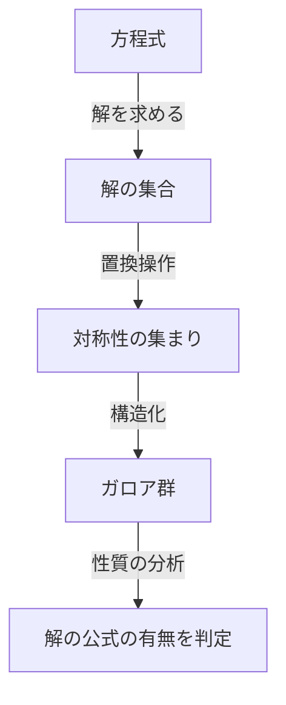
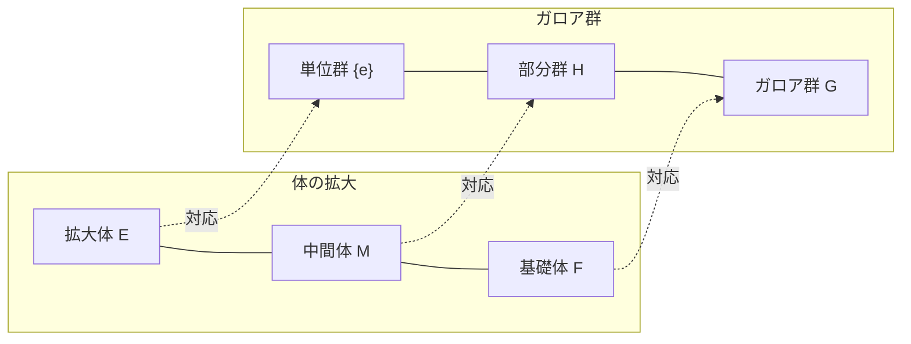

# 1. はじめに：[ガロア理論](https://kenji.blog/p/galois-theory/)とは？

数学の歴史において、最もドラマチックで、かつ最も深遠な理論の一つが **[ガロア理論](https://kenji.blog/p/galois-theory/)** （[Galois Theory](https://kenji.blog/p/galois-theory/)）です。
この理論は、19世紀初頭にフランスの若き数学者[エヴァリスト・ガロア](https://kenji.blog/p/galois/)（[Évariste Galois](https://kenji.blog/p/galois/)）によって構築されました。
[ガロア理論](https://kenji.blog/p/galois-theory/)は、「なぜ5次以上の方程式には一般的な解の公式が存在しないのか？」という古くからの難問を、 **群** （Group）という全く新しい概念を用いて見事に解決しました。

本記事では、[ガロア理論](https://kenji.blog/p/galois-theory/)の基本的なアイデアから、その歴史的背景、そして現代数学に与えた影響までを、できるだけ深く、かつ分かりやすく解説します。代数学の扉を開き、対称性の美しさに触れてみましょう。

## 1.1 方程式の解の公式とは？

私たちが中学生のときに学ぶ2次方程式 $ax^2 + bx + c = 0$ には、次のような解の公式が存在します。

$$
x = \frac{-b \pm \sqrt{b^2 - 4ac}}{2a}
$$

この公式は、係数 $a, b, c$ に対して、四則演算（足し算、引き算、掛け算、割り算）と累乗根（平方根、立方根など）を有限回適用するだけで、どのような2次方程式であっても必ず解を導き出せることを示しています。
3次方程式や4次方程式にも、より複雑ではありますが、同様に四則演算と累乗根を用いた解の公式が存在することが、16世紀のイタリアの数学者たち（カルダノ、タルタリア、フェラーリなど）によって発見されました。これらは数学史における大きなブレイクスルーでした。

しかし、 **5次方程式** $ax^5 + bx^4 + cx^3 + dx^2 + ex + f = 0$ については、何世紀にもわたって[オイラー](https://kenji.blog/p/euler/)やラグランジュといった多くの天才数学者たちが解の公式を見つけようと挑みましたが、誰一人として成功しませんでした。ラグランジュは解の置換に注目し、解決への糸口を掴みましたが、完全な証明には至りませんでした。その後、ルフィニとアーベルによって「5次以上の方程式には一般的な解の公式が存在しない」ことが証明されましたが（[アーベル](https://kenji.blog/p/abel/)–ルフィニの定理）、どのような方程式なら解けて、どのような方程式なら解けないのかという根本的な基準を与えることはできませんでした。

# 2. 対称性と群論の誕生

[ガロア](https://kenji.blog/p/galois/)の最大の功績は、方程式の解を単なる「数」として捉えるのではなく、解の間の **対称性** （Symmetry）に注目したことです。彼は、方程式が持つ固有の構造を「群」という新しい概念で記述しました。

## 2.1 解の置換と[ガロア](https://kenji.blog/p/galois/)群

ある方程式の解を入れ替える操作（置換）を考えます。
もし、解を入れ替えても、解同士の間に成り立つ関係式（有理数係数の多項式としての関係）が保たれる場合、その置換は「方程式の対称性を保つ」と言えます。
[ガロア](https://kenji.blog/p/galois/)は、このような対称性を保つ置換の集まりが **群** という数学的な構造を持つことを見出しました。この群を、その方程式の **ガロア群** （[Galois](https://kenji.blog/p/galois/) Group）と呼びます。

## 2.2 群論の基礎と可解群

ここで、群論の基本的な概念を紹介しましょう。
群 $G$ とは、集合に一つの演算（例えば掛け算や合成）が定義されており、以下の3つの条件を満たすもののことです。

1. **結合法則** : 任意の $a, b, c \in G$ について、 $(a \cdot b) \cdot c = a \cdot (b \cdot c)$ が成り立つ。
2. **単位元の存在** : ある要素 $e \in G$ が存在し、任意の $a \in G$ について $a \cdot e = e \cdot a = a$ が成り立つ。
3. **逆元の存在** : 任意の $a \in G$ について、 $a \cdot a^{-1} = a^{-1} \cdot a = e$ となる $a^{-1} \in G$ が存在する。

[ガロア](https://kenji.blog/p/galois/)は、方程式が「べき根で解ける（四則演算と累乗根の組み合わせで解を表せる）」ことと、その方程式の[ガロア](https://kenji.blog/p/galois/)群が **可解群** （Solvable Group）と呼ばれる特別な性質を持つことが、完全に同値であることを証明しました。可解群とは、大雑把に言えば、群をどんどん細かく分解していったときに、最終的に最も単純な可換群（巡回群）に行き着くような群のことです。

# 3. なぜ5次方程式は解けないのか？

[ガロア理論](https://kenji.blog/p/galois-theory/)を用いると、なぜ5次以上の方程式に解の公式が存在しないのかが驚くほど明確になります。

## 3.1 体の拡大と[ガロア](https://kenji.blog/p/galois/)対応

方程式を解くというプロセスは、数の集合（ **体** 、Field）を徐々に広げていく過程として捉えることができます。体とは、四則演算が自由にできる集合のことです（例：有理数全体、実数全体など）。
例えば、有理数の集合 $\mathbb{Q}$ から出発し、方程式の解の成分である累乗根を付け加えることで新しい体を作ります。これを **体の拡大** と呼びます。

[ガロア理論](https://kenji.blog/p/galois-theory/)の心臓部である基本定理は、「体の拡大の中間体」と「ガロア群の部分群」の間に美しい1対1の対応関係（ **[ガロア](https://kenji.blog/p/galois/)対応** ）があることを示しています。大きい体は小さい群に対応し、小さい体は大きい群に対応するという、見事な反転関係が存在するのです。

## 3.2 5次交代群の非可解性

一般的な $n$ 次方程式の[ガロア](https://kenji.blog/p/galois/)群は、 $n$ 個の解のすべての置換からなる **対称群** $S_n$ となります。
$n=2, 3, 4$ の場合、対称群 $S_n$ は可解群であることが知られています。これは、2次、3次、4次方程式に解の公式が存在することに対応しています。

しかし、 $n \ge 5$ の場合、対称群 $S_n$ の構造は大きく変化します。 $S_5$ に含まれる **交代群** $A_5$ （偶置換のみからなる群）は、正規部分群を自明なものしか持たない「単純群」であり、かつ非[アーベル](https://kenji.blog/p/abel/)（非可換）です。
このような単純非可換群は可解群ではありません。
したがって、一般的な5次方程式の[ガロア](https://kenji.blog/p/galois/)群 $S_5$ は可解群ではなくなり、結果として「べき根による解の公式は存在しない」ことが証明されるのです。

$$
\text{一般的な5次方程式の[ガロア](https://kenji.blog/p/galois/)群 } S_5 \text{ は可解群ではない}
$$

これは単に「まだ公式が見つかっていない」ということではなく、「そのような公式は数学的に存在し得ない」という決定的な事実を示しています。

# 4. [エヴァリスト・ガロア](https://kenji.blog/p/galois/)の生涯

[ガロア理論](https://kenji.blog/p/galois-theory/)の美しさは数学史に燦然と輝いていますが、[ガロア](https://kenji.blog/p/galois/)自身の劇的な生涯もまた、多くの人々を惹きつけてやみません。

[ガロア](https://kenji.blog/p/galois/)は1811年、フランスのパリ近郊で生まれました。彼は10代の頃から数学の類まれな才能を開花させましたが、当時の数学界の権威たち（[コーシー](https://kenji.blog/p/cauchy/)やフーリエ、ポアソンなど）には彼の理論のあまりの斬新さが理解されず、論文は紛失されたり、「説明が不十分で理解不能」と突き返されたりするという不遇をかこちました。エコール・ポリテクニークの入試にも、面接官と衝突したことで二度失敗しています。

また、彼は熱狂的な共和主義者として政治活動にも没頭しました。王政に対する過激な言動から退学処分を受け、さらには投獄される経験もしています。数学の天才でありながら、その情熱は常に政治と社会革命にも向けられていました。

そして1832年、[ガロア](https://kenji.blog/p/galois/)は恋愛関係のもつれ（政治的陰謀という説もあります）から、ピストルによる決闘を行うことになります。
決闘の前夜、彼は自分の死を予感し、数学的理論が失われることを恐れました。彼は友人であるオーギュスト・シュヴァリエに宛てて、自らの理論の要しるしを徹夜で急いで書き残しました。
その手紙の余白には、「時間がない！（Je n'ai pas le temps!）」という悲痛な言葉が書き残されていたと伝えられています。

翌5月30日の決闘で腹部を撃たれた[ガロア](https://kenji.blog/p/galois/)は、翌日、わずか20歳でこの世を去りました。
彼が遺した難解なメモは、10年以上経った後、ジョゼフ・リウヴィルによって注意深く解読・整理され、1846年にようやく学術誌に発表されました。その驚異的な内容が世に知られ、数学界に衝撃を与えたのは、彼が死んでからずっと後のことでした。

# 5. [ガロア理論](https://kenji.blog/p/galois-theory/)の現代数学への影響

[ガロア](https://kenji.blog/p/galois/)が蒔いた「群」や「体の拡大」といった抽象的な種は、その後の数学を大きく変貌させました。
現代の **抽象代数学** は、[ガロア理論](https://kenji.blog/p/galois-theory/)を出発点として発展したと言っても過言ではありません。数だけでなく、多項式や行列、関数など、あらゆる対象の集まりに構造を見出し、それを研究するスタイルが定着しました。

また、対称性を群として捉えるという考え方は、数学のみならず、物理学や化学、情報科学など、幅広い分野で根本的な役割を果たしています。
例えば、素粒子物理学の標準模型はリー群と呼ばれる連続的な群の理論の上に構築されていますし、情報通信の安全を支える暗号理論や、データ通信の誤りを訂正する符号理論（例えば、CDやDVD、QRコードなどで使われるリード・ソロモン符号など）も、有限体上の[ガロア理論](https://kenji.blog/p/galois-theory/)の直接的な応用です。

# 6. まとめと展望

[ガロア理論](https://kenji.blog/p/galois-theory/)は、一見すると複雑な数式の羅列にしか見えない方程式の背後に、対称性という美しい幾何学的な構造が隠されていることを教えてくれます。
5次方程式が解けないという「否定的な」結果を示すために生まれた理論が、結果的に現代数学全体を照らす巨大な光となり、全く新しい数学の世界を切り拓いたことは、科学の歴史における最大のパラドックスであり、奇跡であると言えるでしょう。

方程式に隠された対称性の美しさを探究する旅は、[ガロア](https://kenji.blog/p/galois/)から始まり、現在も最先端の数学（ラングランズ・プログラムなど）へと続いています。[ガロア](https://kenji.blog/p/galois/)が短い生涯で遺した閃きは、200年近く経った今もなお、私たちに無限のインスピレーションを与え続けています。
