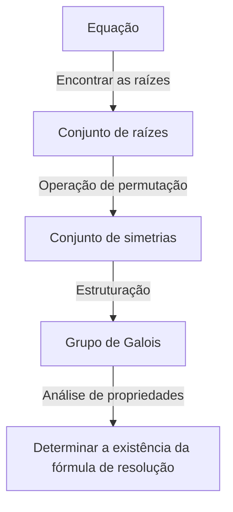
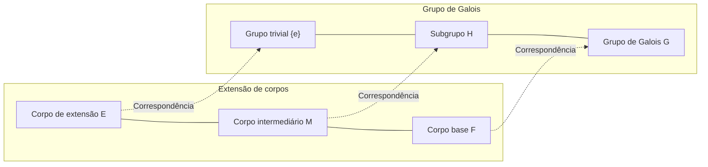

# 1. Introdução: O que é a [Teoria de Galois](https://kenji.blog/pt/p/galois-theory/)?

Na história da matemática, uma das teorias mais dramáticas e profundas é a **[Teoria de Galois](https://kenji.blog/pt/p/galois-theory/)**.
Esta teoria foi construída no início do século XIX pelo jovem matemático francês [Évariste Galois](https://kenji.blog/pt/p/galois/).
A [Teoria de Galois](https://kenji.blog/pt/p/galois-theory/) resolveu de forma brilhante o antigo problema, "Por que não existe uma fórmula geral de resolução para equações de grau 5 ou superior?", usando um conceito totalmente novo: **Grupo**.

Neste artigo, explicaremos desde as ideias básicas da [Teoria de Galois](https://kenji.blog/pt/p/galois-theory/), passando por seu contexto histórico, até seu impacto na matemática moderna, da forma mais profunda e acessível possível. Vamos abrir a porta da álgebra e tocar na beleza da simetria.

## 1.1 O que é a fórmula de resolução de uma equação?

Para a equação do 2º grau $ax^2 + bx + c = 0$, que aprendemos no ensino fundamental, existe a seguinte fórmula de resolução:

$$
x = \frac{-b \pm \sqrt{b^2 - 4ac}}{2a}
$$

Esta fórmula mostra que, aplicando as quatro operações aritméticas (adição, subtração, multiplicação, divisão) e a radiciação (raiz quadrada, raiz cúbica, etc.) um número finito de vezes aos coeficientes $a, b, c$, podemos sempre encontrar as soluções de qualquer equação do 2º grau.
Para equações de 3º e 4º graus, embora sejam mais complexas, matemáticos italianos do século XVI (como Cardano, Tartaglia e Ferrari) descobriram que também existem fórmulas de resolução usando as quatro operações e raízes. Esses foram grandes avanços na história da matemática.

No entanto, para a **equação do 5º grau** $ax^5 + bx^4 + cx^3 + dx^2 + ex + f = 0$, muitos matemáticos geniais como Euler e [Lagrange](https://kenji.blog/pt/p/lagrange/) tentaram encontrar uma fórmula de resolução durante séculos, mas nenhum deles teve sucesso. [Lagrange](https://kenji.blog/pt/p/lagrange/) focou na permutação das raízes e encontrou uma pista para a solução, mas não chegou a uma prova completa. Posteriormente, Ruffini e [Abel](https://kenji.blog/pt/p/abel/) provaram que "não existe fórmula de resolução geral para equações de grau 5 ou superior" (Teorema de [Abel](https://kenji.blog/pt/p/abel/)-Ruffini), mas não conseguiram fornecer um critério fundamental de quais equações poderiam ser resolvidas e quais não poderiam.

# 2. Simetria e o Nascimento da Teoria dos Grupos

A maior contribuição de [Galois](https://kenji.blog/pt/p/galois/) foi não tratar as soluções das equações como meros "números", mas sim focar na **simetria** entre as raízes. Ele descreveu a estrutura inerente de uma equação usando um novo conceito chamado "grupo".

## 2.1 Permutação de raízes e Grupo de [Galois](https://kenji.blog/pt/p/galois/)

Considere a operação de trocar (permutar) as raízes de uma equação.
Se, mesmo após permutar as raízes, as relações válidas entre elas (relações como polinômios com coeficientes racionais) se mantiverem, diz-se que essa permutação "preserva a simetria da equação".
[Galois](https://kenji.blog/pt/p/galois/) descobriu que o conjunto dessas permutações que preservam a simetria tem uma estrutura matemática chamada **grupo**. Esse grupo é chamado de **Grupo de [Galois](https://kenji.blog/pt/p/galois/)** da equação.

## 2.2 Fundamentos da teoria dos grupos e Grupos Solúveis

Aqui, vamos introduzir os conceitos básicos da teoria dos grupos.
Um grupo $G$ é um conjunto onde é definida uma operação (por exemplo, multiplicação ou composição) que satisfaz as seguintes três condições:

1. **Associatividade**: Para quaisquer $a, b, c \in G$, temos $(a \cdot b) \cdot c = a \cdot (b \cdot c)$.
2. **Existência do elemento neutro**: Existe um elemento $e \in G$ tal que, para qualquer $a \in G$, temos $a \cdot e = e \cdot a = a$.
3. **Existência do elemento inverso**: Para qualquer $a \in G$, existe um $a^{-1} \in G$ tal que $a \cdot a^{-1} = a^{-1} \cdot a = e$.

[Galois](https://kenji.blog/pt/p/galois/) provou que uma equação "pode ser resolvida por radicais" (as soluções podem ser expressas por uma combinação das quatro operações básicas e raízes) é completamente equivalente ao fato do Grupo de [Galois](https://kenji.blog/pt/p/galois/) da equação ter uma propriedade especial, sendo chamado de **Grupo Solúvel**. Em termos simples, um grupo solúvel é um grupo que, ao ser decomposto repetidamente, eventualmente resulta no grupo comutativo (grupo cíclico) mais simples possível.

# 3. Por que a equação do 5º grau não pode ser resolvida?

Usando a [Teoria de Galois](https://kenji.blog/pt/p/galois-theory/), fica surpreendentemente claro por que as equações de grau 5 ou superior não possuem uma fórmula de resolução.

## 3.1 Extensão de Corpos e Correspondência de [Galois](https://kenji.blog/pt/p/galois/)

O processo de resolver uma equação pode ser visto como o processo de expandir gradualmente um conjunto de números (**Corpo**). Um corpo é um conjunto onde as quatro operações aritméticas podem ser realizadas livremente (ex: conjunto dos números racionais, conjunto dos números reais).
Por exemplo, começando com o conjunto dos números racionais $\mathbb{Q}$ e adicionando as raízes que são componentes das soluções da equação, criamos um novo corpo. Isso é chamado de **Extensão de corpo**.

O Teorema Fundamental, que é o coração da [Teoria de Galois](https://kenji.blog/pt/p/galois-theory/), mostra que existe uma bela correspondência biunívoca (**Correspondência de [Galois](https://kenji.blog/pt/p/galois/)**) entre os "corpos intermediários da extensão de corpos" e os "subgrupos do Grupo de [Galois](https://kenji.blog/pt/p/galois/)". Existe uma magnífica relação inversa: corpos maiores correspondem a grupos menores, e corpos menores correspondem a grupos maiores.

## 3.2 Insolubilidade do Grupo Alternante de grau 5

O Grupo de [Galois](https://kenji.blog/pt/p/galois/) da equação geral de grau $n$ é o **Grupo Simétrico** $S_n$, que consiste em todas as permutações de suas $n$ raízes.
Para $n=2, 3, 4$, sabe-se que o grupo simétrico $S_n$ é um grupo solúvel. Isso corresponde à existência de fórmulas de resolução para as equações de 2º, 3º e 4º graus.

No entanto, para $n \ge 5$, a estrutura do grupo simétrico $S_n$ muda significativamente. O **Grupo Alternante** $A_5$ (grupo formado apenas por permutações pares) contido em $S_5$ é um "grupo simples", que possui apenas subgrupos normais triviais, e é não-abeliano (não comutativo).
Tais grupos simples não comutativos não são grupos solúveis.
Portanto, o Grupo de [Galois](https://kenji.blog/pt/p/galois/) $S_5$ da equação geral de 5º grau não é um grupo solúvel, resultando na prova de que "não existe uma fórmula de resolução por radicais".

$$
\text{O Grupo de [Galois](https://kenji.blog/pt/p/galois/) } S_5 \text{ de uma equação geral do 5º grau não é um grupo solúvel}
$$

Isso não significa apenas que "a fórmula ainda não foi encontrada", mas mostra o fato conclusivo de que "tal fórmula não pode existir matematicamente".

# 4. A Vida de [Évariste Galois](https://kenji.blog/pt/p/galois/)

Embora a beleza da [Teoria de Galois](https://kenji.blog/pt/p/galois-theory/) brilhe na história da matemática, a vida dramática do próprio [Galois](https://kenji.blog/pt/p/galois/) continua fascinando muitas pessoas.

[Galois](https://kenji.blog/pt/p/galois/) nasceu em 1811, perto de Paris, França. Seu talento extraordinário para a matemática desabrochou na adolescência, mas as autoridades matemáticas da época (como [Cauchy](https://kenji.blog/pt/p/cauchy/), Fourier e Poisson) não compreenderam a extrema novidade de sua teoria. Seus artigos foram perdidos ou devolvidos com comentários de que "as explicações eram insuficientes e incompreensíveis", o que o levou a sofrer com a falta de reconhecimento. Ele também falhou duas vezes no exame de admissão da École Polytechnique após conflitos com os examinadores.

Além disso, como um republicano fanático, ele se dedicou profundamente ao ativismo político. Suas ações e palavras radicais contra a monarquia levaram à sua expulsão da escola e, mais tarde, ele chegou a ser preso. Sendo um gênio da matemática, sua paixão também estava constantemente voltada para a política e a revolução social.

Então, em 1832, [Galois](https://kenji.blog/pt/p/galois/) se envolveu em um duelo de pistolas por causa de complicações em um relacionamento amoroso (também existe a teoria de uma conspiração política).
Na noite anterior ao duelo, ele pressentiu sua morte e temeu que sua teoria matemática fosse perdida. Ele passou a noite em claro escrevendo às pressas o esboço de sua teoria em uma carta endereçada a seu amigo Auguste Chevalier.
Diz-se que nas margens dessa carta, as dolorosas palavras "Não tenho tempo! (Je n'ai pas le temps!)" foram rabiscadas.

[Galois](https://kenji.blog/pt/p/galois/) foi baleado no abdômen durante o duelo no dia 30 de maio, vindo a falecer no dia seguinte, com apenas 20 anos de idade.
As anotações difíceis que ele deixou foram cuidadosamente decifradas e organizadas por Joseph [Liouville](https://kenji.blog/pt/p/liouville/) mais de 10 anos depois, e finalmente publicadas em uma revista acadêmica em 1846. Foi muito tempo após a sua morte que o seu conteúdo surpreendente se tornou conhecido no mundo e chocou a comunidade matemática.

# 5. O Impacto da [Teoria de Galois](https://kenji.blog/pt/p/galois-theory/) na Matemática Moderna

As sementes abstratas de "grupo" e "extensão de corpos" que [Galois](https://kenji.blog/pt/p/galois/) plantou transformaram grandemente a matemática subsequente.
Não é exagero dizer que a **Álgebra Abstrata** moderna se desenvolveu a partir da [Teoria de Galois](https://kenji.blog/pt/p/galois-theory/). Estabeleceu-se a abordagem de encontrar e estudar as estruturas não apenas em conjuntos de números, mas em coleções de qualquer objeto, como polinômios, matrizes ou funções.

Além disso, a ideia de entender a simetria como um grupo desempenha um papel fundamental em uma ampla gama de campos, não apenas na matemática, mas também na física, na química e na ciência da informação.
Por exemplo, o Modelo Padrão da física de partículas é construído sobre a teoria de grupos contínuos chamados Grupos de Lie, e a criptografia, que garante a segurança da comunicação de informações, bem como a teoria de códigos de correção de erros para comunicação de dados (como os códigos Reed-Solomon usados em CDs, DVDs, códigos QR, etc.), são aplicações diretas da [Teoria de Galois](https://kenji.blog/pt/p/galois-theory/) sobre corpos finitos.

# 6. Resumo e Perspectivas

A [Teoria de Galois](https://kenji.blog/pt/p/galois-theory/) nos ensina que, por trás de equações que parecem apenas sequências complexas de fórmulas matemáticas, esconde-se uma bela estrutura geométrica chamada simetria.
O fato de uma teoria nascida para mostrar o resultado "negativo" de que as equações do 5º grau não podem ser resolvidas ter se tornado uma luz gigantesca que iluminou toda a matemática moderna e abriu um mundo matemático inteiramente novo pode ser considerado o maior paradoxo e milagre na história da ciência.

A jornada para explorar a beleza da simetria oculta nas equações começou com [Galois](https://kenji.blog/pt/p/galois/) e continua até as matemáticas de ponta atuais (como o Programa de Langlands). O insight que [Galois](https://kenji.blog/pt/p/galois/) deixou em sua curta vida, quase 200 anos depois, ainda continua a nos dar inspiração infinita.
