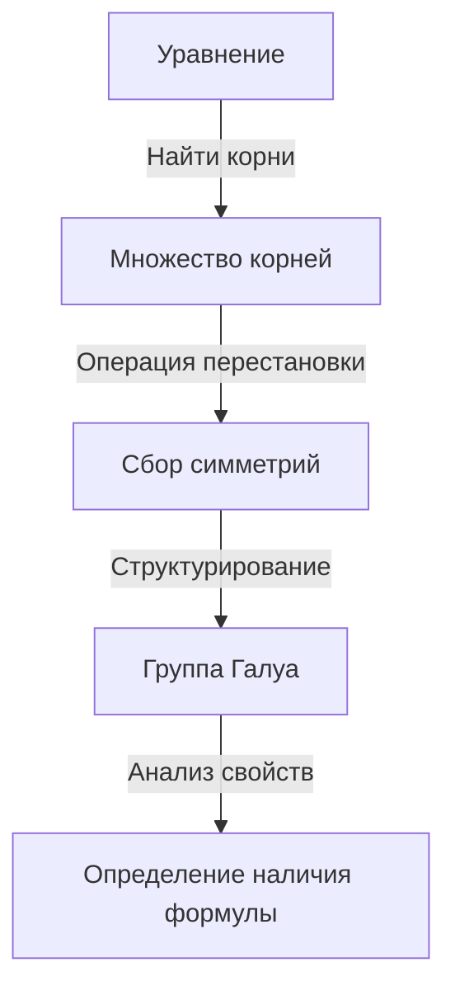
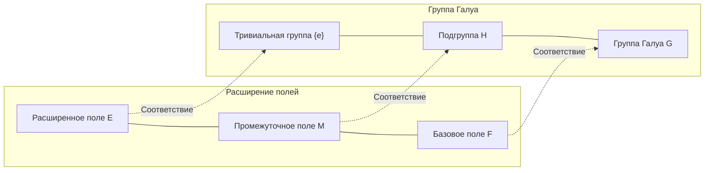

# 1. Введение: Что такое теория Галуа?

В истории математики одной из самых драматичных и глубоких теорий является **теория Галуа** (Galois Theory).
Эта теория была создана в начале 19 века молодым французским математиком Эваристом Галуа (Évariste Galois).
Теория Галуа блестяще решила давнюю проблему: «Почему не существует общей формулы для решения уравнений 5-й степени и выше?», используя совершенно новую концепцию — **группу** (Group).

В этой статье мы максимально глубоко и понятно объясним все, от базовых идей теории Галуа до ее исторического контекста и влияния на современную математику. Давайте откроем двери алгебры и прикоснемся к красоте симметрии.

## 1.1 Что такое формула для корней уравнения?

Для квадратного уравнения $ax^2 + bx + c = 0$, которое мы изучаем в средней школе, существует следующая формула корней:

$$
x = \frac{-b \pm \sqrt{b^2 - 4ac}}{2a}
$$

Эта формула показывает, что для любых коэффициентов $a, b, c$, применив конечное число арифметических операций (сложение, вычитание, умножение, деление) и извлечений корней (квадратных, кубических и т.д.), можно всегда найти решение для любого квадратного уравнения.
В 16 веке итальянские математики (такие как Кардано, Тарталья, Феррари) открыли, что для кубических и уравнений четвертой степени также существуют формулы решения, использующие арифметические операции и извлечение корней, хотя они и более сложные. Это был огромный прорыв в истории математики.

Однако для **уравнения пятой степени** $ax^5 + bx^4 + cx^3 + dx^2 + ex + f = 0$ многие гениальные математики на протяжении веков, такие как Эйлер и Лагранж, пытались найти формулу решения, но ни одному из них это не удалось. Лагранж обратил внимание на перестановки корней и ухватился за нить к решению, но не смог получить полного доказательства. Позже Руффини и Абель доказали, что «не существует общей формулы для решения уравнений пятой степени и выше» (Теорема Абеля-Руффини), но они не смогли дать фундаментальный критерий того, какие уравнения разрешимы, а какие нет.

# 2. Симметрия и зарождение теории групп

Величайшим достижением Галуа было то, что он рассматривал корни уравнения не просто как «числа», а обратил внимание на **симметрию** (Symmetry) между ними. Он описал уникальную структуру уравнения с помощью новой концепции — «группы».

## 2.1 Перестановки корней и группа Галуа

Рассмотрим операцию перестановки корней уравнения.
Если при перестановке корней сохраняются соотношения между ними (соотношения в виде многочленов с рациональными коэффициентами), можно сказать, что такая перестановка «сохраняет симметрию уравнения».
Галуа обнаружил, что множество таких перестановок, сохраняющих симметрию, обладает математической структурой, называемой **группой**. Эта группа называется **группой Галуа** (Galois Group) данного уравнения.

## 2.2 Основы теории групп и разрешимые группы

Здесь мы представим базовые концепции теории групп.
Группа $G$ — это множество с одной определенной операцией (например, умножением или композицией), которое удовлетворяет следующим трем условиям:

1. **Ассоциативность**: Для любых $a, b, c \in G$ выполняется $(a \cdot b) \cdot c = a \cdot (b \cdot c)$.
2. **Наличие нейтрального элемента**: Существует элемент $e \in G$, такой что для любого $a \in G$ выполняется $a \cdot e = e \cdot a = a$.
3. **Наличие обратного элемента**: Для любого $a \in G$ существует такой $a^{-1} \in G$, что $a \cdot a^{-1} = a^{-1} \cdot a = e$.

Галуа доказал, что уравнение «разрешимо в радикалах» (корни могут быть выражены через комбинацию арифметических операций и извлечений корня) тогда и только тогда, когда его группа Галуа обладает особым свойством и называется **разрешимой группой** (Solvable Group). Разрешимая группа — это, грубо говоря, такая группа, которая при последовательном разбиении на всё более мелкие части в конечном итоге сводится к простейшим абелевым (циклическим) группам.

# 3. Почему уравнения пятой степени неразрешимы?

С помощью теории Галуа становится удивительно ясно, почему не существует формулы для решения уравнений 5-й степени и выше.

## 3.1 Расширение полей и соответствие Галуа

Процесс решения уравнения можно рассматривать как процесс постепенного расширения множества чисел (**поля**, Field). Поле — это множество, в котором можно свободно выполнять четыре арифметические операции (например, множество всех рациональных чисел, всех действительных чисел и т.д.).
Например, начиная с множества рациональных чисел $\mathbb{Q}$, мы добавляем радикалы, которые являются компонентами корней уравнения, чтобы создать новое поле. Это называется **расширением поля**.

Основная теорема, являющаяся сердцем теории Галуа, показывает, что существует прекрасное взаимно однозначное соответствие (**соответствие Галуа**) между «промежуточными полями расширения поля» и «подгруппами группы Галуа». Существует великолепная обратная связь, при которой большему полю соответствует меньшая группа, а меньшему полю — большая группа.

## 3.2 Неразрешимость знакопеременной группы степени 5

Группой Галуа общего уравнения степени $n$ является **симметрическая группа** $S_n$, состоящая из всех перестановок $n$ корней.
Известно, что для $n=2, 3, 4$ симметрическая группа $S_n$ является разрешимой группой. Это соответствует наличию формул для корней уравнений 2-й, 3-й и 4-й степеней.

Однако для $n \ge 5$ структура симметрической группы $S_n$ сильно меняется. **Знакопеременная группа** $A_5$ (группа, состоящая только из четных перестановок), содержащаяся в $S_5$, является «простой группой», не имеющей нетривиальных нормальных подгрупп, и при этом неабелевой (некоммутативной).
Такие простые неабелевы группы не являются разрешимыми.
Следовательно, группа Галуа $S_5$ общего уравнения пятой степени не является разрешимой группой, и в результате доказывается, что «не существует формулы решения в радикалах».

$$
\text{Группа Галуа общего уравнения 5-й степени } S_5 \text{ не является разрешимой группой}
$$

Это указывает не просто на то, что «формула еще не найдена», а на определяющий факт, что «такая формула математически не может существовать».

# 4. Жизнь Эвариста Галуа

Красота теории Галуа ярко сияет в истории математики, но драматичная жизнь самого Галуа также продолжает привлекать многих людей.

Галуа родился в 1811 году недалеко от Парижа, во Франции. Его выдающийся математический талант раскрылся еще в подростковом возрасте, однако тогдашние авторитеты математического мира (Коши, Фурье, Пуассон и др.) не смогли понять чрезмерную новаторственность его теории. Его статьи терялись или возвращались с пометками «недостаточно объяснено и непонятно», что приводило к непризнанию. Он также дважды провалил вступительные экзамены в Политехническую школу из-за конфликтов с экзаменаторами.

Кроме того, будучи ярым республиканцем, он был погружен в политическую деятельность. За радикальные высказывания против монархии его исключили из школы, а затем он даже попал в тюрьму. Несмотря на то что он был математическим гением, его страсть всегда была направлена также на политику и социальные революции.

В 1832 году из-за любовных интриг (есть также теория о политическом заговоре) Галуа был вынужден участвовать в дуэли на пистолетах.
В ночь перед дуэлью, предчувствуя свою смерть и опасаясь, что его математические теории будут утрачены, он в спешке, не спав всю ночь, записал краткое изложение своих теорий в письме своему другу Огюсту Шевалье.
Говорят, что на полях этого письма были написаны скорбные слова: «У меня нет времени!» (Je n'ai pas le temps!).

На следующий день, 30 мая, Галуа был ранен в живот на дуэли и скончался на следующий день, когда ему было всего 20 лет.
Оставленные им сложные заметки были тщательно расшифрованы и систематизированы Жозефом Лиувиллем более чем через 10 лет, и наконец были опубликованы в научном журнале в 1846 году. Их поразительное содержание стало известно миру и потрясло математическое сообщество лишь спустя долгое время после его смерти.

# 5. Влияние теории Галуа на современную математику

Абстрактные семена, такие как «группы» и «расширения полей», посеянные Галуа, сильно изменили последующую математику.
Можно без преувеличения сказать, что современная **абстрактная алгебра** развилась на основе теории Галуа. Утвердился стиль выявления структур в любых совокупностях объектов, не только в числах, но и в многочленах, матрицах, функциях, и их изучения.

Кроме того, идея понимания симметрии как группы играет фундаментальную роль не только в математике, но и в широком спектре других областей, таких как физика, химия и информатика.
Например, Стандартная модель в физике элементарных частиц построена на теории непрерывных групп, называемых группами Ли. Теория криптографии, обеспечивающая безопасность информационной связи, а также теория кодирования, корректирующая ошибки при передаче данных (например, коды Рида-Соломона, используемые в CD, DVD и QR-кодах) — это прямые приложения теории Галуа над конечными полями.

# 6. Заключение и перспективы

Теория Галуа показывает нам, что за уравнениями, которые на первый взгляд кажутся просто набором сложных формул, скрывается красивая геометрическая структура — симметрия.
То, что теория, созданная для того, чтобы показать «отрицательный» результат — невозможность решения уравнений пятой степени, в итоге стала гигантским светом, осветившим всю современную математику, и открыла совершенно новый математический мир, можно назвать величайшим парадоксом и чудом в истории науки.

Путешествие в поисках красоты симметрии, скрытой в уравнениях, началось с Галуа и продолжается по сей день в передовой математике (например, программа Ленглендса). Вспышка гения, оставленная Галуа за его короткую жизнь, даже спустя почти 200 лет продолжает дарить нам бесконечное вдохновение.
