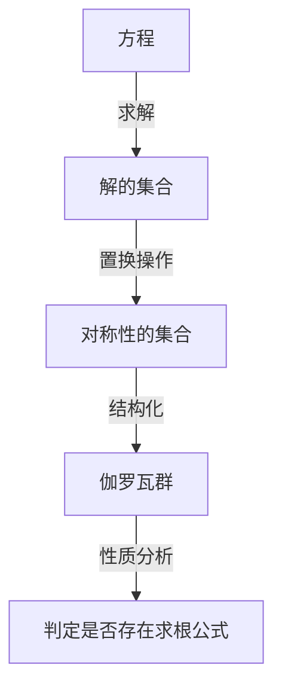
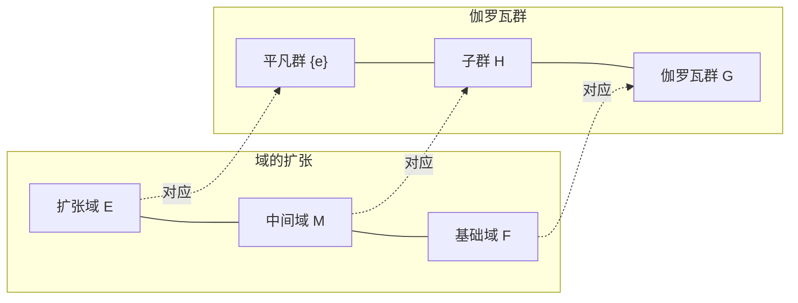

# 1. 引言：什么是伽罗瓦理论？

在数学的历史长河中，最具有戏剧性且最深奥的理论之一就是 **伽罗瓦理论** （[Galois Theory](https://kenji.blog/p/galois-theory/)）。
这个理论是由19世纪初法国年轻的数学家[埃瓦里斯特·伽罗瓦](https://kenji.blog/p/galois/)（[Évariste Galois](https://kenji.blog/p/galois/)）所建立的。
伽罗瓦理论使用名为 **群** （Group）的全新概念，完美地解决了“为什么5次及以上的方程没有一般的求根公式？”这个古老的难题。

本文将从伽罗瓦理论的基本思想出发，探讨其历史背景，以及对现代数学产生的影响，尽可能深入浅出地为您进行讲解。让我们推开代数学的大门，感受对称性的美吧。

## 1.1 什么是方程的求根公式？

我们在初中学习的二次方程 $ax^2 + bx + c = 0$ 存在如下的求根公式：

$$
x = \frac{-b \pm \sqrt{b^2 - 4ac}}{2a}
$$

这个公式表明，对于系数 $a, b, c$ ，只需有限次地使用四则运算（加法、减法、乘法、除法）和开方（平方根、立方根等），无论什么样的二次方程都必定能求出它的解。
对于三次方程和四次方程，虽然更复杂，但也同样存在使用四则运算和开方的求根公式。这是在16世纪由意大利数学家们（卡尔达诺、塔尔塔利亚、费拉里等人）所发现的。这些都是数学史上的重大突破。

然而，对于 **五次方程** $ax^5 + bx^4 + cx^3 + dx^2 + ex + f = 0$ ，几个世纪以来，包括欧拉和拉格朗日在内的许多天才数学家都试图寻找其求根公式，但无一成功。拉格朗日注意到了解的置换，并抓住了解决问题的线索，但最终未能给出完整的证明。之后，鲁菲尼和阿贝尔证明了“5次及以上的方程不存在一般的求根公式”（阿贝尔-鲁菲尼定理），但无法给出一个根本的判断标准，即什么样的方程可解，什么样的方程不可解。

# 2. 对称性与群论的诞生

伽罗瓦最大的贡献在于，他不再将方程的解仅仅视为“数”，而是将目光投向了解之间的 **对称性** （Symmetry）。他用名为“群”的新概念描述了方程所固有的结构。

## 2.1 解的置换与伽罗瓦群

考虑一种交换某个方程的解的操作（置换）。
如果即使交换了解，解之间成立的关系式（作为有理系数多项式的关系）仍保持不变，那么我们就可以说这种置换“保持了方程的对称性”。
伽罗瓦发现，保持这种对称性的置换的集合具有称为 **群** 的数学结构。这个群被称为该方程的 **伽罗瓦群** （Galois Group）。

## 2.2 群论基础与可解群

在这里，让我们介绍一下群论的基本概念。
所谓群 $G$ ，是指在一个集合上定义了一种运算（例如乘法或复合），并满足以下三个条件的代数结构：

1. **结合律** ：对于任意的 $a, b, c \in G$ ，满足 $(a \cdot b) \cdot c = a \cdot (b \cdot c)$ 。
2. **单位元的存在性** ：存在一个元素 $e \in G$ ，使得对于任意的 $a \in G$ ，满足 $a \cdot e = e \cdot a = a$ 。
3. **逆元的存在性** ：对于任意的 $a \in G$ ，存在 $a^{-1} \in G$ 使得 $a \cdot a^{-1} = a^{-1} \cdot a = e$ 。

伽罗瓦证明了，一个方程“能用根式解（能用四则运算和开方的组合来表示解）”与该方程的伽罗瓦群具有称为 **可解群** （Solvable Group）的特殊性质，两者是完全等价的。粗略地说，可解群就是当我们将群不断细分时，最终会到达最简单的交换群（循环群）的群。

# 3. 为什么五次方程不可解？

运用伽罗瓦理论，为什么5次及以上的方程不存在求根公式的原因就变得惊人地清晰了。

## 3.1 域的扩张与伽罗瓦对应

解方程的过程可以看作是数字集合（ **域** ，Field）逐渐扩大的过程。域是可以自由进行四则运算的集合（例如：全体有理数、全体实数等）。
例如，从有理数集合 $\mathbb{Q}$ 出发，通过添加方程解的组成部分——根式来构造一个新的域。这被称为 **域的扩张** 。

伽罗瓦理论的核心基本定理表明，“域扩张的中间域”和“伽罗瓦群的子群”之间存在着美妙的一一对应关系（ **伽罗瓦对应** ）。存在着一种绝妙的反转关系：较大的域对应较小的群，较小的域对应较大的群。

## 3.2 5次交错群的不可解性

一般的 $n$ 次方程的伽罗瓦群是由 $n$ 个解的所有置换构成的 **对称群** $S_n$ 。
对于 $n=2, 3, 4$ 的情况，对称群 $S_n$ 已知是可解群。这对应于2次、3次、4次方程存在求根公式。

然而，当 $n \ge 5$ 时，对称群 $S_n$ 的结构会发生巨大变化。 $S_5$ 中包含的 **交错群** $A_5$ （仅由偶置换构成的群）是一个除了平凡正规子群外不具有其他正规子群的“单群”，而且是非阿贝尔（非交换）的。
这样的非交换单群不是可解群。
因此，一般的5次方程的伽罗瓦群 $S_5$ 不再是可解群，结果就证明了“不存在用根式表示的求根公式”。

$$
\text{一般的5次方程的伽罗瓦群 } S_5 \text{ 不是可解群}
$$

这并非仅仅表示“公式还未被找到”，而是表明了一个决定性的事实，即“这样的公式在数学上是不可能存在的”。

# 4. [埃瓦里斯特·伽罗瓦](https://kenji.blog/p/galois/)的生平

伽罗瓦理论的壮美在数学史上熠熠生辉，而伽罗瓦本人那充满戏剧性的一生也同样令人着迷。

伽罗瓦于1811年出生在法国巴黎近郊。他从十几岁起就展现出了非凡的数学天赋，但当时数学界的权威们（如柯西、傅里叶、泊松等人）却无法理解他理论中过于前卫的思想。他饱受冷遇，论文不是被遗失，就是被以“解释不充分、无法理解”为由退回。在报考巴黎综合理工学院时，也因与面试官发生冲突而两次落榜。

此外，作为一名狂热的共和主义者，他也投身于政治活动中。由于对王室的过激言论，他被开除学籍，甚至还有过入狱的经历。尽管是一位数学天才，但他的热情也始终倾注于政治和社会革命。

后来在1832年，由于一场感情纠葛（也有说法称是政治阴谋），伽罗瓦卷入了一场持枪决斗。
在决斗的前夜，他预感到自己将要死亡，并害怕他的数学理论会就此失传。于是，他熬夜奋笔疾书，给朋友奥古斯特·舍瓦利耶写下了一封信，匆忙地记录下自己理论的要点。
据说在那封信的空白处，留下了“我没有时间了！（Je n'ai pas le temps!）”这样悲痛的字句。

在第二天5月30日的决斗中，伽罗瓦腹部中弹，次日便与世长辞，年仅20岁。
他留下的深奥笔记，直到十多年后才由约瑟夫·刘维尔仔细解读和整理，并最终于1846年发表在学术期刊上。他那惊世骇俗的内容为人所知，并震惊数学界，已是在他去世很久之后的事情了。

# 5. 伽罗瓦理论对现代数学的影响

伽罗瓦播下的“群”和“域的扩张”这些抽象的种子，极大地改变了后来的数学面貌。
毫不夸张地说，现代的 **抽象代数学** 就是以伽罗瓦理论为起点发展起来的。它确立了一种研究范式，即不仅在数字中，而且在多项式、矩阵、函数等各种对象的集合中寻找结构，并对其进行研究。

此外，将对称性视为群的思想，不仅在数学领域，而且在物理学、化学、信息科学等广泛的领域中都发挥着根本性的作用。
例如，粒子物理学的标准模型就是建立在被称为李群的连续群理论之上的；而保障信息通信安全的密码学理论，以及用于纠正数据通信错误的编码理论（例如CD、DVD、二维码等所使用的里德-所罗门码等），也都是有限域上伽罗瓦理论的直接应用。

# 6. 总结与展望

伽罗瓦理论告诉我们，在那些乍一看不过是复杂公式堆砌的方程背后，隐藏着被称为对称性的美丽几何结构。
一个为了证明5次方程不可解这一“否定性”结果而诞生的理论，最终却成为了照亮整个现代数学的巨大光芒，并开辟了一个全新的数学世界，这可以说是科学史上最大的悖论，也是一个奇迹。

探索方程背后隐藏的对称性之美的旅程，从伽罗瓦开始，并一直延续到今天最前沿的数学（如朗兰兹纲领等）。伽罗瓦在短暂的一生中留下的灵光，在近200年后的今天，依然源源不断地给予我们无限的启迪。
