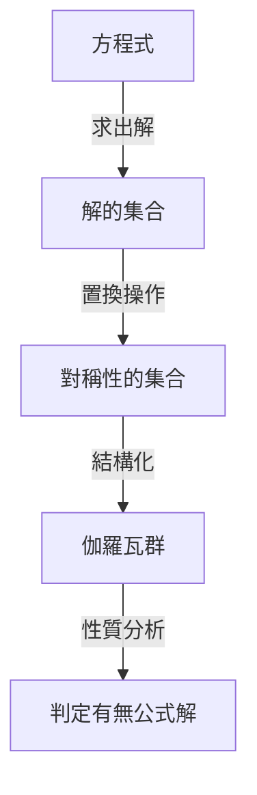
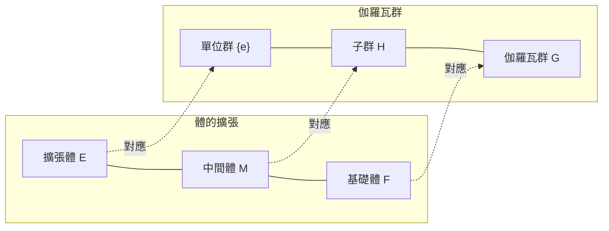

# 1. 前言：什麼是伽羅瓦理論？

在數學的歷史中，最富有戲劇性且最深奧的理論之一就是 **伽羅瓦理論** （Galois Theory）。
這個理論是由 19 世紀初法國年輕數學家埃瓦里斯特·伽羅瓦（Évariste Galois）所建構的。
伽羅瓦理論使用了一種名為 **群** （Group）的全新概念，完美解決了「為何五次以上方程式不存在一般公式解？」這個古老的難題。

在本篇文章中，我們將盡可能深入淺出地解說伽羅瓦理論的基本概念、其歷史背景，以及對現代數學的影響。讓我們一起推開代數學的大門，接觸對稱性的美妙吧。

## 1.1 什麼是方程式的公式解？

我們在國中時學過的一元二次方程式 $ax^2 + bx + c = 0$ 擁有以下的公式解：

$$
x = \frac{-b \pm \sqrt{b^2 - 4ac}}{2a}
$$

這個公式表示，對於係數 $a, b, c$ ，只要進行有限次數的四則運算（加法、減法、乘法、除法）與次方根（平方根、立方根等），無論是哪種二次方程式，都必定能推導出解。
在 16 世紀的義大利數學家們（卡爾達諾、塔爾塔利亞、費拉里等）發現，三次方程式與四次方程式雖然更為複雜，但也同樣存在著使用四則運算與次方根的公式解。這些在數學史上都是重大的突破。

然而，關於 **五次方程式** $ax^5 + bx^4 + cx^3 + dx^2 + ex + f = 0$ ，雖然數個世紀以來有尤拉與拉格朗日等多位天才數學家試圖尋找公式解，卻沒有任何一個人成功。拉格朗日注意到了解的置換，抓住了邁向解答的線索，但未能給出完整的證明。之後，魯菲尼與阿貝爾雖然證明了「五次以上方程式不存在一般公式解」（阿貝爾-魯菲尼定理），卻無法給出一個根本的標準，說明究竟什麼樣的方程式可解，什麼樣的方程式不可解。

# 2. 對稱性與群論的誕生

伽羅瓦最大的功績，在於他不是將方程式的解單純視為「數字」，而是著眼於解之間的 **對稱性** （Symmetry）。他將方程式固有的結構用一種名為「群」的新概念來描述。

## 2.1 解的置換與伽羅瓦群

考慮將某個方程式的解進行替換的操作（置換）。
如果即使替換了解，解彼此之間成立的關係式（作為有理數係數多項式的關係）仍能保持不變，我們就說該置換「保持了方程式的對稱性」。
伽羅瓦發現，這些保持對稱性的置換集合，具有一種名為 **群** 的數學結構。我們將這個群稱為該方程式的 **伽羅瓦群** （Galois Group）。

## 2.2 群論基礎與可解群

在此我們介紹群論的基本概念。
所謂群 $G$ ，是指在一個集合上定義了一種運算（例如乘法或複合），且滿足以下三個條件：

1. **結合律** ：對於任意 $a, b, c \in G$ ，滿足 $(a \cdot b) \cdot c = a \cdot (b \cdot c)$ 。
2. **單位元素的存在** ：存在一個元素 $e \in G$ ，使得對於任意 $a \in G$ ，滿足 $a \cdot e = e \cdot a = a$ 。
3. **反元素的存在** ：對於任意 $a \in G$ ，存在 $a^{-1} \in G$ ，使得 $a \cdot a^{-1} = a^{-1} \cdot a = e$ 。

伽羅瓦證明了，方程式能夠「用方根求解（用四則運算與次方根的組合來表示解）」這件事，與該方程式的伽羅瓦群具有一種稱為 **可解群** （Solvable Group）的特殊性質，是完全等價的。粗略地說，可解群就是當我們將群不斷細分下去時，最終會抵達最簡單的交換群（循環群）的一種群。

# 3. 為何五次方程式無法求解？

使用伽羅瓦理論，就能令人驚訝地清楚明白為何五次以上方程式不存在公式解。

## 3.1 體的擴張與伽羅瓦對應

求解方程式的過程，可以看作是將數字集合（ **體** ，Field）逐漸擴張的過程。體是指可以自由進行四則運算的集合（例如：全體有理數、全體實數等）。
舉例來說，從有理數的集合 $\mathbb{Q}$ 出發，藉由加入作為方程式解的成分的次方根，來建立新的體。這被稱為 **體的擴張** 。

作為伽羅瓦理論核心的基本定理，揭示了「體擴張的中間體」與「伽羅瓦群的子群」之間，存在著絕妙的一對一對應關係（ **伽羅瓦對應** ）。較大的體對應到較小的群，較小的體對應到較大的群，存在著如此絕妙的反轉關係。

## 3.2 五次交錯群的非可解性

一般的 $n$ 次方程式的伽羅瓦群，會是由 $n$ 個解的所有置換所組成的 **對稱群** $S_n$ 。
已知當 $n=2, 3, 4$ 時，對稱群 $S_n$ 是可解群。這正對應了二、三、四次方程式存在公式解。

然而，當 $n \ge 5$ 時，對稱群 $S_n$ 的結構會發生巨大變化。包含在 $S_5$ 中的 **交錯群** $A_5$ （僅由偶置換組成的群），是只擁有平凡正規子群的「單群」，且為非阿貝爾（非交換）群。
這種非交換單群不是可解群。
因此，一般五次方程式的伽羅瓦群 $S_5$ 不是可解群，結果就證明了「不存在利用方根求出的公式解」。

$$
\text{一般的五次方程式的伽羅瓦群 } S_5 \text{ 不是可解群}
$$

這並不僅僅是「還沒找到公式」，而是展現出「這種公式在數學上不可能存在」的決定性事實。

# 4. 埃瓦里斯特·伽羅瓦的一生

伽羅瓦理論的絕美在數學史上閃耀著燦爛的光芒，而伽羅瓦本身戲劇化的一生，同樣深深地吸引著眾人。

伽羅瓦於 1811 年出生在法國巴黎近郊。他從十幾歲起便展露出過人的數學天分，但當時數學界的權威們（如柯西、傅立葉、卜瓦松等）無法理解他理論中過於嶄新的觀念，他的論文甚至遭到遺失，或以「說明不充分且無法理解」被退回，境遇十分不得志。在報考巴黎綜合理工學院時，也因與面試官發生衝突而兩度落榜。

此外，身為狂熱共和主義者的他也埋首於政治活動。他因為對王權發表過激言論而遭到退學處分，甚至經歷了牢獄之災。身為數學天才，他的熱情同時也永遠指向政治與社會革命。

而在 1832 年，伽羅瓦因為戀愛關係的糾紛（也有一說是政治陰謀），必須與人進行手槍決鬥。
決鬥前夜，他預感到自己的死亡，害怕他的數學理論就此失傳。他寫信給朋友奧古斯特·謝瓦列，徹夜趕著寫下了自己理論的要點。
據說在那封信的空白處，留下了「沒有時間了！（Je n'ai pas le temps!）」這句悲痛的話語。

隔天 5 月 30 日的決鬥中，腹部中彈的伽羅瓦在第二天離開了人世，年僅 20 歲。
他所遺留下來的艱澀筆記，在歷經十年以上後，由約瑟夫·劉維爾仔細地解讀並整理，終於在 1846 年發表於學術期刊。其驚人的內容為世人所知並震驚了數學界，已是他死後很久以後的事了。

# 5. 伽羅瓦理論對現代數學的影響

伽羅瓦所播下的「群」與「體的擴張」等抽象種子，讓其後的數學發生了巨大的轉變。
可以毫不誇張地說，現代的 **抽象代數學** 正是以伽羅瓦理論為起點發展起來的。人們開始將不只是數字，還有多項式、矩陣、函數等所有對象的集合視為結構，並確立了研究這些結構的風格。

此外，將對稱性視為群的概念，不僅在數學領域，在物理學、化學、資訊科學等廣泛領域也都扮演著根本的角色。
例如，粒子物理學的標準模型便是建立在被稱為李群的連續群理論之上，而支撐資訊通訊安全的密碼理論，以及修正數據通訊錯誤的編碼理論（例如 CD 、 DVD 、 QR 碼中使用的里德-所羅門碼等），也都是有限體上伽羅瓦理論的直接應用。

# 6. 總結與展望

伽羅瓦理論告訴我們，在看似只是一連串複雜數學式的方程式背後，隱藏著名為對稱性的美麗幾何學結構。
為了展現五次方程式無法求解的「否定性」結果而誕生的理論，最終成為照亮整個現代數學的巨大光芒，並開拓出一個全新的數學世界，這可以說是科學史上最大的悖論，也是一場奇蹟。

探索隱藏在方程式中對稱性之美的旅程，從伽羅瓦開始，直到現在仍延續至最尖端的數學領域（如朗蘭茲綱領等）。伽羅瓦短暫一生中所留下的閃光，在過了將近 200 年後的今天，依然持續帶給我們無限的靈感。
