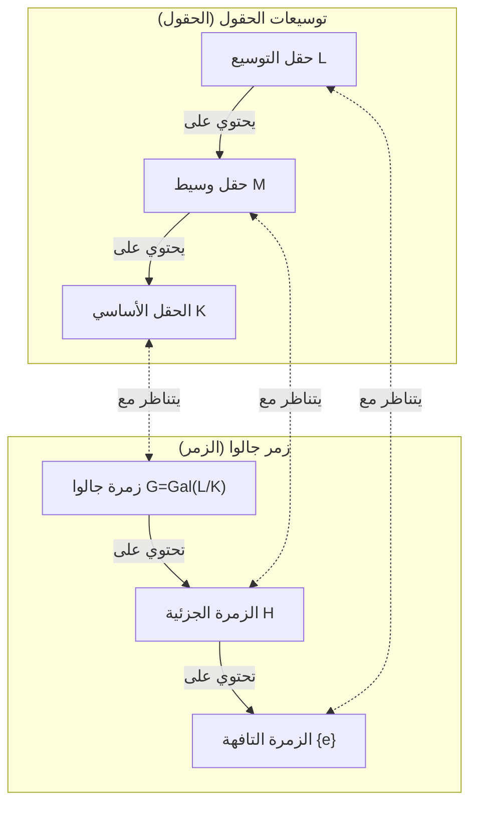

في تاريخ الرياضيات، قلما نجد من عاش حياة درامية ومأساوية مثل [إيفاريست جالوا](https://kenji.blog/ar/p/galois/) (1811–1832). هذا الشاب الفرنسي، الذي فقد حياته في مبارزة في سن العشرين، أرسى الأسس لنظرية عظيمة غيّرت الرياضيات اللاحقة بشكل جذري، وذلك في رسالة كتبها عشية وفاته. في هذا المقال، نتعمق في حياة جالوا المضطربة وأعظم إرث له، **نظرية جالوا** ([Galois Theory](https://kenji.blog/ar/p/galois-theory/)).

## 1. حياة مضطربة: شغف وإحباط

### حياته المبكرة واستيقاظه على الرياضيات

ولد [إيفاريست جالوا](https://kenji.blog/ar/p/galois/) عام 1811 في بور لا رين، إحدى ضواحي باريس. كان والده جمهوريًا متعلمًا وشغل لاحقًا منصب عمدة البلدة. تلقى جالوا تعليمه الأولي على يد والدته، ثم التحق بمدرسة لوي لو غران في باريس وهو في الثانية عشرة من عمره.

كانت الحياة المدرسية مملة بالنسبة له، لكن حياته تغيرت تمامًا في سن الخامسة عشرة عندما اكتشف كتاب "عناصر الهندسة" (Éléments de Géométrie) للعالم ليجاندر. يُقال إن جالوا قرأ هذا الكتاب الصعب في غضون أيام وكأنه يقرأ رواية. ومنذ ذلك الحين، تجاهل الكتب المدرسية العادية وبدأ يلتهم أبحاث أعظم علماء الرياضيات في ذلك الوقت، مثل لاغرانج وكوشي.

### التحديات والفشل في مدرسة البوليتكنيك

كان جالوا يرغب بشدة في الالتحاق بمدرسة البوليتكنيك (École Polytechnique)، وهي أعلى مؤسسة أكاديمية اجتمع فيها أفضل علماء الرياضيات في فرنسا في ذلك الوقت. ومع ذلك، **رسب في امتحان القبول مرتين**.

كان الفشل الأول بسبب عدم الاستعداد، لكن الثاني كان أكثر مأساوية. تقول الأسطورة إن الممتحن لم يستطع فهم الحدس الرياضي العميق لجالوا، فغضب جالوا وألقى بممسحة السبورة على الممتحن. وما زاد الطين بلة، أنه قبل هذه المحاولة الثانية بقليل، عانى من فاجعة انتحار والده الحبيب بعد تورطه في مؤامرة سياسية.

في النهاية، التحق بالمدرسة العادية (École Normale)، والتي كانت تُعتبر أقل شأناً من مدرسة البوليتكنيك.

### ضياع الأبحاث وتجاهل الأكاديمية

لخص جالوا اكتشافاته الرياضية في أوراق بحثية وقدمها إلى الأكاديمية الفرنسية للعلوم. ومع ذلك، توالت عليه سلسلة من الأحداث المؤسفة.

وقعت الورقة الأولى في يدي عالم الرياضيات العظيم كوشي، الذي أضاعها (أو كما يقول البعض، أعادها ونصح جالوا بدمجها في ورقة أخرى). أُرسلت الورقة التالية إلى فورييه، لكن فورييه مات فجأة بعد فترة وجيزة، واختفت الورقة مرة أخرى.

تمت مراجعة الورقة الثالثة بواسطة بواسون، لكنها رُفضت بحجة أن "برهانه غير واضح وغير مفهوم". كانت نظرية جالوا سابقة لعصرها لدرجة أن علماء الرياضيات المعاصرين لم يتمكنوا من فهم قيمتها الحقيقية.

### النشاط السياسي والسجن

كانت تلك الحقبة في خضم "ثورة يوليو" عام 1830. وبصفته جمهوريًا متحمسًا، انخرط جالوا بعمق في الحركة الثورية. ومع ذلك، منع مدير المدرسة العادية الانتهازي الطلاب من المشاركة في الثورة. ولأن جالوا انتقد المدير علنًا، تم طرده من المدرسة.

بعد ذلك، انضم إلى مدفعية الحرس الوطني، ولكن بسبب أنشطته السياسية المتطرفة، أُلقي القبض عليه وسُجن. وحتى في السجن، واصل أبحاثه الرياضية، لكنه أُصيب بالإرهاق الجسدي والعقلي.

### المبارزة القاتلة ووصيته

في عام 1832، أُطلق سراح جالوا بشروط بسبب وباء الكوليرا، ووقع في حب امرأة (ستيفاني فيليس). ومع ذلك، وبسبب هذه العلاقة العاطفية، تم تحديه لمبارزة. لا يزال الخصم والأسباب الدقيقة للمبارزة محاطة بالغموض حتى اليوم، مع نظريات تتراوح من مؤامرة سياسية إلى تشابك رومانسي.

عشية المبارزة، وبشعور مسبق بدنو أجله، كتب جالوا رسالة طويلة إلى صديقه المقرب أوغست شوفالييه، مدونًا فيها اكتشافاته الرياضية. وفي هوامش تلك الرسالة، ترك الكلمات المفجعة: "ليس لدي وقت".

في صباح اليوم التالي، 30 مايو 1832، أُصيب جالوا برصاصة في بطنه وتوفي في اليوم التالي. كان عمره 20 عامًا. كانت كلماته الأخيرة لأخيه الأصغر الباكي هي: "لا تبكِ. أحتاج إلى كل شجاعتي لأموت في العشرين".

## 2. الإنجازات الرياضية: ما هي نظرية جالوا؟

أعظم إرث تركه جالوا هو ما يُسمى اليوم **نظرية جالوا**. قدمت هذه النظرية إجابة كاملة وجذرية لمشكلة رياضية طال أمدها: "لماذا لا يمكن حل المعادلات من الدرجة الخامسة فما فوق جبريًا؟"

### جذور المعادلات والتناظر

توجد "صيغة تربيعية" شهيرة للمعادلات من الدرجة الثانية. المعادلات التكعيبية والرباعية لها أيضًا صيغ للجذور، وإن كانت أكثر تعقيدًا (اكتشفها كاردانو وفيراري). ومع ذلك، بالنسبة للمعادلات من الدرجة الخامسة، كافح العديد من علماء الرياضيات لقرون لإيجاد صيغة، لكن لم ينجح أحد.

في أوائل القرن التاسع عشر، أثبت روفيني وآبيل أنه "لا توجد صيغة للمعادلات العامة من الدرجة الخامسة فما فوق باستخدام العمليات الحسابية الأربع الأساسية واستخراج الجذور فقط" (مبرهنة آبيل-روفيني). ومع ذلك، ظلت الهياكل العميقة مثل "إذن، ما نوع المعادلات التي يمكن حلها؟" و"لماذا لا يمكن حلها عندما تكون الدرجة 5 فما فوق؟" دون تفسير.

ركز جالوا على **التناظر** (Symmetry) المخفي وراء جذور المعادلة. درس مجموعة العمليات التي تبدل الجذور (ما نسميه اليوم **زمرة**)، واكتشف أن دراسة بنية هذه الزمرة تحدد ما إذا كانت المعادلة قابلة للحل.

### الزمر والحقول: تناظر جالوا

يكمن جوهر نظرية جالوا في إثبات وجود تناظر جميل بين كائنين رياضيين يبدوان مختلفين تمامًا: "الحقول" (Fields) و"الزمر" (Groups).

- **الحقل (Field)**: مجموعة من الأعداد حيث يمكن إجراء العمليات الحسابية الأربع الأساسية (الجمع والطرح والضرب والقسمة) بحرية. يمثل امتداد الفضاء الذي يحتوي على معاملات وجذور المعادلة.
- **الزمرة (Group)**: مجموعة من التناظرات أو التحويلات. تمثل بنية العمليات (التشواكل الذاتية) التي تبدل جذور المعادلة.

أثبت جالوا وجود تقابل أحادي ( **تناظر جالوا** ) بين الحقول الوسيطة لتوسيع حقل يحتوي على جميع جذور معادلة (توسيع جالوا) والزمر الجزئية لزمرة جالوا التي تمثل تناظرات ذلك التوسيع.

أدناه رسم بياني (Mermaid) يوضح هذا التناظر الجميل.

كما يوضح هذا المخطط، فإن الحقل الذي يصبح أكبر (من الأسفل إلى الأعلى) يتوافق مع الزمرة التي تصبح أصغر (من الأسفل إلى الأعلى). باستخدام هذه العلاقة، أصبح من الممكن ترجمة هياكل الحقول المعقدة إلى هياكل زمر يسهل إدارتها ودراستها.

### شروط قابلية الحل بالجذور

وصف جالوا الشرط اللازم والكافي لكي تكون المعادلة قابلة للحل عن طريق العمليات الحسابية الأساسية والجذور (قابلة للحل جبريًا) كخاصية لزمرة جالوا المقابلة لها. على وجه التحديد، أظهر أن كون المعادلة قابلة للحل يعادل كون زمرة جالوا الخاصة بها **زمرة قابلة للحل** (Solvable group).

$$
\text{المعادلة قابلة للحل جبريًا} \iff \text{زمرة جالوا هي زمرة قابلة للحل}
$$

زمرة جالوا لمعادلة عامة من الدرجة $n$ هي الزمرة المتماثلة $S_n$، وهي مجموعة التبديلات لـ $n$ من الأحرف. حقيقة مهمة في نظرية الزمر هي أنه من أجل $n \ge 5$، فإن الزمرة المتناوبة $A_n$، وهي زمرة جزئية من الزمرة المتماثلة $S_n$، تصبح **زمرة بسيطة** (Simple group) وغير تبادلية. بعبارة أخرى، الزمرة المتماثلة $S_n$ من أجل $n \ge 5$ ليست زمرة قابلة للحل.

وهكذا، تم إثبات حقيقة أن "المعادلات العامة من الدرجة الخامسة فما فوق لا يمكن حلها جبريًا" بشكل كامل من منظور واضح للغاية لبنية الزمر.

## 3. إرث جالوا وتأثيره على الرياضيات الحديثة

بعد وفاة جالوا، احتفظ صديقه المقرب شوفالييه برسائله وبدأت تُعرف تدريجيًا بين علماء الرياضيات. ثم في عام 1846، نظم عالم الرياضيات الفرنسي جوزيف ليوفيل أوراق جالوا ونشرها في مجلة رياضية مع تعليقاته الخاصة، ليُخرج أخيرًا نظرية جالوا إلى النور.

أصبح مفهوم "الزمرة" الذي قدمه جالوا لغة أساسية ليس فقط في الجبر، ولكن في جميع المجالات العلمية، بما في ذلك الهندسة والطوبولوجيا والفيزياء (مثل فيزياء الجسيمات وعلم البلورات). واليوم، أصبح الجبر المجرد، الذي يدرس الأنظمة الجبرية مثل "الزمر والحلقات والحقول"، أحد أهم ركائز الرياضيات الحديثة.

توفي [إيفاريست جالوا](https://kenji.blog/ar/p/galois/) في ريعان شبابه عن عمر يناهز 20 عامًا. ومع ذلك، فإن الإنجاز الضخم الذي أسسه خلال حياته القصيرة لم يتلاشَ حتى بعد مرور ما يقرب من 200 عام، ولا يزال يسطع بضوء قوي ينير أعماق الرياضيات الحديثة. تبدو كلماته الأخيرة، "ليس لدي وقت"، وكأنها تواجهنا بشدة بلا حدود الفكر البشري وقصر الحياة.
