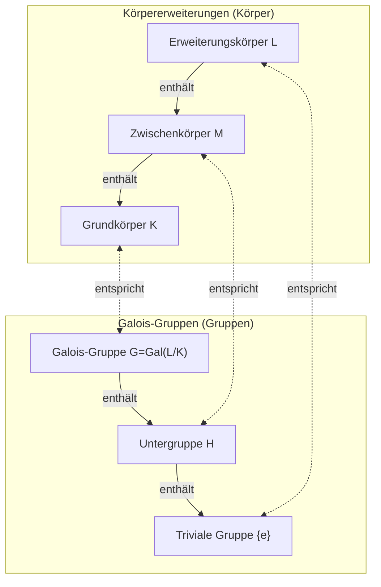

In der Geschichte der Mathematik gibt es nur wenige, deren Leben so dramatisch und tragisch verlief wie das von [Évariste Galois](https://kenji.blog/de/p/galois/) (1811–1832). Dieser junge Franzose, der im Alter von nur 20 Jahren in einem Duell sein Leben verlor, legte in einem Brief, den er am Vorabend seines Todes schrieb, den Grundstein für eine großartige Theorie, die die nachfolgende Mathematik grundlegend verändern sollte. In diesem Artikel tauchen wir tief in das turbulente Leben von Galois und sein größtes Erbe, die **[Galois](https://kenji.blog/de/p/galois/)-Theorie**, ein.

## 1. Ein turbulentes Leben: Leidenschaft und Frustration

### Frühes Leben und das Erwachen der Mathematik

[Évariste Galois](https://kenji.blog/de/p/galois/) wurde 1811 in Bourg-la-Reine, einem Vorort von Paris, geboren. Sein Vater war ein gebildeter Republikaner, der später als Bürgermeister der Stadt diente. Zunächst von seiner Mutter unterrichtet, trat [Galois](https://kenji.blog/de/p/galois/) im Alter von 12 Jahren in das Lycée Louis-le-Grand in Paris ein.

Das Schulleben am Lycée war für ihn langweilig, aber sein Leben veränderte sich im Alter von 15 Jahren grundlegend, als er [Legendre](https://kenji.blog/de/p/legendre/)s *Éléments de Géométrie* entdeckte. Es wird gesagt, dass Galois dieses schwierige Buch innerhalb von Tagen las, als würde er einen Roman lesen. Von da an ignorierte er normale Lehrbücher und begann, die Schriften der größten Mathematiker der Zeit, wie Lagrange und [Cauchy](https://kenji.blog/de/p/cauchy/), zu verschlingen.

### Herausforderungen und Misserfolge an der École Polytechnique

[Galois](https://kenji.blog/de/p/galois/) wollte unbedingt in die École Polytechnique eintreten, die höchste akademische Einrichtung, in der sich damals die besten Mathematiker Frankreichs versammelten. Er ist jedoch **zweimal durch die Aufnahmeprüfung gefallen**.

Das erste Scheitern war auf mangelnde Vorbereitung zurückzuführen, aber das zweite war tragischer. Die Legende besagt, dass der Prüfer die tiefe mathematische Intuition von [Galois](https://kenji.blog/de/p/galois/) nicht verstehen konnte und ein irritierter [Galois](https://kenji.blog/de/p/galois/) einen Tafelwischer (oder einen Lappen) nach dem Prüfer warf. Erschwerend kam hinzu, dass er kurz vor diesem zweiten Versuch die Tragödie erlebte, dass sein geliebter Vater nach Verstrickungen in eine politische Verschwörung Selbstmord beging.

Letztendlich schrieb er sich an der École Normale ein, die als eine Stufe unter der École Polytechnique angesehen wurde.

### Verlorene Papiere und die Ignoranz der Akademie

[Galois](https://kenji.blog/de/p/galois/) fasste seine mathematischen Entdeckungen in Arbeiten zusammen und reichte sie bei der französischen Akademie der Wissenschaften ein. Es folgte jedoch eine Reihe unglücklicher Ereignisse.

Die erste eingereichte Arbeit fiel in die Hände des großen Mathematikers [Cauchy](https://kenji.blog/de/p/cauchy/), der sie verlor (oder, wie einige sagen, zurückgab und [Galois](https://kenji.blog/de/p/galois/) riet, sie in eine andere Arbeit einzubauen). Die nächste eingereichte Arbeit wurde an Fourier geschickt, aber Fourier starb kurz darauf plötzlich, und das Papier verschwand erneut.

Die dritte eingereichte Arbeit wurde von Poisson überprüft, aber mit der Begründung abgelehnt, dass "sein Beweis unklar und unverständlich ist". Die Theorie von [Galois](https://kenji.blog/de/p/galois/) war ihrer Zeit so weit voraus, dass die zeitgenössischen Mathematiker ihren wahren Wert nicht verstehen konnten.

### Politischer Aktivismus und Inhaftierung

Die Ära befand sich mitten in der "Julirevolution" von 1830. Als glühender Republikaner engagierte sich [Galois](https://kenji.blog/de/p/galois/) stark in der revolutionären Bewegung. Der opportunistische Direktor der École Normale verbot den Studenten jedoch die Teilnahme an der Revolution. Da [Galois](https://kenji.blog/de/p/galois/) den Direktor öffentlich kritisierte, wurde er von der Schule verwiesen.

Danach trat er der Artillerie der Nationalgarde bei, wurde jedoch aufgrund seiner radikalen politischen Aktivitäten verhaftet und inhaftiert. Selbst im Gefängnis setzte er seine mathematischen Forschungen fort, aber er war körperlich und geistig erschöpft.

### Das tödliche Duell und sein Testament

Im Jahr 1832 verliebte sich [Galois](https://kenji.blog/de/p/galois/), der aufgrund einer Cholera-Epidemie auf Bewährung freigelassen worden war, in eine Frau (Stéphanie-Félicie). Aufgrund dieser romantischen Beziehung wurde er jedoch zu einem Duell herausgefordert. Der Gegner und die genauen Gründe für das Duell bleiben bis heute in ein Geheimnis gehüllt, wobei die Theorien von einer politischen Verschwörung bis zu einer romantischen Verstrickung reichen.

Am Vorabend des Duells, im Vorahnung seines Todes, schrieb [Galois](https://kenji.blog/de/p/galois/) einen langen Brief an seinen engen Freund Auguste Chevalier, in dem er seine mathematischen Entdeckungen festhielt. Am Rand dieses Briefes hinterließ er die herzzerreißenden Worte: "Ich habe keine Zeit."

Am nächsten Morgen, dem 30. Mai 1832, wurde [Galois](https://kenji.blog/de/p/galois/) in den Bauch geschossen und starb am folgenden Tag. Er war 20 Jahre alt. Seine letzten Worte an seinen weinenden jüngeren Bruder waren: "Weine nicht. Ich brauche all meinen Mut, um mit zwanzig Jahren zu sterben."

## 2. Mathematische Errungenschaften: Was ist die [Galois](https://kenji.blog/de/p/galois/)-Theorie?

Das größte Erbe von [Galois](https://kenji.blog/de/p/galois/) ist das, was heute als **[Galois](https://kenji.blog/de/p/galois/)-Theorie** bezeichnet wird. Diese lieferte eine vollständige und grundlegende Antwort auf ein langjähriges mathematisches Problem: "Warum können Gleichungen vom Grad 5 oder höher nicht algebraisch gelöst werden?"

### Gleichungswurzeln und Symmetrie

Es gibt eine berühmte "Mitternachtsformel" für quadratische Gleichungen. Auch für kubische und quartische Gleichungen gibt es Wurzelformeln, wenn auch komplexere (entdeckt von Cardano und Ferrari). Für Gleichungen fünften Grades kämpften viele Mathematiker jahrhundertelang darum, eine Formel zu finden, aber niemand hatte Erfolg.

Im frühen 19. Jahrhundert bewiesen Ruffini und [Abel](https://kenji.blog/de/p/abel/), dass "es keine Formel für allgemeine Gleichungen vom Grad 5 oder höher gibt, die nur die vier Grundrechenarten und das Ziehen von Wurzeln (Radikalen) verwendet" (der Satz von [Abel](https://kenji.blog/de/p/abel/)-Ruffini). Die tieferen Strukturen wie "Welche Art von Gleichungen können dann gelöst werden?" und "Warum können sie nicht gelöst werden, wenn der Grad 5 oder höher ist?" blieben jedoch ungeklärt.

[Galois](https://kenji.blog/de/p/galois/) konzentrierte sich auf die **Symmetrie**, die sich hinter den Wurzeln einer Gleichung verbirgt. Er betrachtete die Sammlung von Operationen, die die Wurzeln permutieren (was wir heute eine **Gruppe** nennen), und entdeckte, dass die Untersuchung der Struktur dieser Gruppe bestimmt, ob eine Gleichung lösbar ist.

### Gruppen und Körper: Die [Galois](https://kenji.blog/de/p/galois/)-Korrespondenz

Der Kern der [Galois](https://kenji.blog/de/p/galois/)-Theorie besteht darin, zu zeigen, dass eine wunderbare Korrespondenz zwischen zwei scheinbar völlig unterschiedlichen mathematischen Objekten besteht: "Körpern" und "Gruppen".

- **Körper (Field)**: Eine Menge von Zahlen, bei der die vier Grundrechenarten (Addition, Subtraktion, Multiplikation, Division) frei durchgeführt werden können. Er repräsentiert die Ausdehnung des Raumes, der die Koeffizienten und Wurzeln einer Gleichung enthält.
- **Gruppe (Group)**: Eine Sammlung von Symmetrien oder Transformationen. Sie repräsentiert die Struktur der Operationen (Automorphismen), die die Wurzeln einer Gleichung permutieren.

[Galois](https://kenji.blog/de/p/galois/) bewies, dass es eine Eins-zu-eins-Korrespondenz (die **Galois-Korrespondenz**) gibt zwischen den Zwischenkörpern einer Körpererweiterung, die alle Wurzeln einer Gleichung enthält (eine Galois-Erweiterung), und den Untergruppen der [Galois](https://kenji.blog/de/p/galois/)-Gruppe, die die Symmetrien dieser Erweiterung darstellt.

Unten sehen Sie ein Diagramm (Mermaid), das diese wunderbare Korrespondenz veranschaulicht.

Wie dieses Diagramm zeigt, entspricht die Vergrößerung des Körpers (von unten nach oben) der Verkleinerung der Gruppe (von unten nach oben). Durch Nutzung dieser Beziehung wurde es möglich, komplexe Körperstrukturen in handlichere Gruppenstrukturen für die Untersuchung zu übersetzen.

### Bedingungen für die Lösbarkeit durch Radikale

[Galois](https://kenji.blog/de/p/galois/) charakterisierte die notwendige und hinreichende Bedingung dafür, dass eine Gleichung durch Grundrechenarten und Radikale gelöst werden kann (algebraisch lösbar ist), als Eigenschaft der zugehörigen Galois-Gruppe. Insbesondere zeigte er, dass die Lösbarkeit einer Gleichung äquivalent dazu ist, dass ihre [Galois](https://kenji.blog/de/p/galois/)-Gruppe eine **auflösbare Gruppe** ist.

$$
\text{Die Gleichung ist algebraisch lösbar} \iff \text{Die [Galois](https://kenji.blog/de/p/galois/)-Gruppe ist auflösbar}
$$

Die [Galois](https://kenji.blog/de/p/galois/)-Gruppe einer allgemeinen Gleichung vom Grad $n$ ist die symmetrische Gruppe $S_n$, die eine Sammlung von Permutationen von $n$ Buchstaben ist. Eine wichtige Tatsache in der Gruppentheorie ist, dass für $n \ge 5$ die alternierende Gruppe $A_n$, die eine Untergruppe der symmetrischen Gruppe $S_n$ ist, eine **einfache Gruppe** und nicht kommutativ wird. Mit anderen Worten: Die symmetrische Gruppe $S_n$ für $n \ge 5$ ist keine auflösbare Gruppe.

So wurde die Tatsache, dass "allgemeine Gleichungen vom Grad 5 oder höher nicht algebraisch gelöst werden können", aus der höchst klaren Perspektive der Gruppenstruktur vollständig bewiesen.

## 3. Das Vermächtnis von [Galois](https://kenji.blog/de/p/galois/) und sein Einfluss auf die moderne Mathematik

Nach dem Tod von [Galois](https://kenji.blog/de/p/galois/) wurden seine Briefe von seinem engen Freund Chevalier aufbewahrt und allmählich unter Mathematikern bekannt. Im Jahr 1846 organisierte dann der französische Mathematiker Joseph Liouville die Schriften von Galois und veröffentlichte sie in einer mathematischen Zeitschrift mit eigenen Kommentaren, womit die [Galois](https://kenji.blog/de/p/galois/)-Theorie schließlich ans Licht gebracht wurde.

Das von [Galois](https://kenji.blog/de/p/galois/) eingeführte Konzept der "Gruppe" wurde in der Folge nicht nur zur Grundsprache der Algebra, sondern aller wissenschaftlichen Bereiche, einschließlich der Geometrie, der Topologie und der Physik (wie der Teilchenphysik und der Kristallographie). Heute ist die abstrakte Algebra, die algebraische Systeme wie "[Gruppen, Ringe und Körper](https://kenji.blog/de/p/groups-rings-and-fields/)" untersucht, zu einer der wichtigsten Säulen der modernen Mathematik geworden.

[Évariste Galois](https://kenji.blog/de/p/galois/) verstarb im jungen Alter von 20 Jahren. Das monumentale Werk, das er in seinem kurzen Leben geschaffen hat, ist jedoch selbst nach fast 200 Jahren nicht verblasst und strahlt weiterhin ein starkes Licht aus, das die Tiefen der modernen Mathematik beleuchtet. Seine letzten Worte: "Ich habe keine Zeit", scheinen uns stark mit der Grenzenlosigkeit des menschlichen Intellekts und der Kürze des Lebens zu konfrontieren.
