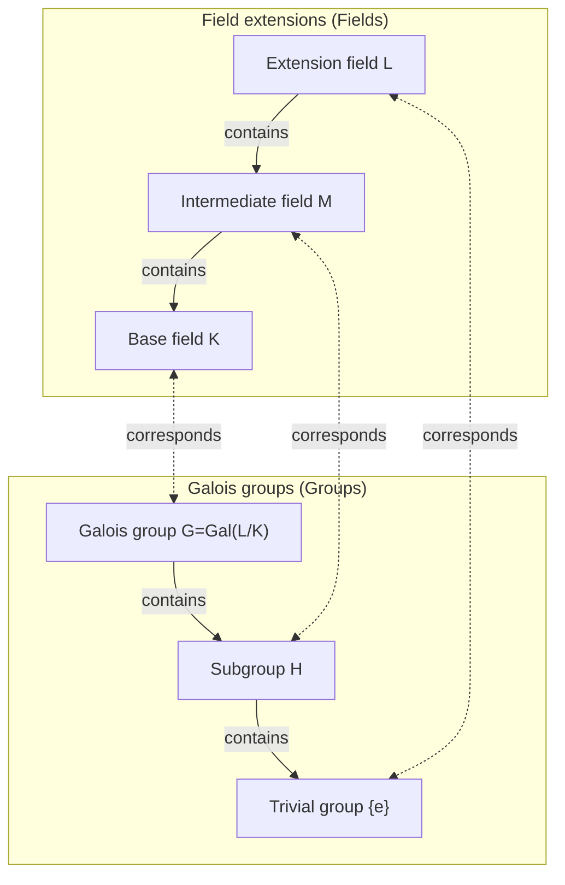

In the history of mathematics, few have led a life as dramatic and tragic as [Évariste Galois](https://kenji.blog/en/p/galois/) (1811–1832). This young Frenchman, who lost his life in a duel at the tender age of 20, laid the foundations for a magnificent theory that would fundamentally change subsequent mathematics in a letter written on the eve of his death. In this article, we delve deeply into [Galois](https://kenji.blog/en/p/galois/)'s turbulent life and his greatest legacy, **[Galois Theory](https://kenji.blog/en/p/galois-theory/)**.

## 1. A Turbulent Life: Passion and Frustration

### Early Life and Awakening to Mathematics

[Évariste Galois](https://kenji.blog/en/p/galois/) was born in 1811 in Bourg-la-Reine, a suburb of Paris. His father was an educated Republican who later served as the town's mayor. Initially educated by his mother, [Galois](https://kenji.blog/en/p/galois/) entered the Lycée Louis-le-Grand in Paris at the age of 12.

School life at the lycée was boring for him, but his life changed completely at the age of 15 when he encountered [Legendre](https://kenji.blog/en/p/legendre/)'s *Éléments de Géométrie*. It is said that [Galois](https://kenji.blog/en/p/galois/) read this difficult book in a matter of days, as if reading a novel. From then on, he ignored normal textbooks and began devouring the papers of the greatest mathematicians of the time, such as [Lagrange](https://kenji.blog/en/p/lagrange/) and [Cauchy](https://kenji.blog/en/p/cauchy/).

### Challenges and Failures at the École Polytechnique

[Galois](https://kenji.blog/en/p/galois/) desperately wanted to enter the École Polytechnique, the highest academic institution where the best mathematicians in France gathered at the time. However, he **failed the entrance examination twice**.

The first failure was due to a lack of preparation, but the second was more tragic. Legend has it that the examiner could not understand [Galois](https://kenji.blog/en/p/galois/)'s deep mathematical intuition, and an irritated [Galois](https://kenji.blog/en/p/galois/) threw a blackboard eraser (or a rag) at the examiner. To make matters worse, just before this second attempt, he suffered the tragedy of his beloved father committing suicide after being entangled in a political conspiracy.

Ultimately, he enrolled in the École Normale, which was considered a step down from the École Polytechnique.

### Lost Papers and Being Ignored by the Academy

[Galois](https://kenji.blog/en/p/galois/) summarized his mathematical discoveries in papers and submitted them to the French Academy of Sciences. However, a series of unfortunate events followed.

The first paper submitted fell into the hands of the great mathematician [Cauchy](https://kenji.blog/en/p/cauchy/), who lost it (or, as some say, returned it advising [Galois](https://kenji.blog/en/p/galois/) to incorporate it into another paper). The next paper submitted was sent to Fourier, but Fourier died suddenly shortly after, and the paper once again went missing.

The third paper submitted was reviewed by Poisson but was rejected on the grounds that "his proof is unclear and incomprehensible." [Galois](https://kenji.blog/en/p/galois/)'s theory was so far ahead of its time that contemporary mathematicians could not understand its true value.

### Political Activism and Imprisonment

The era was right in the middle of the "July Revolution" of 1830. An ardent Republican, [Galois](https://kenji.blog/en/p/galois/) became deeply involved in the revolutionary movement. However, the opportunistic director of the École Normale forbade students from participating in the revolution. Because [Galois](https://kenji.blog/en/p/galois/) publicly criticized the director, he was expelled from the school.

Afterward, he joined the artillery of the National Guard, but due to his radical political activities, he was arrested and imprisoned. Even in prison, he continued his mathematical research, but he became physically and mentally exhausted.

### The Fatal Duel and His Will

In 1832, [Galois](https://kenji.blog/en/p/galois/), paroled due to a cholera epidemic, fell in love with a woman (Stéphanie-Félicie). However, because of this romantic relationship, he was challenged to a duel. The opponent and exact reasons for the duel remain shrouded in mystery today, with theories ranging from a political conspiracy to a romantic entanglement.

On the eve of the duel, having a premonition of his death, [Galois](https://kenji.blog/en/p/galois/) wrote a long letter to his close friend Auguste Chevalier, writing down his mathematical discoveries. In the margins of that letter, he left the heartbreaking words, "I have not the time."

The next morning, May 30, 1832, [Galois](https://kenji.blog/en/p/galois/) was shot in the abdomen and died the following day. He was 20 years old. His last words to his weeping younger brother were, "Don't cry. I need all my courage to die at twenty."

## 2. Mathematical Achievements: What is [Galois Theory](https://kenji.blog/en/p/galois-theory/)?

[Galois](https://kenji.blog/en/p/galois/)'s greatest legacy is what is now called **[Galois Theory](https://kenji.blog/en/p/galois-theory/)**. This provided a complete and fundamental answer to a long-standing mathematical problem: "Why can't equations of degree 5 or higher be solved algebraically?"

### Equation Roots and Symmetry

There is a famous "quadratic formula" for quadratic equations. Cubic and quartic equations also have roots formulas, albeit more complex (discovered by Cardano and Ferrari). However, for quintic equations, many mathematicians struggled for centuries to find a formula, but no one succeeded.

In the early 19th century, Ruffini and [Abel](https://kenji.blog/en/p/abel/) proved that "there is no formula for general equations of degree 5 or higher using only the four basic arithmetic operations and root extractions (radicals)" (the [Abel](https://kenji.blog/en/p/abel/)-Ruffini theorem). However, the deeper structures such as "Then what kind of equations can be solved?" and "Why can't they be solved when the degree is 5 or higher?" remained unexplained.

[Galois](https://kenji.blog/en/p/galois/) focused on the **symmetry** hidden behind the roots of an equation. He considered the collection of operations that permute the roots (what we call a **group** today) and discovered that investigating the structure of that group determines whether an equation is solvable.

### Groups and Fields: [Galois](https://kenji.blog/en/p/galois/) Correspondence

The core of [Galois Theory](https://kenji.blog/en/p/galois-theory/) lies in showing that a beautiful correspondence exists between two seemingly completely different mathematical objects: "Fields" and "Groups."

- **Field**: A set of numbers where the four basic arithmetic operations (addition, subtraction, multiplication, division) can be performed freely. It represents the expanse of the space containing the coefficients and roots of an equation.
- **Group**: A collection of symmetries or transformations. It represents the structure of the operations (automorphisms) that permute the roots of an equation.

[Galois](https://kenji.blog/en/p/galois/) proved that there is a one-to-one correspondence ( **[Galois](https://kenji.blog/en/p/galois/) correspondence** ) between the intermediate fields of a field extension containing all roots of an equation (a [Galois](https://kenji.blog/en/p/galois/) extension) and the subgroups of the [Galois](https://kenji.blog/en/p/galois/) group representing the symmetries of that extension.

Below is a diagram (Mermaid) illustrating this beautiful correspondence.

As this diagram shows, the field becoming larger (from bottom to top) corresponds to the group becoming smaller (from bottom to top). By utilizing this relationship, it became possible to translate complex field structures into more manageable group structures for investigation.

### Conditions for Solvability by Radicals

[Galois](https://kenji.blog/en/p/galois/) characterized the necessary and sufficient condition for an equation to be solved by basic arithmetic operations and radicals (algebraically solvable) as a property of its corresponding [Galois](https://kenji.blog/en/p/galois/) group. Specifically, he showed that an equation being solvable is equivalent to its [Galois](https://kenji.blog/en/p/galois/) group being a **solvable group**.

$$
\text{Equation is solvable algebraically} \iff \text{[Galois](https://kenji.blog/en/p/galois/) group is a solvable group}
$$

The [Galois](https://kenji.blog/en/p/galois/) group of a general equation of degree $n$ is the symmetric group $S_n$, which is a collection of permutations of $n$ letters. An important fact in group theory is that for $n \ge 5$, the alternating group $A_n$, which is a subgroup of the symmetric group $S_n$, becomes a **simple group** and is non-commutative. In other words, the symmetric group $S_n$ for $n \ge 5$ is not a solvable group.

Thus, the fact that "general equations of degree 5 or higher cannot be solved algebraically" was completely proven from the highly clear perspective of group structure.

## 3. [Galois](https://kenji.blog/en/p/galois/)'s Legacy and Impact on Modern Mathematics

After [Galois](https://kenji.blog/en/p/galois/)'s death, his letters were kept by his close friend Chevalier and gradually became known among mathematicians. Then in 1846, French mathematician Joseph [Liouville](https://kenji.blog/en/p/liouville/) organized [Galois](https://kenji.blog/en/p/galois/)'s papers and published them in a mathematical journal with his own commentary, finally bringing [Galois](https://kenji.blog/en/p/galois/)'s theory to light.

The concept of "group" introduced by [Galois](https://kenji.blog/en/p/galois/) subsequently became the foundational language not only for algebra but for all scientific fields, including geometry, topology, and physics (such as particle physics and crystallography). Today, abstract algebra, which studies algebraic systems like "groups, rings, and fields," has become one of the most important pillars of modern mathematics.

[Évariste Galois](https://kenji.blog/en/p/galois/) passed away at the young age of 20. However, the monumental achievement he established during his short life has not faded even after nearly 200 years, and it continues to shine a powerful light illuminating the depths of modern mathematics. His dying words, "I have not the time," seem to strongly confront us with the boundlessness of human intellect and the brevity of life.
