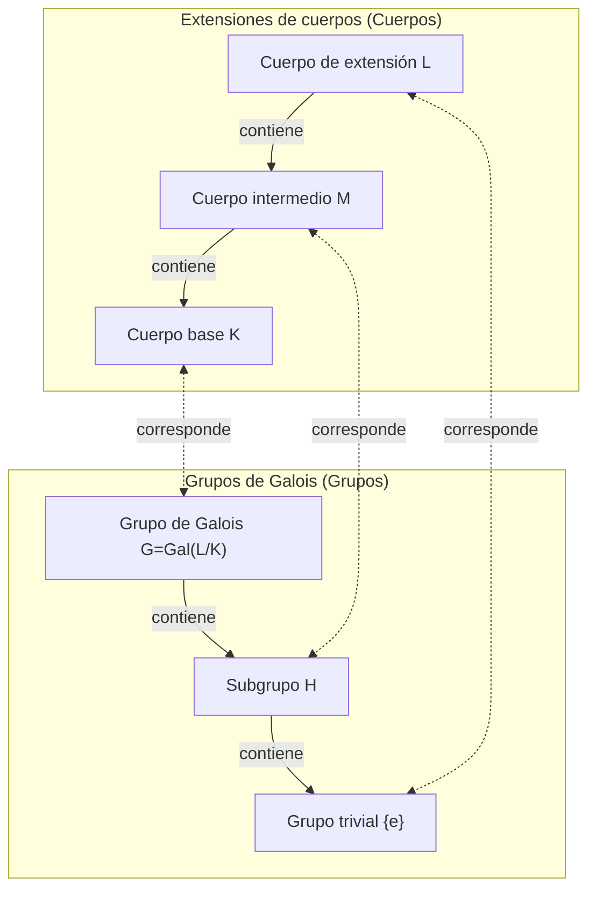

En la historia de las matemáticas, pocos han llevado una vida tan dramática y trágica como [Évariste Galois](https://kenji.blog/p/galois/) (1811-1832). Este joven francés, que perdió la vida en un duelo a la temprana edad de 20 años, sentó las bases de una magnífica teoría que cambiaría fundamentalmente las matemáticas posteriores en una carta escrita en la víspera de su muerte. En este artículo, profundizamos en la turbulenta vida de Galois y su mayor legado, la **Teoría de Galois**.

## 1. Una vida turbulenta: Pasión y frustración

### Vida temprana y despertar a las matemáticas

[Évariste Galois](https://kenji.blog/p/galois/) nació en 1811 en Bourg-la-Reine, un suburbio de París. Su padre era un republicano educado que más tarde se desempeñó como alcalde de la ciudad. Inicialmente educado por su madre, Galois ingresó al Lycée Louis-le-Grand en París a la edad de 12 años.

La vida escolar en el liceo era aburrida para él, pero su vida cambió por completo a la edad de 15 años cuando descubrió los *Éléments de Géométrie* de Legendre. Se dice que Galois leyó este difícil libro en cuestión de días, como si estuviera leyendo una novela. A partir de entonces, ignoró los libros de texto normales y comenzó a devorar los escritos de los matemáticos más grandes de la época, como Lagrange y Cauchy.

### Desafíos y fracasos en la École Polytechnique

Galois quería desesperadamente ingresar a la École Polytechnique, la institución académica más alta donde se reunían los mejores matemáticos de Francia en ese momento. Sin embargo, **fracasó dos veces en el examen de ingreso**.

El primer fracaso se debió a la falta de preparación, pero el segundo fue más trágico. La leyenda dice que el examinador no pudo entender la profunda intuición matemática de Galois, y un Galois irritado le arrojó un borrador de pizarra (o un trapo) al examinador. Para empeorar las cosas, justo antes de este segundo intento, sufrió la tragedia del suicidio de su amado padre tras verse envuelto en una conspiración política.

En última instancia, se inscribió en la École Normale, que se consideraba un escalón por debajo de la École Polytechnique.

### Papeles perdidos y el desprecio de la Academia

Galois resumió sus descubrimientos matemáticos en artículos y los presentó a la Academia de Ciencias de Francia. Sin embargo, siguió una serie de eventos desafortunados.

El primer artículo presentado cayó en manos del gran matemático Cauchy, quien lo perdió (o, como dicen algunos, lo devolvió aconsejando a Galois que lo incorporara en otro artículo). El siguiente artículo presentado fue enviado a Fourier, pero Fourier murió repentinamente poco después, y el documento volvió a desaparecer.

El tercer artículo presentado fue revisado por Poisson, pero fue rechazado argumentando que "su demostración es poco clara e incomprensible". La teoría de Galois estaba tan adelantada a su tiempo que los matemáticos contemporáneos no podían entender su verdadero valor.

### Activismo político y encarcelamiento

La época estaba en medio de la "Revolución de Julio" de 1830. Un ardiente republicano, Galois se involucró profundamente en el movimiento revolucionario. Sin embargo, el director oportunista de la École Normale prohibió a los estudiantes participar en la revolución. Debido a que Galois criticó públicamente al director, fue expulsado de la escuela.

Posteriormente, se unió a la artillería de la Guardia Nacional, pero debido a sus actividades políticas radicales, fue arrestado y encarcelado. Incluso en prisión, continuó su investigación matemática, pero se agotó física y mentalmente.

### El duelo fatal y su testamento

En 1832, Galois, en libertad condicional debido a una epidemia de cólera, se enamoró de una mujer (Stéphanie-Félicie). Sin embargo, debido a esta relación romántica, fue retado a un duelo. El oponente y las razones exactas del duelo siguen siendo un misterio hoy en día, con teorías que van desde una conspiración política hasta un enredo amoroso.

En la víspera del duelo, teniendo la premonición de su muerte, Galois escribió una larga carta a su amigo cercano Auguste Chevalier, anotando sus descubrimientos matemáticos. En los márgenes de esa carta, dejó las desgarradoras palabras: "No tengo tiempo".

A la mañana siguiente, el 30 de mayo de 1832, Galois recibió un disparo en el abdomen y murió al día siguiente. Tenía 20 años. Sus últimas palabras a su hermano menor que lloraba fueron: "No llores. Necesito todo mi coraje para morir a los veinte".

## 2. Logros matemáticos: ¿Qué es la Teoría de Galois?

El mayor legado de Galois es lo que ahora se llama la **Teoría de Galois**. Esta proporcionó una respuesta completa y fundamental a un problema matemático de larga data: "¿Por qué las ecuaciones de grado 5 o superior no pueden resolverse algebraicamente?"

### Raíces de ecuaciones y simetría

Existe una famosa "fórmula cuadrática" para las ecuaciones de segundo grado. Las ecuaciones cúbicas y cuárticas también tienen fórmulas de raíces, aunque más complejas (descubiertas por Cardano y Ferrari). Sin embargo, para las ecuaciones quínticas, muchos matemáticos lucharon durante siglos para encontrar una fórmula, pero nadie tuvo éxito.

A principios del siglo XIX, Ruffini y Abel demostraron que "no existe una fórmula para las ecuaciones generales de grado 5 o superior utilizando solo las cuatro operaciones aritméticas básicas y la extracción de raíces (radicales)" (el teorema de Abel-Ruffini). Sin embargo, las estructuras más profundas como "Entonces, ¿qué tipo de ecuaciones se pueden resolver?" y "¿Por qué no se pueden resolver cuando el grado es 5 o superior?" permanecieron sin explicación.

Galois se centró en la **simetría** escondida detrás de las raíces de una ecuación. Consideró el conjunto de operaciones que permutan las raíces (lo que hoy llamamos un **grupo**) y descubrió que investigar la estructura de ese grupo determina si una ecuación tiene solución.

### Grupos y cuerpos: La correspondencia de Galois

El núcleo de la Teoría de Galois radica en mostrar que existe una hermosa correspondencia entre dos objetos matemáticos aparentemente completamente diferentes: los "Cuerpos" (Campos) y los "Grupos".

- **Cuerpo (Field)**: Un conjunto de números donde las cuatro operaciones aritméticas básicas (suma, resta, multiplicación, división) se pueden realizar libremente. Representa la extensión del espacio que contiene los coeficientes y las raíces de una ecuación.
- **Grupo (Group)**: Una colección de simetrías o transformaciones. Representa la estructura de las operaciones (automorfismos) que permutan las raíces de una ecuación.

Galois demostró que existe una correspondencia uno a uno (la **correspondencia de Galois**) entre los cuerpos intermedios de una extensión de cuerpo que contiene todas las raíces de una ecuación (una extensión de Galois) y los subgrupos del grupo de Galois que representan las simetrías de esa extensión.

A continuación se muestra un diagrama (Mermaid) que ilustra esta hermosa correspondencia.

Como muestra este diagrama, el hecho de que el cuerpo se vuelva más grande (de abajo hacia arriba) se corresponde con el grupo volviéndose más pequeño (de abajo hacia arriba). Al utilizar esta relación, fue posible traducir estructuras complejas de cuerpos en estructuras de grupos más manejables para la investigación.

### Condiciones para la resolubilidad por radicales

Galois caracterizó la condición necesaria y suficiente para que una ecuación sea resuelta por operaciones aritméticas básicas y radicales (algebráicamente soluble) como una propiedad de su grupo de Galois correspondiente. Específicamente, demostró que el hecho de que una ecuación sea resoluble es equivalente a que su grupo de Galois sea un **grupo soluble**.

$$
\text{La ecuación es resoluble algebraicamente} \iff \text{El grupo de Galois es un grupo soluble}
$$

El grupo de Galois de una ecuación general de grado $n$ es el grupo simétrico $S_n$, que es una colección de permutaciones de $n$ letras. Un hecho importante en la teoría de grupos es que para $n \ge 5$, el grupo alternante $A_n$, que es un subgrupo del grupo simétrico $S_n$, se convierte en un **grupo simple** y no es conmutativo. En otras palabras, el grupo simétrico $S_n$ para $n \ge 5$ no es un grupo soluble.

Así, el hecho de que "las ecuaciones generales de grado 5 o superior no pueden resolverse algebraicamente" quedó completamente demostrado desde la clarísima perspectiva de la estructura de grupos.

## 3. El legado de Galois y su impacto en las matemáticas modernas

Después de la muerte de Galois, sus cartas fueron guardadas por su amigo cercano Chevalier y gradualmente se hicieron conocidas entre los matemáticos. Luego, en 1846, el matemático francés Joseph Liouville organizó los escritos de Galois y los publicó en una revista matemática con sus propios comentarios, sacando finalmente a la luz la teoría de Galois.

El concepto de "grupo" introducido por Galois se convirtió posteriormente en el lenguaje fundamental no solo para el álgebra, sino para todos los campos científicos, incluyendo la geometría, la topología y la física (como la física de partículas y la cristalografía). Hoy en día, el álgebra abstracta, que estudia sistemas algebraicos como "grupos, anillos y cuerpos", se ha convertido en uno de los pilares más importantes de las matemáticas modernas.

[Évariste Galois](https://kenji.blog/p/galois/) falleció a la temprana edad de 20 años. Sin embargo, el logro monumental que estableció durante su corta vida no se ha desvanecido incluso después de casi 200 años, y continúa brillando con una poderosa luz iluminando las profundidades de las matemáticas modernas. Sus últimas palabras, "No tengo tiempo", parecen confrontarnos fuertemente con la infinidad del intelecto humano y la brevedad de la vida.
