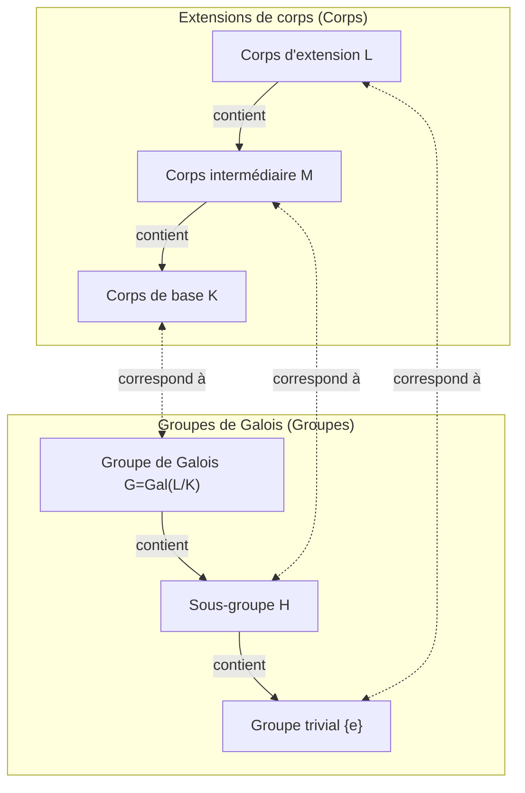

Dans l'histoire des mathématiques, rares sont ceux qui ont mené une vie aussi dramatique et tragique qu'[Évariste Galois](https://kenji.blog/fr/p/galois/) (1811–1832). Ce jeune Français, qui a perdu la vie dans un duel à l'âge de 20 ans, a posé les bases d'une théorie magnifique qui allait changer fondamentalement les mathématiques ultérieures dans une lettre écrite à la veille de sa mort. Dans cet article, nous nous pencherons sur la vie tumultueuse de [Galois](https://kenji.blog/fr/p/galois/) et sur son plus grand héritage, la **théorie de [Galois](https://kenji.blog/fr/p/galois/)**.

## 1. Une vie tumultueuse : Passion et frustration

### Jeunesse et éveil aux mathématiques

[Évariste Galois](https://kenji.blog/fr/p/galois/) est né en 1811 à Bourg-la-Reine, en banlieue parisienne. Son père était un républicain cultivé qui fut plus tard maire de la ville. Initialement éduqué par sa mère, [Galois](https://kenji.blog/fr/p/galois/) est entré au Lycée Louis-le-Grand à Paris à l'âge de 12 ans.

La vie scolaire au lycée l'ennuyait, mais sa vie a complètement changé à l'âge de 15 ans lorsqu'il a découvert les *Éléments de Géométrie* de [Legendre](https://kenji.blog/fr/p/legendre/). On dit que [Galois](https://kenji.blog/fr/p/galois/) a lu ce livre difficile en quelques jours, comme s'il lisait un roman. Dès lors, il a ignoré les manuels scolaires normaux et a commencé à dévorer les articles des plus grands mathématiciens de l'époque, tels que [Lagrange](https://kenji.blog/fr/p/lagrange/) et [Cauchy](https://kenji.blog/fr/p/cauchy/).

### Défis et échecs à l'École polytechnique

[Galois](https://kenji.blog/fr/p/galois/) souhaitait désespérément entrer à l'École polytechnique, la plus haute institution académique où se réunissaient les meilleurs mathématiciens de France à l'époque. Cependant, il a **échoué deux fois à l'examen d'entrée**.

Le premier échec était dû à un manque de préparation, mais le second fut plus tragique. La légende raconte que l'examinateur n'a pas pu comprendre la profonde intuition mathématique de [Galois](https://kenji.blog/fr/p/galois/), et que ce dernier, irrité, lui a jeté un effaceur (ou un chiffon). Pour ne rien arranger, juste avant cette seconde tentative, il a subi la tragédie du suicide de son père bien-aimé après s'être retrouvé mêlé à un complot politique.

Finalement, il s'est inscrit à l'École normale, considérée comme un cran en dessous de l'École polytechnique.

### Papiers perdus et ignorance par l'Académie

[Galois](https://kenji.blog/fr/p/galois/) a résumé ses découvertes mathématiques dans des articles et les a soumis à l'Académie des sciences française. Cependant, une série d'événements malheureux a suivi.

Le premier article soumis est tombé entre les mains du grand mathématicien [Cauchy](https://kenji.blog/fr/p/cauchy/), qui l'a perdu (ou, selon certains, l'a rendu en conseillant à [Galois](https://kenji.blog/fr/p/galois/) de l'intégrer à un autre article). L'article suivant a été envoyé à Fourier, mais ce dernier est mort subitement peu après, et l'article a de nouveau disparu.

Le troisième article soumis a été examiné par Poisson, mais a été rejeté au motif que "sa démonstration est obscure et incompréhensible". La théorie de [Galois](https://kenji.blog/fr/p/galois/) était tellement en avance sur son temps que les mathématiciens contemporains ne pouvaient pas en comprendre la véritable valeur.

### Activisme politique et emprisonnement

L'époque était en plein milieu de la "Révolution de Juillet" de 1830. Fervent républicain, [Galois](https://kenji.blog/fr/p/galois/) s'est profondément impliqué dans le mouvement révolutionnaire. Cependant, le directeur opportuniste de l'École normale a interdit aux étudiants de participer à la révolution. Parce que [Galois](https://kenji.blog/fr/p/galois/) a publiquement critiqué le directeur, il a été expulsé de l'école.

Par la suite, il a rejoint l'artillerie de la Garde nationale, mais en raison de ses activités politiques radicales, il a été arrêté et emprisonné. Même en prison, il a continué ses recherches mathématiques, mais il est devenu physiquement et mentalement épuisé.

### Le duel fatal et son testament

En 1832, [Galois](https://kenji.blog/fr/p/galois/), libéré sur parole en raison d'une épidémie de choléra, tombe amoureux d'une femme (Stéphanie-Félicie). Cependant, en raison de cette relation amoureuse, il est provoqué en duel. L'adversaire et les raisons exactes du duel restent entourés de mystère aujourd'hui, les théories allant d'un complot politique à une querelle amoureuse.

La veille du duel, ayant le pressentiment de sa mort, [Galois](https://kenji.blog/fr/p/galois/) a écrit une longue lettre à son ami proche Auguste Chevalier, y consignant ses découvertes mathématiques. Dans les marges de cette lettre, il a laissé ces mots déchirants : "Je n'ai pas le temps."

Le lendemain matin, 30 mai 1832, [Galois](https://kenji.blog/fr/p/galois/) a reçu une balle dans l'abdomen et est décédé le jour suivant. Il avait 20 ans. Ses derniers mots à son jeune frère en pleurs furent : "Ne pleure pas, j'ai besoin de tout mon courage pour mourir à vingt ans."

## 2. Réalisations mathématiques : Qu'est-ce que la théorie de [Galois](https://kenji.blog/fr/p/galois/) ?

Le plus grand héritage de [Galois](https://kenji.blog/fr/p/galois/) est ce qu'on appelle aujourd'hui la **théorie de [Galois](https://kenji.blog/fr/p/galois/)**. Celle-ci a apporté une réponse complète et fondamentale à un problème mathématique de longue date : "Pourquoi les équations de degré 5 ou supérieur ne peuvent-elles pas être résolues algébriquement ?"

### Racines des équations et symétrie

Il existe une célèbre "formule quadratique" pour les équations du second degré. Les équations cubiques et quartiques ont également des formules de racines, bien que plus complexes (découvertes par Cardan et Ferrari). Cependant, pour les équations quintiques, de nombreux mathématiciens ont lutté pendant des siècles pour trouver une formule, mais aucun n'a réussi.

Au début du XIXe siècle, Ruffini et [Abel](https://kenji.blog/fr/p/abel/) ont prouvé qu'"il n'y a pas de formule pour les équations générales de degré 5 ou supérieur utilisant uniquement les quatre opérations arithmétiques de base et l'extraction de racines (radicaux)" (théorème d'[Abel](https://kenji.blog/fr/p/abel/)-Ruffini). Cependant, les structures plus profondes telles que "Alors, quel type d'équations peut être résolu ?" et "Pourquoi ne peuvent-elles pas être résolues lorsque le degré est de 5 ou supérieur ?" restaient inexpliquées.

[Galois](https://kenji.blog/fr/p/galois/) s'est concentré sur la **symétrie** cachée derrière les racines d'une équation. Il a considéré l'ensemble des opérations qui permutent les racines (ce que nous appelons aujourd'hui un **groupe**) et a découvert que l'étude de la structure de ce groupe détermine si une équation est résoluble.

### Groupes et corps : Correspondance de [Galois](https://kenji.blog/fr/p/galois/)

Le cœur de la théorie de [Galois](https://kenji.blog/fr/p/galois/) consiste à montrer qu'il existe une belle correspondance entre deux objets mathématiques en apparence complètement différents : les "corps" et les "groupes".

- **Corps (Field)** : Un ensemble de nombres où les quatre opérations arithmétiques de base (addition, soustraction, multiplication, division) peuvent être effectuées librement. Il représente l'étendue de l'espace contenant les coefficients et les racines d'une équation.
- **Groupe (Group)** : Un ensemble de symétries ou de transformations. Il représente la structure des opérations (automorphismes) qui permutent les racines d'une équation.

[Galois](https://kenji.blog/fr/p/galois/) a prouvé qu'il existe une correspondance biunivoque (la **correspondance de [Galois](https://kenji.blog/fr/p/galois/)**) entre les corps intermédiaires d'une extension de corps contenant toutes les racines d'une équation (une extension de [Galois](https://kenji.blog/fr/p/galois/)) et les sous-groupes du groupe de [Galois](https://kenji.blog/fr/p/galois/) représentant les symétries de cette extension.

Voici un diagramme (Mermaid) illustrant cette belle correspondance.

Comme le montre ce diagramme, l'agrandissement du corps (de bas en haut) correspond à la réduction du groupe (de bas en haut). En utilisant cette relation, il est devenu possible de traduire des structures de corps complexes en structures de groupes plus gérables pour l'étude.

### Conditions de résolubilité par radicaux

[Galois](https://kenji.blog/fr/p/galois/) a caractérisé la condition nécessaire et suffisante pour qu'une équation soit résolue par des opérations arithmétiques de base et des radicaux (résoluble algébriquement) comme une propriété de son groupe de [Galois](https://kenji.blog/fr/p/galois/) correspondant. Plus précisément, il a montré qu'une équation est résoluble si et seulement si son groupe de [Galois](https://kenji.blog/fr/p/galois/) est un **groupe résoluble**.

$$
\text{L'équation est résoluble algébriquement} \iff \text{Le groupe de [Galois](https://kenji.blog/fr/p/galois/) est un groupe résoluble}
$$

Le groupe de [Galois](https://kenji.blog/fr/p/galois/) d'une équation générale de degré $n$ est le groupe symétrique $S_n$, qui est un ensemble de permutations de $n$ lettres. Un fait important de la théorie des groupes est que pour $n \ge 5$, le groupe alterné $A_n$, qui est un sous-groupe du groupe symétrique $S_n$, devient un **groupe simple** et est non commutatif. En d'autres termes, le groupe symétrique $S_n$ pour $n \ge 5$ n'est pas un groupe résoluble.

Ainsi, le fait que "les équations générales de degré 5 ou supérieur ne peuvent pas être résolues algébriquement" a été complètement prouvé du point de vue très clair de la structure de groupe.

## 3. L'héritage de [Galois](https://kenji.blog/fr/p/galois/) et son impact sur les mathématiques modernes

Après la mort de [Galois](https://kenji.blog/fr/p/galois/), ses lettres ont été conservées par son ami proche Chevalier et sont progressivement devenues connues des mathématiciens. Puis en 1846, le mathématicien français Joseph [Liouville](https://kenji.blog/fr/p/liouville/) a organisé les articles de [Galois](https://kenji.blog/fr/p/galois/) et les a publiés dans une revue de mathématiques avec ses propres commentaires, mettant enfin la théorie de [Galois](https://kenji.blog/fr/p/galois/) en lumière.

Le concept de "groupe" introduit par [Galois](https://kenji.blog/fr/p/galois/) est devenu par la suite le langage fondamental non seulement de l'algèbre, mais de tous les domaines scientifiques, y compris la géométrie, la topologie et la physique (comme la physique des particules et la cristallographie). Aujourd'hui, l'algèbre abstraite, qui étudie les systèmes algébriques tels que les "groupes, anneaux et corps", est devenue l'un des piliers les plus importants des mathématiques modernes.

[Évariste Galois](https://kenji.blog/fr/p/galois/) est décédé à la fleur de l'âge de 20 ans. Cependant, l'œuvre monumentale qu'il a établie au cours de sa courte vie n'a pas pâli même après près de 200 ans, et continue de briller d'une lumière puissante éclairant les profondeurs des mathématiques modernes. Ses derniers mots, "Je n'ai pas le temps", semblent nous confronter fortement à l'infinité de l'intellect humain et à la brièveté de la vie.
