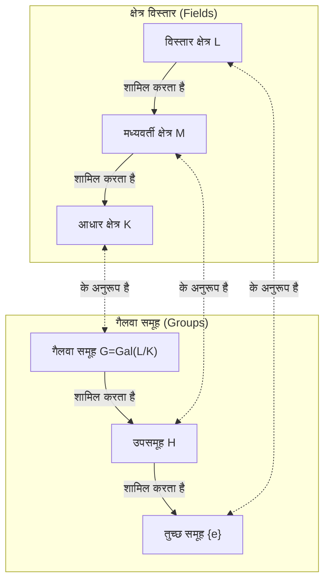

गणित के इतिहास में, एवरिस्ट गैलवा (1811-1832) के समान नाटकीय और दुखद जीवन जीने वाले कम ही लोग हुए हैं। मात्र 20 वर्ष की कोमल आयु में एक द्वंद्वयुद्ध में अपनी जान गंवाने वाले इस युवा फ्रांसीसी ने अपनी मृत्यु की पूर्व संध्या पर लिखे एक पत्र में एक शानदार सिद्धांत की नींव रखी, जो बाद के गणित को मौलिक रूप से बदल देगा। इस लेख में, हम गैलवा के अशांत जीवन और उनकी सबसे बड़ी विरासत, **गैलवा सिद्धांत** में गहराई से गोता लगाते हैं।

## 1. एक अशांत जीवन: जुनून और हताशा

### प्रारंभिक जीवन और गणित के प्रति जागरण

एवरिस्ट गैलवा का जन्म 1811 में पेरिस के एक उपनगर बौर्ग-ला-रेन में हुआ था। उनके पिता एक शिक्षित रिपब्लिकन थे, जिन्होंने बाद में शहर के मेयर के रूप में कार्य किया। प्रारंभ में अपनी माँ द्वारा शिक्षित, गैलवा ने 12 वर्ष की आयु में पेरिस के लाइसी लुई-ले-ग्रैंड में प्रवेश लिया।

लाइसी में स्कूली जीवन उनके लिए उबाऊ था, लेकिन 15 वर्ष की आयु में उनका जीवन पूरी तरह से बदल गया जब उनका सामना लेजेंड्रे की *Éléments de Géométrie* से हुआ। ऐसा कहा जाता है कि गैलवा ने इस कठिन पुस्तक को कुछ ही दिनों में पढ़ लिया, मानो कोई उपन्यास पढ़ रहे हों। उसके बाद से, उन्होंने सामान्य पाठ्यपुस्तकों को नज़रअंदाज़ कर दिया और लैग्रेंज और कॉची जैसे उस समय के महानतम गणितज्ञों के शोध पत्रों को पढ़ना शुरू कर दिया।

### इकोले पॉलिटेक्निक में चुनौतियां और असफलताएं

गैलवा उस समय फ्रांस के सर्वश्रेष्ठ गणितज्ञों के एकत्रित होने वाले सर्वोच्च शैक्षणिक संस्थान, इकोले पॉलिटेक्निक में प्रवेश पाने के लिए बेताब थे। हालांकि, वे **प्रवेश परीक्षा में दो बार असफल रहे**।

पहली असफलता तैयारी की कमी के कारण थी, लेकिन दूसरी अधिक दुखद थी। किंवदंती है कि परीक्षक गैलवा की गहरी गणितीय अंतर्दृष्टि को नहीं समझ सका, और चिढ़कर गैलवा ने परीक्षक पर ब्लैकबोर्ड इरेज़र (या एक कपड़ा) फेंक दिया। मामलों को और बदतर बनाने के लिए, इस दूसरे प्रयास से ठीक पहले, उन्होंने एक राजनीतिक साजिश में उलझने के बाद अपने प्यारे पिता की आत्महत्या की त्रासदी का सामना किया।

अंततः, उन्होंने इकोले नॉर्मले में दाखिला लिया, जिसे इकोले पॉलिटेक्निक से एक कदम नीचे माना जाता था।

### खोए हुए कागजात और अकादमी द्वारा अनदेखी

गैलवा ने अपनी गणितीय खोजों को शोध पत्रों में संक्षेपित किया और उन्हें फ्रांसीसी विज्ञान अकादमी में प्रस्तुत किया। हालांकि, दुर्भाग्यपूर्ण घटनाओं की एक श्रृंखला का पालन हुआ।

प्रस्तुत किया गया पहला शोध पत्र महान गणितज्ञ कॉची के हाथों में पड़ गया, जिन्होंने इसे खो दिया (या, जैसा कि कुछ कहते हैं, गैलवा को इसे किसी अन्य शोध पत्र में शामिल करने की सलाह देते हुए लौटा दिया)। अगला प्रस्तुत पत्र फूरियर को भेजा गया था, लेकिन उसके कुछ समय बाद ही फूरियर की अचानक मृत्यु हो गई, और वह पत्र फिर से गायब हो गया।

प्रस्तुत किए गए तीसरे पत्र की पवासों द्वारा समीक्षा की गई थी, लेकिन इस आधार पर अस्वीकार कर दिया गया था कि "उनका प्रमाण स्पष्ट नहीं है और समझ से बाहर है।" गैलवा का सिद्धांत अपने समय से इतना आगे था कि समकालीन गणितज्ञ इसके वास्तविक मूल्य को नहीं समझ सके।

### राजनीतिक सक्रियता और कारावास

यह युग 1830 की "जुलाई क्रांति" के ठीक मध्य में था। एक उत्साही रिपब्लिकन, गैलवा क्रांतिकारी आंदोलन में गहराई से शामिल हो गए। हालांकि, इकोले नॉर्मले के अवसरवादी निदेशक ने छात्रों को क्रांति में भाग लेने से मना कर दिया। क्योंकि गैलवा ने सार्वजनिक रूप से निदेशक की आलोचना की, इसलिए उन्हें स्कूल से निकाल दिया गया।

बाद में, वे नेशनल गार्ड के तोपखाने में शामिल हो गए, लेकिन अपनी कट्टरपंथी राजनीतिक गतिविधियों के कारण उन्हें गिरफ्तार कर लिया गया और जेल में डाल दिया गया। जेल में भी, उन्होंने अपना गणितीय शोध जारी रखा, लेकिन वे शारीरिक और मानसिक रूप से थक गए।

### घातक द्वंद्वयुद्ध और उनकी वसीयत

1832 में हैजे की महामारी के कारण पैरोल पर रिहा हुए गैलवा को एक महिला (स्टेफ़नी-फेलिसी) से प्यार हो गया। हालांकि, इस रोमांटिक रिश्ते के कारण उन्हें द्वंद्वयुद्ध की चुनौती दी गई। विरोधी और द्वंद्वयुद्ध के सटीक कारण आज भी रहस्य में डूबे हुए हैं, सिद्धांतों में राजनीतिक साजिश से लेकर रोमांटिक उलझाव तक शामिल हैं।

द्वंद्वयुद्ध की पूर्व संध्या पर, अपनी मृत्यु का पूर्वाभास होने पर, गैलवा ने अपने करीबी दोस्त अगस्टे शेवेलियर को अपनी गणितीय खोजों को लिखते हुए एक लंबा पत्र लिखा। उस पत्र के हाशिये में, उन्होंने दिल दहला देने वाले शब्द छोड़े, "मेरे पास समय नहीं है।"

अगली सुबह, 30 मई 1832 को, गैलवा के पेट में गोली लगी और अगले दिन उनकी मृत्यु हो गई। वे 20 वर्ष के थे। रोते हुए अपने छोटे भाई से उनके अंतिम शब्द थे, "रोओ मत। मुझे बीस साल की उम्र में मरने के लिए अपने पूरे साहस की आवश्यकता है।"

## 2. गणितीय उपलब्धियां: गैलवा सिद्धांत क्या है?

गैलवा की सबसे बड़ी विरासत वह है जिसे अब **गैलवा सिद्धांत** कहा जाता है। इसने एक लंबे समय से चली आ रही गणितीय समस्या का एक पूर्ण और मौलिक उत्तर प्रदान किया: "डिग्री 5 या उससे अधिक के समीकरणों को बीजगणितीय रूप से क्यों नहीं हल किया जा सकता है?"

### समीकरण के मूल और समरूपता

द्विघात समीकरणों के लिए एक प्रसिद्ध "द्विघात सूत्र" है। त्रिघात और चतुर्थ घात वाले समीकरणों के भी मूल सूत्र होते हैं, हालांकि वे अधिक जटिल होते हैं (कार्डानो और फेरारी द्वारा खोजे गए)। हालांकि, पंचम घात वाले समीकरणों के लिए, कई गणितज्ञों ने सदियों तक एक सूत्र खोजने के लिए संघर्ष किया, लेकिन कोई भी सफल नहीं हुआ।

19वीं सदी की शुरुआत में, रफिनी और एबेल ने साबित किया कि "केवल चार मूल अंकगणितीय संक्रियाओं और मूल निष्कर्षण (रेडिकल्स) का उपयोग करके डिग्री 5 या उससे अधिक के सामान्य समीकरणों के लिए कोई सूत्र नहीं है" (एबेल-रफिनी प्रमेय)। हालांकि, "फिर किस तरह के समीकरणों को हल किया जा सकता है?" और "जब डिग्री 5 या उससे अधिक हो तो उन्हें क्यों नहीं हल किया जा सकता है?" जैसी गहरी संरचनाएं अस्पष्टीकृत रहीं।

गैलवा ने एक समीकरण के मूलों के पीछे छिपी **समरूपता** (Symmetry) पर ध्यान केंद्रित किया। उन्होंने मूलों को क्रमपरिवर्तित (परम्यूट) करने वाले ऑपरेशनों के संग्रह (जिसे हम आज **समूह** या Group कहते हैं) पर विचार किया और पाया कि उस समूह की संरचना की जांच करने से यह निर्धारित होता है कि समीकरण हल करने योग्य है या नहीं।

### समूह और क्षेत्र (Groups and Fields): गैलवा पत्राचार

गैलवा सिद्धांत का मूल दो प्रतीत होने वाली पूरी तरह से अलग गणितीय वस्तुओं: "क्षेत्र" (Fields) और "समूह" (Groups) के बीच एक सुंदर पत्राचार (Correspondence) के अस्तित्व को दिखाने में निहित है।

- **क्षेत्र (Field)**: संख्याओं का एक सेट जहां चार बुनियादी अंकगणितीय संक्रियाएं (जोड़, घटाव, गुणा, भाग) स्वतंत्र रूप से की जा सकती हैं। यह एक समीकरण के गुणांक और मूलों वाले अंतरिक्ष के विस्तार का प्रतिनिधित्व करता है।
- **समूह (Group)**: समरूपता या परिवर्तनों का एक संग्रह। यह उन ऑपरेशनों (ऑटोमोर्फिज़्म) की संरचना का प्रतिनिधित्व करता है जो एक समीकरण के मूलों को क्रमपरिवर्तित करते हैं।

गैलवा ने साबित किया कि किसी समीकरण (एक गैलवा विस्तार) के सभी मूलों वाले क्षेत्र विस्तार के मध्यवर्ती क्षेत्रों और उस विस्तार की समरूपता का प्रतिनिधित्व करने वाले गैलवा समूह के उपसमूहों के बीच एक-से-एक पत्राचार ( **गैलवा पत्राचार** ) है।

नीचे एक आरेख (Mermaid) है जो इस सुंदर पत्राचार को दर्शाता है।

जैसा कि यह आरेख दिखाता है, क्षेत्र का बड़ा होना (नीचे से ऊपर) समूह के छोटे होने (नीचे से ऊपर) से मेल खाता है। इस संबंध का उपयोग करके, जांच के लिए जटिल क्षेत्र संरचनाओं को अधिक प्रबंधनीय समूह संरचनाओं में अनुवाद करना संभव हो गया।

### रेडिकल्स द्वारा समाधान क्षमता की शर्तें

गैलवा ने बुनियादी अंकगणितीय संक्रियाओं और रेडिकल्स (बीजगणितीय रूप से हल करने योग्य) द्वारा हल किए जाने वाले समीकरण के लिए आवश्यक और पर्याप्त स्थिति को उसके संबंधित गैलवा समूह की संपत्ति के रूप में चित्रित किया। विशेष रूप से, उन्होंने दिखाया कि एक समीकरण हल करने योग्य होने के बराबर है कि इसका गैलवा समूह एक **हल करने योग्य समूह** (Solvable group) है।

$$
\text{समीकरण बीजगणितीय रूप से हल करने योग्य है} \iff \text{गैलवा समूह एक हल करने योग्य समूह है}
$$

डिग्री $n$ के सामान्य समीकरण का गैलवा समूह सममित समूह $S_n$ है, जो $n$ अक्षरों के क्रमपरिवर्तन का संग्रह है। समूह सिद्धांत में एक महत्वपूर्ण तथ्य यह है कि $n \ge 5$ के लिए, एकांतर समूह $A_n$, जो सममित समूह $S_n$ का एक उपसमूह है, एक **सरल समूह** (Simple group) बन जाता है और गैर-कम्यूटेटिव होता है। दूसरे शब्दों में, $n \ge 5$ के लिए सममित समूह $S_n$ एक हल करने योग्य समूह नहीं है।

इस प्रकार, तथ्य यह है कि "डिग्री 5 या उससे अधिक के सामान्य समीकरणों को बीजगणितीय रूप से हल नहीं किया जा सकता है" पूरी तरह से समूह संरचना के अत्यधिक स्पष्ट परिप्रेक्ष्य से साबित हुआ था।

## 3. गैलवा की विरासत और आधुनिक गणित पर प्रभाव

गैलवा की मृत्यु के बाद, उनके पत्रों को उनके करीबी दोस्त शेवेलियर द्वारा रखा गया था और धीरे-धीरे गणितज्ञों के बीच जाना जाने लगा। फिर 1846 में, फ्रांसीसी गणितज्ञ जोसेफ लिउविल ने गैलवा के पत्रों को व्यवस्थित किया और उन्हें अपनी स्वयं की टिप्पणी के साथ एक गणितीय पत्रिका में प्रकाशित किया, अंततः गैलवा के सिद्धांत को प्रकाश में लाया।

गैलवा द्वारा पेश की गई "समूह" की अवधारणा बाद में न केवल बीजगणित, बल्कि ज्यामिति, टोपोलॉजी और भौतिकी (जैसे कण भौतिकी और क्रिस्टलोग्राफी) सहित सभी वैज्ञानिक क्षेत्रों के लिए आधारभूत भाषा बन गई। आज, अमूर्त बीजगणित, जो "समूह, रिंग और क्षेत्र" जैसी बीजगणितीय प्रणालियों का अध्ययन करता है, आधुनिक गणित के सबसे महत्वपूर्ण स्तंभों में से एक बन गया है।

एवरिस्ट गैलवा 20 वर्ष की कोमल आयु में निधन हो गए। हालांकि, अपने छोटे से जीवन के दौरान उन्होंने जो स्मारकीय उपलब्धि स्थापित की, वह लगभग 200 वर्षों के बाद भी फीकी नहीं पड़ी है, और यह आधुनिक गणित की गहराई को रोशन करने वाली एक शक्तिशाली रोशनी को चमकाना जारी रखती है। उनके मरते हुए शब्द, "मेरे पास समय नहीं है," मानव बुद्धि की असीमितता और जीवन की संक्षिप्तता का दृढ़ता से सामना करते प्रतीत होते हैं।
