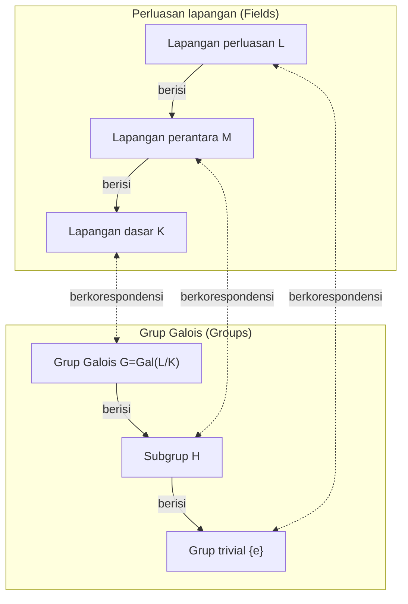

Dalam sejarah matematika, hanya sedikit yang menjalani kehidupan yang begitu dramatis dan tragis seperti [Évariste Galois](https://kenji.blog/p/galois/) (1811–1832). Pemuda Prancis ini, yang kehilangan nyawanya dalam duel pada usia muda 20 tahun, meletakkan dasar bagi teori luar biasa yang pada dasarnya akan mengubah matematika selanjutnya dalam sebuah surat yang ditulis pada malam kematiannya. Dalam artikel ini, kita menyelami lebih dalam kehidupan Galois yang bergejolak dan warisan terbesarnya, **Teori Galois**.

## 1. Kehidupan yang Bergejolak: Semangat dan Frustrasi

### Kehidupan Awal dan Kebangkitan pada Matematika

[Évariste Galois](https://kenji.blog/p/galois/) lahir pada tahun 1811 di Bourg-la-Reine, pinggiran kota Paris. Ayahnya adalah seorang Republikan terpelajar yang kemudian menjabat sebagai walikota. Awalnya dididik oleh ibunya, Galois memasuki Lycée Louis-le-Grand di Paris pada usia 12 tahun.

Kehidupan sekolah di lycée membosankan baginya, tetapi hidupnya berubah total pada usia 15 tahun ketika ia menemukan *Éléments de Géométrie* karya Legendre. Dikatakan bahwa Galois membaca buku sulit ini dalam hitungan hari, seolah-olah sedang membaca novel. Sejak saat itu, ia mengabaikan buku teks biasa dan mulai melahap tulisan-tulisan matematikawan terhebat pada masanya, seperti Lagrange dan Cauchy.

### Tantangan dan Kegagalan di École Polytechnique

Galois sangat ingin masuk ke École Polytechnique, institusi akademik tertinggi tempat berkumpulnya matematikawan terbaik di Prancis saat itu. Namun, ia **gagal dalam ujian masuk dua kali**.

Kegagalan pertama karena kurang persiapan, tetapi yang kedua lebih tragis. Legenda mengatakan bahwa penguji tidak dapat memahami intuisi matematika Galois yang dalam, dan Galois yang kesal melempar penghapus papan tulis (atau lap) ke arah penguji. Yang memperburuk keadaan, tepat sebelum percobaan kedua ini, ia menderita tragedi bunuh diri ayah tercintanya setelah terjerat dalam konspirasi politik.

Pada akhirnya, ia mendaftar di École Normale, yang dianggap selangkah di bawah École Polytechnique.

### Makalah yang Hilang dan Diabaikan oleh Akademi

Galois merangkum penemuan matematikanya ke dalam makalah dan menyerahkannya ke Akademi Sains Prancis. Namun, serangkaian peristiwa malang pun terjadi.

Makalah pertama yang diserahkan jatuh ke tangan matematikawan hebat Cauchy, yang menghilangkannya (atau, seperti yang dikatakan beberapa orang, mengembalikannya dengan menyarankan agar Galois memasukkannya ke dalam makalah lain). Makalah berikutnya dikirim ke Fourier, tetapi Fourier meninggal mendadak tak lama kemudian, dan makalah itu pun hilang lagi.

Makalah ketiga yang diserahkan ditinjau oleh Poisson tetapi ditolak dengan alasan bahwa "buktinya tidak jelas dan tidak dapat dipahami." Teori Galois begitu melampaui zamannya sehingga matematikawan sezamannya tidak dapat memahami nilai sebenarnya.

### Aktivisme Politik dan Pemenjaraan

Era tersebut berada tepat di tengah-tengah "Revolusi Juli" tahun 1830. Sebagai seorang Republikan yang gigih, Galois sangat terlibat dalam gerakan revolusioner. Namun, direktur École Normale yang oportunistik melarang mahasiswa berpartisipasi dalam revolusi. Karena Galois secara terbuka mengkritik direktur tersebut, ia dikeluarkan dari sekolah.

Setelah itu, ia bergabung dengan artileri Garda Nasional, tetapi karena aktivitas politik radikalnya, ia ditangkap dan dipenjara. Bahkan di penjara, ia melanjutkan penelitian matematikanya, tetapi ia menjadi kelelahan secara fisik dan mental.

### Duel Fatal dan Wasiatnya

Pada tahun 1832, Galois, yang dibebaskan bersyarat karena wabah kolera, jatuh cinta pada seorang wanita (Stéphanie-Félicie). Namun, karena hubungan asmara ini, ia ditantang berduel. Lawan dan alasan pasti duel tersebut masih diselimuti misteri hingga saat ini, dengan teori-teori mulai dari konspirasi politik hingga keterikatan romantis.

Pada malam sebelum duel, dengan firasat akan kematiannya, Galois menulis surat panjang kepada sahabat karibnya Auguste Chevalier, menuliskan penemuan matematikanya. Di margin surat itu, ia meninggalkan kata-kata yang memilukan, "Saya tidak punya waktu."

Keesokan paginya, 30 Mei 1832, Galois ditembak di perut dan meninggal keesokan harinya. Ia berusia 20 tahun. Kata-kata terakhirnya kepada adik laki-lakinya yang menangis adalah, "Jangan menangis. Aku butuh seluruh keberanianku untuk mati di usia dua puluh."

## 2. Pencapaian Matematika: Apa itu Teori Galois?

Warisan terbesar Galois adalah apa yang sekarang disebut **Teori Galois**. Ini memberikan jawaban yang lengkap dan mendasar untuk masalah matematika yang sudah berlangsung lama: "Mengapa persamaan derajat 5 atau lebih tinggi tidak dapat diselesaikan secara aljabar?"

### Akar Persamaan dan Simetri

Ada "rumus kuadrat" yang terkenal untuk persamaan kuadrat. Persamaan kubik dan kuartik juga memiliki rumus akar, meskipun lebih kompleks (ditemukan oleh Cardano dan Ferrari). Namun, untuk persamaan kuintik, banyak matematikawan berjuang selama berabad-abad untuk menemukan rumus, tetapi tidak ada yang berhasil.

Pada awal abad ke-19, Ruffini dan Abel membuktikan bahwa "tidak ada rumus untuk persamaan umum derajat 5 atau lebih tinggi yang hanya menggunakan empat operasi aritmatika dasar dan ekstraksi akar (radikal)" (teorema Abel-Ruffini). Namun, struktur yang lebih dalam seperti "Lalu persamaan macam apa yang bisa diselesaikan?" dan "Mengapa tidak bisa diselesaikan jika derajatnya 5 atau lebih tinggi?" tetap tidak dapat dijelaskan.

Galois berfokus pada **simetri** yang tersembunyi di balik akar persamaan. Dia mempertimbangkan kumpulan operasi yang mengubah akar-akarnya (yang kita sebut sebagai **grup** hari ini) dan menemukan bahwa menyelidiki struktur grup itu menentukan apakah suatu persamaan dapat diselesaikan.

### Grup dan Lapangan (Fields): Korespondensi Galois

Inti dari Teori Galois terletak pada pembuktian bahwa terdapat korespondensi yang indah antara dua objek matematika yang tampaknya sama sekali berbeda: "Lapangan" (Fields) dan "Grup" (Groups).

- **Lapangan (Field)**: Himpunan angka di mana empat operasi aritmatika dasar (penjumlahan, pengurangan, perkalian, pembagian) dapat dilakukan secara bebas. Ini mewakili perluasan ruang yang berisi koefisien dan akar suatu persamaan.
- **Grup (Group)**: Kumpulan simetri atau transformasi. Ini mewakili struktur operasi (automorfisme) yang mengubah akar-akar persamaan.

Galois membuktikan bahwa terdapat korespondensi satu-ke-satu ( **korespondensi Galois** ) antara lapangan perantara dari perluasan lapangan yang berisi semua akar persamaan (perluasan Galois) dan subgrup dari grup Galois yang mewakili simetri perluasan tersebut.

Di bawah ini adalah diagram (Mermaid) yang menggambarkan korespondensi yang indah ini.

Seperti yang ditunjukkan diagram ini, lapangan yang membesar (dari bawah ke atas) berkorespondensi dengan grup yang mengecil (dari bawah ke atas). Dengan memanfaatkan hubungan ini, dimungkinkan untuk menerjemahkan struktur lapangan yang kompleks ke dalam struktur grup yang lebih mudah dikelola untuk diselidiki.

### Kondisi Keterpecahan oleh Radikal

Galois mencirikan kondisi perlu dan cukup agar sebuah persamaan dapat diselesaikan dengan operasi aritmatika dasar dan radikal (dapat diselesaikan secara aljabar) sebagai sifat grup Galois-nya. Secara khusus, dia menunjukkan bahwa sebuah persamaan yang dapat diselesaikan ekuivalen dengan grup Galois-nya sebagai **grup yang dapat diselesaikan** (Solvable group).

$$
\text{Persamaan dapat diselesaikan secara aljabar} \iff \text{Grup Galois adalah grup yang dapat diselesaikan}
$$

Grup Galois dari persamaan umum berderajat $n$ adalah grup simetris $S_n$, yang merupakan kumpulan permutasi dari $n$ huruf. Fakta penting dalam teori grup adalah bahwa untuk $n \ge 5$, grup bolak-balik (alternating group) $A_n$, yang merupakan subgrup dari grup simetris $S_n$, menjadi **grup sederhana** (Simple group) dan non-komutatif. Dengan kata lain, grup simetris $S_n$ untuk $n \ge 5$ bukanlah grup yang dapat diselesaikan.

Jadi, fakta bahwa "persamaan umum derajat 5 atau lebih tinggi tidak dapat diselesaikan secara aljabar" telah dibuktikan sepenuhnya dari perspektif struktur grup yang sangat jelas.

## 3. Warisan Galois dan Dampaknya pada Matematika Modern

Setelah kematian Galois, surat-suratnya disimpan oleh sahabat karibnya Chevalier dan secara bertahap dikenal di kalangan matematikawan. Kemudian pada tahun 1846, matematikawan Prancis Joseph Liouville mengorganisir makalah-makalah Galois dan menerbitkannya dalam jurnal matematika dengan komentarnya sendiri, yang pada akhirnya membawa teori Galois menjadi terang benderang.

Konsep "grup" yang diperkenalkan oleh Galois kemudian menjadi bahasa dasar bukan hanya untuk aljabar tetapi untuk semua bidang ilmiah, termasuk geometri, topologi, dan fisika (seperti fisika partikel dan kristalografi). Saat ini, aljabar abstrak, yang mempelajari sistem aljabar seperti "grup, gelanggang, dan lapangan", telah menjadi salah satu pilar terpenting matematika modern.

[Évariste Galois](https://kenji.blog/p/galois/) meninggal di usia muda, 20 tahun. Namun, pencapaian monumental yang ia capai selama hidupnya yang singkat belum pudar bahkan setelah hampir 200 tahun, dan terus memancarkan cahaya kuat yang menerangi kedalaman matematika modern. Kata-kata terakhirnya, "Saya tidak punya waktu," seakan sangat mengonfrontasi kita dengan ketidakterbatasan kecerdasan manusia dan singkatnya kehidupan.
