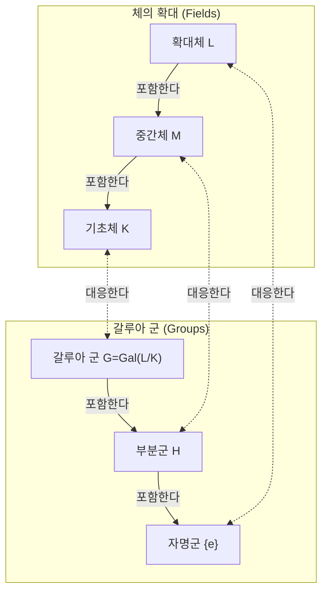

수학의 역사에서 [에바리스투 갈루아](https://kenji.blog/ko/p/galois/)(Évariste Galois, 1811–1832)만큼 극적이고 비극적인 삶을 살았던 인물은 드뭅니다. 겨우 20세의 나이에 결투로 목숨을 잃은 이 젊은 프랑스인은 죽기 전날 밤 쓴 편지에서 이후의 수학을 근본적으로 뒤바꿀 거대한 이론의 기초를 세웠습니다. 본 기사에서는 갈루아의 파란만장한 생애와 그가 남긴 최대의 업적인 **갈루아 이론** ([Galois Theory](https://kenji.blog/ko/p/galois-theory/))에 대해 깊이 파헤쳐 보겠습니다.

## 1. 파란만장한 생애: 열정과 좌절

### 유년기와 수학에 대한 눈뜸

[에바리스투 갈루아](https://kenji.blog/ko/p/galois/)는 1811년 파리 근교의 부르라렌(Bourg-la-Reine)에서 태어났습니다. 그의 아버지는 교양 있는 공화주의자로 훗날 그 도시의 시장을 지내기도 했습니다. 갈루아는 처음에 어머니에게 교육을 받다가 12세에 파리의 리세 루이르그랑(Lycée Louis-le-Grand)에 입학합니다.

리세에서의 학교 생활은 그에게 지루했지만, 15세 때 르장드르의 『기하학 원론』(Éléments de Géométrie)을 접하면서 그의 인생은 완전히 바뀝니다. 갈루아는 이 난해한 책을 마치 소설을 읽듯 며칠 만에 독파했다고 합니다. 그 이후로 그는 일반 교과서는 거들떠보지도 않고 라그랑주나 코시 같은 당대 최고 수학자들의 논문을 탐독하기 시작했습니다.

### 에콜 폴리테크니크에 대한 도전과 좌절

갈루아는 당시 프랑스에서 우수한 수학자들이 모이는 최고 학부였던 에콜 폴리테크니크(École Polytechnique) 입학을 열망했습니다. 하지만 그는 입학시험에서 **두 번이나 낙방** 하고 맙니다.

첫 번째 낙방은 준비 부족 때문이었지만, 두 번째는 더 비극적이었습니다. 전해지는 바에 따르면 면접관이 갈루아의 깊은 수학적 직관을 이해하지 못했고, 짜증이 난 갈루아가 칠판지우개(또는 걸레)를 면접관에게 던졌다고 합니다. 설상가상으로 이 두 번째 응시 직전에 존경하는 아버지가 정치적 음모에 휘말려 자살하는 비극을 겪기도 했습니다.

결국 그는 에콜 폴리테크니크보다 한 단계 아래로 여겨졌던 에콜 노르말(École Normale)에 진학하게 됩니다.

### 논문 분실과 학회의 무시

갈루아는 자신의 수학적 발견을 논문으로 정리해 프랑스 과학 아카데미에 제출했습니다. 하지만 그에게 불운한 일련의 사건들이 이어졌습니다.

처음 제출한 논문은 대수학자 코시의 손에 들어갔지만, 코시가 이를 분실하고 맙니다(또는 갈루아에게 다른 논문에 통합하라고 조언하며 돌려주었다는 설도 있습니다). 다음으로 제출한 논문은 푸리에에게 보내졌으나 푸리에가 직후 급사하면서 논문은 또다시 행방불명되었습니다.

세 번째로 제출한 논문은 푸아송이 심사했지만 "그의 증명은 불명확하고 이해할 수 없다"는 이유로 거절당합니다. 갈루아의 이론은 시대를 너무 앞서갔기 때문에 당시의 수학자들은 그 진가를 이해할 수 없었던 것입니다.

### 정치 활동과 투옥

시대는 1830년 '7월 혁명'의 한가운데 있었습니다. 열렬한 공화주의자였던 갈루아는 혁명 운동에 깊이 빠져들었습니다. 하지만 그가 다니던 에콜 노르말의 기회주의적인 교장은 학생들의 혁명 참여를 금지했습니다. 갈루아가 교장을 공개적으로 비판했기 때문에 그는 학교에서 퇴학당하고 맙니다.

그 후 그는 국민방위군 포병대에 입대하지만, 급진적인 정치 활동으로 인해 체포되어 투옥됩니다. 감옥에서도 그는 수학 연구를 계속했지만 심신은 지쳐갔습니다.

### 운명의 결투와 유서

1832년, 콜레라 유행을 이유로 가석방된 갈루아는 한 여성(스테파니 펠리스)과 사랑에 빠집니다. 하지만 이 연애 관계로 인해 그는 결투를 신청받게 됩니다. 결투의 상대와 정확한 이유는 정치적 음모설부터 연애 문제까지 다양하게 제기되며 현재까지도 미스터리로 남아 있습니다.

결투 전날 밤, 자신의 죽음을 예감한 갈루아는 절친한 친구 오귀스트 슈발리에(Auguste Chevalier)에게 자신의 수학적 발견을 적은 장문의 편지를 썼습니다. 그 편지의 여백에는 "나에게는 시간이 없다"라는 비통한 말이 남겨져 있었습니다.

다음 날 아침인 1832년 5월 30일, 갈루아는 복부에 총을 맞고 그 다음 날 숨을 거두었습니다. 향년 20세. 울고 있는 동생에게 남긴 그의 마지막 말은 "울지 마. 20살에 죽으려면 내 모든 용기가 필요해"라는 것이었습니다.

## 2. 수학적 업적: 갈루아 이론이란 무엇인가?

갈루아가 남긴 최대의 업적은 현재 **갈루아 이론** 이라 불리는 것입니다. 이는 오랜 수학적 난제였던 "5차 이상의 방정식은 왜 대수적으로 풀 수 없는가?"라는 문제에 대한 완전하고 근본적인 해답을 제공했습니다.

### 방정식의 해와 대칭성

2차 방정식에는 유명한 '근의 공식'이 있습니다. 3차 방정식과 4차 방정식에도 더 복잡하긴 하지만 근의 공식이 존재합니다(카르다노와 페라리에 의해 발견됨). 하지만 5차 방정식에 대해서는 수 세기에 걸쳐 많은 수학자가 근의 공식을 찾으려 노력했지만 아무도 성공하지 못했습니다.

19세기 초, 루피니와 아벨은 "5차 이상의 일반 방정식에는 사칙연산과 거듭제곱근(루트)만을 사용한 근의 공식이 존재하지 않는다"는 것을 증명했습니다(아벨-루피니 정리). 하지만 "그렇다면 어떤 방정식은 풀 수 있는가?", "왜 5차 이상이 되면 풀 수 없는가?"와 같은 더 깊은 구조에 대해서는 해명되지 않은 채로 남아 있었습니다.

갈루아는 방정식의 해 이면에 숨어 있는 **대칭성** (Symmetry)에 주목했습니다. 그는 방정식의 해를 치환하는 조작들의 모임(오늘날 **군** 이라 부르는 것)을 고안했고, 그 군의 구조를 조사함으로써 방정식의 가해성(풀 수 있는지의 여부)이 결정된다는 것을 발견했습니다.

### 군과 체: 갈루아 대응

갈루아 이론의 핵심은 전혀 달라 보이는 두 수학적 대상인 '체(Field)'와 '군(Group)' 사이에 아름다운 대응 관계가 존재함을 보여준 데 있습니다.

- **체(Field)** : 사칙연산(덧셈, 뺄셈, 곱셈, 나눗셈)을 자유롭게 할 수 있는 수의 집합. 방정식의 계수와 해를 포함하는 공간의 확장을 나타냅니다.
- **군(Group)** : 대칭성이나 변환의 모임. 방정식의 해를 치환하는 조작(자기동형사상)의 구조를 나타냅니다.

갈루아는 방정식의 해를 모두 포함하는 체의 확대(갈루아 확대)의 중간체와 그 확대의 대칭성을 나타내는 갈루아 군의 부분군 사이에 1대1 대응 관계( **갈루아 대응** )가 있음을 증명했습니다.

아래는 이 아름다운 대응 관계를 보여주는 다이어그램(Mermaid)입니다.

이 다이어그램이 보여주듯 체가 커지는 것(아래에서 위로)은 군이 작아지는 것(아래에서 위로)에 대응합니다. 이 관계를 이용함으로써 복잡한 체의 구조를 다루기 쉬운 군의 구조로 번역하여 조사할 수 있게 되었습니다.

### 거듭제곱근으로 풀 수 있을 조건

갈루아는 방정식이 사칙연산과 거듭제곱근으로 풀리기(대수적으로 가해일) 위한 필요충분조건을 대응하는 갈루아 군의 성질로서 특징지었습니다. 구체적으로, 방정식이 가해인 것은 그 갈루아 군이 **가해군** (Solvable group)인 것과 동치임을 보여주었습니다.

$$
\text{방정식이 대수적으로 가해이다} \iff \text{갈루아 군이 가해군이다}
$$

$n$ 차 일반 방정식의 갈루아 군은 $n$ 개의 문자를 치환하는 모임인 대칭군 $S_n$ 입니다. 여기서 군론의 중요한 사실로서 $n \ge 5$ 일 때 대칭군 $S_n$ 의 부분군인 교대군 $A_n$ 은 **단순군** (Simple group)이 되며 비가환(non-commutative)입니다. 즉, $n \ge 5$ 일 때 대칭군 $S_n$ 은 가해군이 아닙니다.

이로써 "5차 이상의 일반 방정식은 대수적으로 풀 수 없다"는 사실이 군의 구조라는 극히 명쾌한 관점에서 완전히 증명된 것입니다.

## 3. 갈루아의 유산과 현대 수학에 미친 영향

갈루아의 사후, 그의 편지는 절친한 친구 슈발리에가 보관하였고 수학자들 사이에서 조금씩 알려지게 되었습니다. 그리고 1846년, 프랑스의 수학자 조제프 리우빌이 갈루아의 논문들을 정리하여 자신의 해설을 덧붙여 수학 잡지에 발표함으로써 마침내 갈루아의 이론은 빛을 보게 되었습니다.

갈루아가 도입한 '군'이라는 개념은 이후 대수학뿐만 아니라 기하학, 위상수학, 물리학(소립자 물리학이나 결정학 등)을 포함한 모든 과학 분야의 기초 언어가 되었습니다. 오늘날 "[군, 환, 체](https://kenji.blog/ko/p/groups-rings-and-fields/)"와 같은 대수계를 연구하는 추상대수학은 현대 수학의 가장 중요한 기둥 중 하나가 되었습니다.

20세의 젊은 나이에 스러진 [에바리스투 갈루아](https://kenji.blog/ko/p/galois/). 하지만 그가 그 짧은 생애 동안 세운 금자탑은 200년 가까이 지난 지금도 빛바래지 않고 현대 수학의 심연을 비추는 강렬한 빛을 뿜어내고 있습니다. 그가 남긴 "나에게는 시간이 없다"는 말은 우리에게 인간 지성의 무한함과 인생의 짧음을 강렬하게 일깨워주는 듯합니다.
