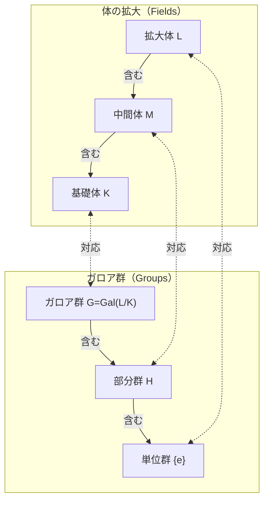

数学の歴史において、エヴァリスト・ガロア（Évariste Galois、1811年 - 1832年）ほどドラマチックで悲劇的な人生を送った人物は稀です。わずか20歳で決闘によって命を落としたこの若きフランス人は、死の前夜に書き残した手紙の中で、その後の数学を根本から変えることになる壮大な理論の基礎を築きました。本記事では、ガロアの波乱に満ちた生涯と、彼が遺した最大の業績である **ガロア理論** （Galois Theory）について、深く掘り下げていきます。

## 1. 波乱万丈な生涯：情熱と挫折

### 幼少期と数学への目覚め

エヴァリスト・ガロアは1811年、パリ近郊のブール＝ラ＝レーヌで生まれました。彼の父親は共和主義者で、後に同市の市長も務めた教養ある人物でした。ガロアは当初、母親から教育を受けていましたが、12歳でパリのリセ・ルイ＝ル＝グランに入学します。

リセでの学校生活は退屈なものでしたが、15歳の時にルジャンドルの『幾何学原論』に出会ったことで、彼の人生は一変します。ガロアはこの難解な書物をまるで小説を読むかのように数日で読破したと言われています。それ以降、彼は通常の教科書には見向きもせず、ラグランジュやコーシーといった当時の最高峰の数学者の論文を読み漁るようになりました。

### エコール・ポリテクニークへの挑戦と挫折

ガロアは、当時のフランスにおいて優秀な数学者が集まる最高学府であったエコール・ポリテクニーク（理工科学校）への入学を熱望しました。しかし、彼はその入学試験に **2度も失敗** してしまいます。

1度目の失敗は準備不足が原因でしたが、2度目の失敗はより悲劇的でした。面接官がガロアの深い数学的直観を理解できず、苛立ったガロアが黒板消し（あるいは雑巾）を面接官に投げつけたという伝説が残っています。さらに不幸なことに、この2度目の受験の直前に、敬愛する父親が政治的な陰謀に巻き込まれて自殺してしまうという悲劇に見舞われていました。

結局、彼はエコール・ポリテクニークよりは格が落ちるとされたエコール・ノルマル（高等師範学校）に進学することになります。

### 論文の紛失と学会からの黙殺

ガロアは自分の数学的発見を論文にまとめ、フランス科学アカデミーに提出しました。しかし、彼にとって不運な出来事が続きます。

最初に提出した論文は、大数学者コーシーの手に渡りましたが、コーシーはそれを紛失してしまいます（あるいは、別の論文に組み込むように助言して返却したとも言われています）。次に提出した論文は、フーリエに送られましたが、フーリエが直後に急死してしまい、またしても論文は行方不明となってしまいました。

3度目に提出した論文はポアソンによって審査されましたが、「彼の証明は不明確で理解できない」として却下されてしまいます。ガロアの理論はあまりにも時代を先取りしており、当時の数学者たちにはその真価を理解することができなかったのです。

### 政治活動と投獄

時代は1830年の「七月革命」の真っ只中でした。熱烈な共和主義者であったガロアは、革命運動に深く傾倒していきます。しかし、彼が在籍していたエコール・ノルマルの校長は日和見主義的であり、学生が革命に参加することを禁じました。ガロアは校長を公然と批判したため、学校を退学させられてしまいます。

その後、彼は国民軍の砲兵隊に入隊しますが、急進的な政治活動が原因で逮捕され、投獄されてしまいます。獄中でも彼は数学の研究を続けていましたが、心身共に疲弊していきました。

### 運命の決闘と遺書

1832年、コレラの流行を理由に仮釈放されたガロアは、ある女性（ステファニー・フェリス）と恋に落ちます。しかし、この恋愛関係が原因で、彼は決闘を申し込まれることになります。決闘の相手や正確な理由は現在でも謎に包まれていますが、政治的な陰謀であったという説や、恋愛のもつれであったという説などがあります。

決闘の前夜、自分が死ぬことを予感していたガロアは、親友のオーギュスト・シュヴァリエ宛てに、自分の数学的発見を書き留めた長文の手紙をしたためました。その手紙の余白には、「私には時間がない」という悲痛な言葉が書き残されていました。

翌朝、1832年5月30日、ガロアは腹部を撃たれ、その翌日に息を引き取りました。享年20歳。彼の最期の言葉は、泣いている弟に向けられた「泣かないでくれ。20歳で死ぬのには、ありったけの勇気が必要なんだ」というものでした。

## 2. 数学的業績：ガロア理論とは何か

ガロアが遺した最大の業績は、現在 **ガロア理論** （Galois Theory）と呼ばれているものです。これは、長年の数学の難問であった「5次以上の方程式はなぜ代数的に解けないのか」という問題に対する、完全かつ根本的な解答を与えるものでした。

### 方程式の解と対称性

2次方程式には有名な「解の公式」があります。3次方程式、4次方程式にも、より複雑ではありますが解の公式が存在します（カルダノやフェラーリによって発見されました）。しかし、5次方程式については、数世紀にわたって多くの数学者が解の公式を見つけようと奮闘しましたが、誰も成功しませんでした。

19世紀の初め、ルフィニとアーベルによって「5次以上の一般の方程式には、四則演算と冪根（ルート）だけを使った解の公式は存在しない」ことが証明されました（アーベル-ルフィニの定理）。しかし、「では、どのような方程式なら解けるのか？」「なぜ5次以上になると解けないのか？」というより深い構造については未解明のままでした。

ガロアは、方程式の解の背後に潜む **対称性** （Symmetry）に注目しました。彼は、方程式の解を入れ替える操作の集まり（今日でいう **群** ）を考え、その群の構造を調べることで、方程式が解けるかどうかが決定されることを発見したのです。

### 群と体：ガロア対応

ガロア理論の核心は、全く異なるように見える2つの数学的対象、「体（Field）」と「群（Group）」の間に、美しい対応関係が存在することを示した点にあります。

- **体（Field）** ：四則演算（足し算、引き算、掛け算、割り算）が自由にできる数の集合。方程式の係数や解を含む空間の広がりを表します。
- **群（Group）** ：対称性や変換の集まり。方程式の解を入れ替える操作（自己同型写像）の構造を表します。

ガロアは、方程式の解をすべて含む体の拡大（ガロア拡大）の中間体と、その拡大の対称性を表すガロア群の部分群との間に、1対1の対応関係（ **ガロア対応** ）があることを証明しました。

以下は、この美しい対応関係を示す図（Mermaid）です。

この図が示すように、体が大きくなる（下から上へ）ことは、群が小さくなる（下から上へ）ことに対応しています。この関係を利用することで、複雑な体の構造を、より扱いやすい群の構造に翻訳して調べることができるようになりました。

### 代数的に解けるということの条件

ガロアは、方程式が四則演算と冪根で解ける（代数的に可解である）ための必要十分条件を、対応するガロア群の性質として特徴づけました。具体的には、方程式が可解であることは、そのガロア群が **可解群** （Solvable group）であることと同値であることを示しました。

$$
\text{方程式が代数的に解ける} \iff \text{ガロア群が可解群である}
$$

$n$ 次の一般方程式のガロア群は、$n$ 文字の置換の集まりである対称群 $S_n$ となります。ここで群論の重要な事実として、$n \ge 5$ のとき、対称群 $S_n$ の部分群である交代群 $A_n$ は **単純群** （Simple group）となり、非可換となります。つまり、$n \ge 5$ の対称群 $S_n$ は可解群ではありません。

これにより、「5次以上の一般方程式は代数的に解けない」という事実が、群の構造という極めて見通しの良い視点から完全に証明されたのです。

## 3. ガロアの遺産と現代数学への影響

ガロアの死後、彼の手紙は親友のシュヴァリエによって保管され、少しずつ数学者たちの間で知られるようになりました。そして1846年、フランスの数学者ジョゼフ・リウヴィルがガロアの論文を整理し、彼自身の解説を加えて数学雑誌に発表したことで、ついにガロアの理論は日の目を見ることになりました。

ガロアが導入した「群」という概念は、その後、代数学にとどまらず、幾何学、トポロジー、物理学（素粒子物理学や結晶学など）といったあらゆる科学分野の基礎言語となりました。現在では、「群・環・体」といった代数系を研究する抽象代数学は、現代数学の最も重要な柱の一つとなっています。

20歳の若さで散ったエヴァリスト・ガロア。しかし、彼がその短い生涯の中で打ち立てた金字塔は、200年近く経った今でも色褪せることなく、現代数学の深淵を照らす強烈な光を放ち続けています。彼の遺した「私には時間がない」という言葉は、私たちに人間の持つ知性の限界のなさと、人生の短さを強く突きつけてくるようです。
