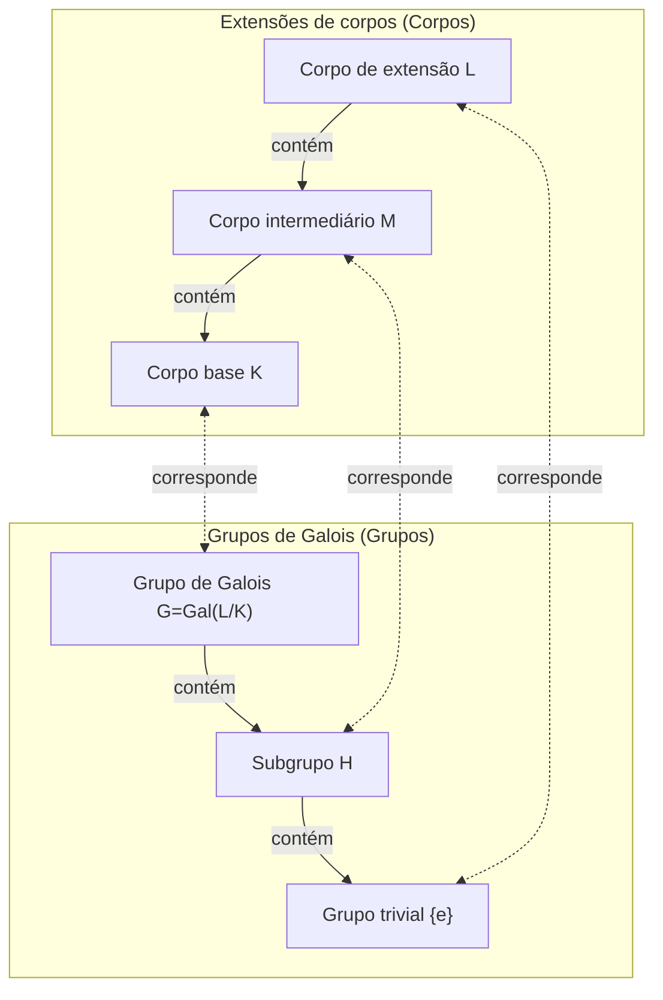

Na história da matemática, poucos tiveram uma vida tão dramática e trágica quanto Évariste Galois (1811-1832). Este jovem francês, que perdeu a vida em um duelo na tenra idade de 20 anos, lançou as bases de uma magnífica teoria que mudaria fundamentalmente a matemática posterior em uma carta escrita na véspera de sua morte. Neste artigo, mergulhamos profundamente na vida turbulenta de Galois e no seu maior legado, a **Teoria de Galois**.

## 1. Uma vida turbulenta: Paixão e frustração

### Início da vida e o despertar para a matemática

Évariste Galois nasceu em 1811 em Bourg-la-Reine, um subúrbio de Paris. Seu pai era um republicano instruído que mais tarde serviu como prefeito da cidade. Inicialmente educado por sua mãe, Galois entrou no Lycée Louis-le-Grand em Paris aos 12 anos.

A vida escolar no liceu era monótona para ele, mas sua vida mudou completamente aos 15 anos, quando ele descobriu os *Éléments de Géométrie* de Legendre. Diz-se que Galois leu este difícil livro em questão de dias, como se estivesse lendo um romance. A partir de então, ignorou os livros didáticos normais e começou a devorar os escritos dos maiores matemáticos da época, como Lagrange e Cauchy.

### Desafios e fracassos na École Polytechnique

Galois queria desesperadamente entrar na École Polytechnique, a mais alta instituição acadêmica onde se reuniam os melhores matemáticos da França da época. No entanto, ele **falhou duas vezes no exame de admissão**.

A primeira falha deveu-se à falta de preparação, mas a segunda foi mais trágica. A lenda conta que o examinador não conseguiu entender a profunda intuição matemática de Galois, e um Galois irritado atirou um apagador de quadro-negro (ou um pano) no examinador. Para piorar a situação, pouco antes desta segunda tentativa, ele sofreu a tragédia do suicídio de seu amado pai após se envolver em uma conspiração política.

No final das contas, ele se matriculou na École Normale, que era considerada um degrau abaixo da École Polytechnique.

### Papéis perdidos e a ignorância pela Academia

Galois resumiu suas descobertas matemáticas em artigos e as enviou à Academia Francesa de Ciências. No entanto, uma série de eventos infelizes se seguiu.

O primeiro artigo enviado caiu nas mãos do grande matemático Cauchy, que o perdeu (ou, como alguns dizem, devolveu aconselhando Galois a incorporá-lo em outro artigo). O artigo seguinte enviado foi encaminhado a Fourier, mas Fourier morreu repentinamente logo depois, e o documento mais uma vez desapareceu.

O terceiro artigo enviado foi revisado por Poisson, mas foi rejeitado com o argumento de que "sua demonstração é obscura e incompreensível". A teoria de Galois estava tão à frente de seu tempo que os matemáticos contemporâneos não podiam entender seu verdadeiro valor.

### Ativismo político e prisão

A época estava no meio da "Revolução de Julho" de 1830. Um ardente republicano, Galois se envolveu profundamente no movimento revolucionário. No entanto, o oportunista diretor da École Normale proibiu os alunos de participarem da revolução. Como Galois criticou publicamente o diretor, ele foi expulso da escola.

Depois, juntou-se à artilharia da Guarda Nacional, mas devido às suas atividades políticas radicais, foi preso e encarcerado. Mesmo na prisão, ele continuou sua pesquisa matemática, mas ficou física e mentalmente exausto.

### O duelo fatal e seu testamento

Em 1832, Galois, em liberdade condicional devido a uma epidemia de cólera, apaixonou-se por uma mulher (Stéphanie-Félicie). No entanto, devido a esse relacionamento romântico, ele foi desafiado para um duelo. O oponente e os motivos exatos do duelo permanecem envoltos em mistério hoje, com teorias variando de uma conspiração política a um emaranhado amoroso.

Na véspera do duelo, tendo a premonição de sua morte, Galois escreveu uma longa carta a seu amigo íntimo Auguste Chevalier, anotando suas descobertas matemáticas. Nas margens dessa carta, ele deixou as palavras de partir o coração: "Não tenho tempo".

Na manhã seguinte, em 30 de maio de 1832, Galois foi baleado no abdômen e morreu no dia seguinte. Tinha 20 anos. Suas últimas palavras ao seu irmão mais novo que chorava foram: "Não chore. Preciso de toda a minha coragem para morrer aos vinte".

## 2. Realizações matemáticas: O que é a Teoria de Galois?

O maior legado de Galois é o que agora chamamos de **Teoria de Galois**. Ela forneceu uma resposta completa e fundamental para um problema matemático de longa data: "Por que as equações de grau 5 ou superior não podem ser resolvidas algebricamente?"

### Raízes de equações e simetria

Existe uma famosa "fórmula quadrática" para as equações de segundo grau. As equações cúbicas e quárticas também possuem fórmulas para as raízes, embora mais complexas (descobertas por Cardano e Ferrari). No entanto, para as equações quínticas, muitos matemáticos lutaram por séculos para encontrar uma fórmula, mas ninguém obteve sucesso.

No início do século XIX, Ruffini e Abel provaram que "não há fórmula para as equações gerais de grau 5 ou superior usando apenas as quatro operações aritméticas básicas e a extração de raízes (radicais)" (o teorema de Abel-Ruffini). No entanto, as estruturas mais profundas como "Então, que tipo de equações podem ser resolvidas?" e "Por que não podem ser resolvidas quando o grau é 5 ou superior?" permaneceram sem explicação.

Galois se concentrou na **simetria** escondida por trás das raízes de uma equação. Ele considerou o conjunto de operações que permutam as raízes (o que hoje chamamos de **grupo**) e descobriu que investigar a estrutura desse grupo determina se uma equação pode ser resolvida.

### Grupos e corpos: A correspondência de Galois

O núcleo da Teoria de Galois reside em mostrar que existe uma bela correspondência entre dois objetos matemáticos aparentemente completamente diferentes: "Corpos" e "Grupos".

- **Corpo (Field)**: Um conjunto de números onde as quatro operações aritméticas básicas (adição, subtração, multiplicação, divisão) podem ser realizadas livremente. Ele representa a extensão do espaço que contém os coeficientes e as raízes de uma equação.
- **Grupo (Group)**: Uma coleção de simetrias ou transformações. Ele representa a estrutura das operações (automorfismos) que permutam as raízes de uma equação.

Galois provou que há uma correspondência biunívoca (a **correspondência de Galois**) entre os corpos intermediários de uma extensão de corpo que contém todas as raízes de uma equação (uma extensão de Galois) e os subgrupos do grupo de Galois que representam as simetrias dessa extensão.

Abaixo está um diagrama (Mermaid) ilustrando essa bela correspondência.

Como este diagrama mostra, o corpo se tornando maior (de baixo para cima) corresponde ao grupo se tornando menor (de baixo para cima). Utilizando essa relação, tornou-se possível traduzir estruturas complexas de corpos em estruturas de grupos mais gerenciáveis para investigação.

### Condições para a resolubilidade por radicais

Galois caracterizou a condição necessária e suficiente para que uma equação seja resolvida por operações aritméticas básicas e radicais (algebricamente solúvel) como uma propriedade do seu grupo de Galois correspondente. Especificamente, ele mostrou que o fato de uma equação ser resolúvel é equivalente ao seu grupo de Galois ser um **grupo solúvel**.

$$
\text{A equação é solúvel algebricamente} \iff \text{O grupo de Galois é um grupo solúvel}
$$

O grupo de Galois de uma equação geral de grau $n$ é o grupo simétrico $S_n$, que é uma coleção de permutações de $n$ letras. Um fato importante na teoria dos grupos é que para $n \ge 5$, o grupo alternante $A_n$, que é um subgrupo do grupo simétrico $S_n$, torna-se um **grupo simples** e não comutativo. Em outras palavras, o grupo simétrico $S_n$ para $n \ge 5$ não é um grupo solúvel.

Assim, o fato de que "equações gerais de grau 5 ou superior não podem ser resolvidas algebricamente" foi completamente provado a partir da perspectiva muito clara da estrutura de grupos.

## 3. O legado de Galois e seu impacto na matemática moderna

Após a morte de Galois, suas cartas foram guardadas pelo seu amigo íntimo Chevalier e gradualmente se tornaram conhecidas entre os matemáticos. Então, em 1846, o matemático francês Joseph Liouville organizou os escritos de Galois e os publicou em uma revista matemática com seus próprios comentários, finalmente trazendo a teoria de Galois à luz.

O conceito de "grupo" introduzido por Galois tornou-se posteriormente a linguagem fundamental não apenas da álgebra, mas de todos os campos científicos, incluindo geometria, topologia e física (como a física de partículas e a cristalografia). Hoje, a álgebra abstrata, que estuda sistemas algébricos como "grupos, anéis e corpos", tornou-se um dos pilares mais importantes da matemática moderna.

Évariste Galois faleceu na tenra idade de 20 anos. No entanto, a obra monumental que ele estabeleceu durante sua curta vida não desapareceu, mesmo após quase 200 anos, e continua a brilhar com uma luz poderosa iluminando as profundezas da matemática moderna. Suas últimas palavras, "Não tenho tempo", parecem nos confrontar fortemente com a infinitude do intelecto humano e a brevidade da vida.
