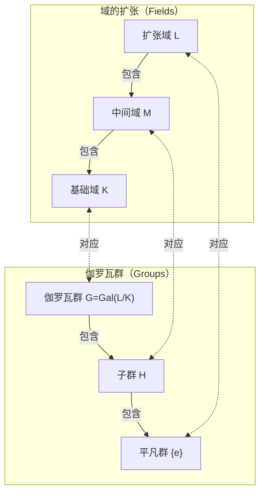

在数学的历史上，很少有人能像[埃瓦里斯特·伽罗瓦](https://kenji.blog/zh-cn/p/galois/)（[Évariste Galois](https://kenji.blog/zh-cn/p/galois/)，1811年 - 1832年）那样，度过如此充满戏剧性和悲剧色彩的一生。这位年仅20岁便在决斗中丧生的法国年轻人，在死前一夜写下的信中，为日后彻底改变数学面貌的宏大理论奠定了基础。在本文中，我们将深入探讨伽罗瓦波澜壮阔的一生，以及他留下的最伟大遗产—— **伽罗瓦理论** （[Galois Theory](https://kenji.blog/zh-cn/p/galois-theory/)）。

## 1. 波澜壮阔的一生：激情与挫折

### 早年生活与数学的觉醒

[埃瓦里斯特·伽罗瓦](https://kenji.blog/zh-cn/p/galois/)于1811年出生在巴黎郊外的拉尔日堡（Bourg-la-Reine）。他的父亲是一位受过良好教育的共和主义者，后来还担任了该市的市长。伽罗瓦最初由母亲进行教育，12岁时进入巴黎的路易大帝中学（Lycée Louis-le-Grand）就读。

中学的学校生活对他来说十分枯燥，但在15岁时，他接触到了勒让德的《几何学基础》（Éléments de Géométrie），这彻底改变了他的人生。据说伽罗瓦像读小说一样，在几天内就读完了这本艰深的书。从那时起，他就不再看普通的教科书，而是开始如饥似渴地阅读拉格朗日和柯西等当时最顶尖数学家的论文。

### 挑战巴黎综合理工学院与落榜

伽罗瓦非常渴望进入当时法国汇聚了最优秀数学家的最高学府——巴黎综合理工学院（École Polytechnique）。然而，他却在入学考试中 **两次落榜** 。

第一次落榜是因为准备不足，但第二次则更具悲剧色彩。据传说，考官无法理解伽罗瓦深刻的数学直觉，而被激怒的伽罗瓦将黑板擦（或抹布）扔向了考官。更不幸的是，就在这第二次考试之前，他深爱的父亲因卷入一场政治阴谋而自杀，这给他带来了巨大的打击。

最终，他进入了被认为比综合理工学院稍逊一筹的巴黎高等师范学院（École Normale）就读。

### 论文的遗失与学术界的冷遇

伽罗瓦将自己的数学发现写成了论文，并提交给了法国科学院。然而，一系列不幸的事件接踵而至。

他提交的第一篇论文落到了大数学家柯西的手中，但柯西却把它弄丢了（也有人说柯西把论文退还给了他，并建议他将其并入另一篇论文中）。接下来提交的论文被送到了傅里叶那里，但傅里叶不久后突然去世，论文再次下落不明。

第三次提交的论文由泊松进行审查，但却被以“他的证明不清晰且无法理解”为由拒绝。伽罗瓦的理论太超前于他所处的时代，以至于当时的数学家们无法理解其真正的价值。

### 政治活动与入狱

当时正值1830年“七月革命”的浪潮之中。作为一名狂热的共和主义者，伽罗瓦深深地投入到了革命运动中。然而，他所在的高等师范学院的校长却是个机会主义者，禁止学生参与革命。因为伽罗瓦公开批评了校长，他被学校开除。

随后，他加入了国民自卫军的炮兵队，但由于激进的政治活动，他被捕入狱。即使在狱中，他依然坚持数学研究，但身心已经疲惫不堪。

### 命运的决斗与绝笔

1832年，因霍乱流行而获得假释的伽罗瓦，爱上了一位名叫斯蒂芬妮·费利斯（Stéphanie-Félicie）的女子。然而，正是因为这段恋情，他被卷入了一场决斗。决斗的对手和确切原因至今仍是一个谜，有说法称是政治阴谋，也有说法称是感情纠葛。

在决斗的前夜，预感到自己即将死去的伽罗瓦，给他的挚友奥古斯特·舍瓦利耶（Auguste Chevalier）写了一封长信，记下了他的数学发现。在那封信的空白处，他留下了令人心碎的话语：“我没有时间了。”

第二天早上，即1832年5月30日，伽罗瓦腹部中弹，并于次日去世。年仅20岁。他留给哭泣的弟弟的最后一句话是：“别哭。要在二十岁时死去，我需要全部的勇气。”

## 2. 数学成就：什么是伽罗瓦理论？

伽罗瓦留下的最伟大遗产就是现在被称为 **伽罗瓦理论** 的理论。它为一个长久以来的数学难题——“为什么五次及以上方程无法用代数方法求解？”——提供了一个完整而根本的答案。

### 方程的根与对称性

二次方程有著名的“求根公式”。三次和四次方程也有求根公式，尽管更为复杂（由卡尔达诺和费拉里发现）。然而，对于五次方程，几个世纪以来许多数学家都致力于寻找求根公式，但无一成功。

在19世纪初，鲁菲尼和阿贝尔证明了“对于一般的五次及以上方程，不存在仅使用四则运算和开根号的求根公式”（阿贝尔-鲁菲尼定理）。但是，“那么什么样的方程是可以求解的呢？”以及“为什么次数达到五次或以上就无法求解？”这些更深层次的结构依然未被阐明。

伽罗瓦将注意力集中在隐藏在方程根背后的 **对称性** （Symmetry）上。他构想了置换方程根的操作的集合（即我们今天所说的 **群** ），并发现通过研究该群的结构，就可以决定一个方程是否可解。

### 群与域：伽罗瓦对应

伽罗瓦理论的核心在于证明了两个看似完全不同的数学对象——“域”（Field）和“群”（Group）——之间存在着美妙的对应关系。

- **域（Field）** ：可以自由进行四则运算（加、减、乘、除）的数的集合。它表示包含方程系数和根的空间的扩张。
- **群（Group）** ：对称性或变换的集合。它表示置换方程根的操作（自同构映射）的结构。

伽罗瓦证明了，在包含方程所有根的域扩张（伽罗瓦扩张）的中间域与表示该扩张对称性的伽罗瓦群的子群之间，存在着一一对应关系（ **伽罗瓦对应** ）。

下面是展示这种美妙对应关系的图表（Mermaid）。

正如该图所示，域变大（从下到上）对应于群变小（从下到上）。利用这种关系，就可以将复杂的域结构转化为更易于处理的群结构来进行研究。

### 可用根式求解的条件

伽罗瓦将一个方程能用四则运算和开根号求解（代数可解）的充要条件，刻画为其对应的伽罗瓦群的性质。具体来说，他证明了一个方程是可解的，当且仅当它的伽罗瓦群是一个 **可解群** （Solvable group）。

$$
\text{方程是代数可解的} \iff \text{伽罗瓦群是可解群}
$$

$n$ 次一般方程的伽罗瓦群是对称群 $S_n$，它是 $n$ 个字母的置换的集合。群论中一个重要的事实是，当 $n \ge 5$ 时，对称群 $S_n$ 的子群交错群 $A_n$ 会成为一个 **单群** （Simple group）且是非交换的。换句话说，当 $n \ge 5$ 时的对称群 $S_n$ 不是一个可解群。

由此，“一般的五次及以上方程无法用代数方法求解”这一事实，从群的结构这个极其清晰的视角得到了完全的证明。

## 3. 伽罗瓦的遗产与对现代数学的影响

伽罗瓦死后，他的信件由挚友舍瓦利耶保存，并逐渐在数学家之间传开。到了1846年，法国数学家约瑟夫·刘维尔整理了伽罗瓦的论文，并加上自己的解说发表在数学杂志上，伽罗瓦的理论终于重见天日。

伽罗瓦引入的“群”的概念，后来不仅成为了代数学的基础语言，也成为了包括几何学、拓扑学以及物理学（如粒子物理学和结晶学）在内的所有科学领域的基础语言。如今，研究“[群、环、域](https://kenji.blog/zh-cn/p/groups-rings-and-fields/)”等代数系统的抽象代数学，已经成为现代数学最重要的支柱之一。

年仅20岁便陨落的[埃瓦里斯特·伽罗瓦](https://kenji.blog/zh-cn/p/galois/)，在其短暂的一生中建立的丰碑，即使在近200年后的今天也未曾褪色，它依然放射出强烈的光芒，照亮着现代数学的深渊。他留下的那句“我没有时间了”，似乎在强烈地向我们昭示着人类智慧的无限与生命的短暂。
