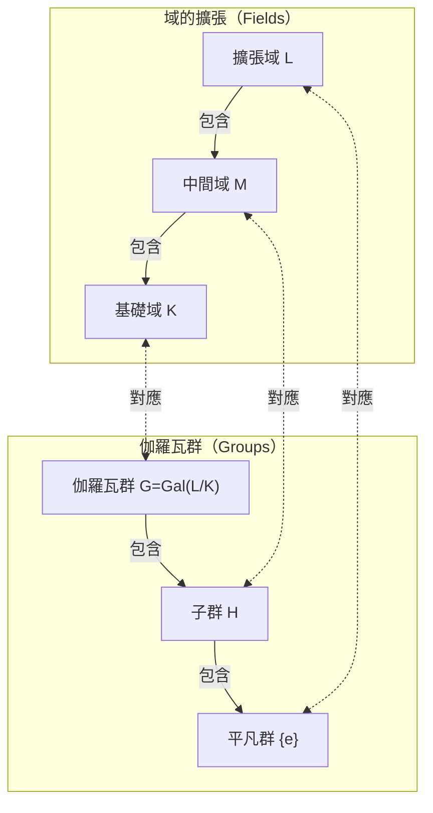

在數學的歷史上，很少有人能像[埃瓦里斯特·伽羅瓦](https://kenji.blog/zh-tw/p/galois/)（Évariste Galois，1811年 - 1832年）那樣，度過如此充滿戲劇性和悲劇色彩的一生。這位年僅20歲便在決鬥中喪生的法國年輕人，在死前一夜寫下的信中，為日後徹底改變數學面貌的宏大理論奠定了基礎。在本文中，我們將深入探討伽羅瓦波瀾壯闊的一生，以及他留下的最偉大遺產—— **伽羅瓦理論** （[Galois Theory](https://kenji.blog/zh-tw/p/galois-theory/)）。

## 1. 波瀾壯闊的一生：激情與挫折

### 早年生活與數學的覺醒

[埃瓦里斯特·伽羅瓦](https://kenji.blog/zh-tw/p/galois/)於1811年出生在巴黎郊外的拉爾日堡（Bourg-la-Reine）。他的父親是一位受過良好教育的共和主義者，後來還擔任了該市的市長。伽羅瓦最初由母親進行教育，12歲時進入巴黎的路易大帝中學（Lycée Louis-le-Grand）就讀。

中學的學校生活對他來說十分枯燥，但在15歲時，他接觸到了勒讓德的《幾何學基礎》（Éléments de Géométrie），這徹底改變了他的人生。據說伽羅瓦像讀小說一樣，在幾天內就讀完了這本艱深的書。從那時起，他就不再看普通的教科書，而是開始如飢似渴地閱讀拉格朗日和柯西等當時最頂尖數學家的論文。

### 挑戰巴黎綜合理工學院與落榜

伽羅瓦非常渴望進入當時法國匯聚了最優秀數學家的最高學府——巴黎綜合理工學院（École Polytechnique）。然而，他卻在入學考試中 **兩次落榜** 。

第一次落榜是因為準備不足，但第二次則更具悲劇色彩。據傳說，考官無法理解伽羅瓦深刻的數學直覺，而被激怒的伽羅瓦將黑板擦（或抹布）扔向了考官。更不幸的是，就在這第二次考試之前，他深愛的父親因捲入一場政治陰謀而自殺，這給他帶來了巨大的打擊。

最終，他進入了被認為比綜合理工學院稍遜一籌的巴黎高等師範學院（École Normale）就讀。

### 論文的遺失與學術界的冷遇

伽羅瓦將自己的數學發現寫成了論文，並提交給了法國科學院。然而，一系列不幸的事件接踵而至。

他提交的第一篇論文落到了大數學家柯西的手中，但柯西卻把它弄丟了（也有人說柯西把論文退還給了他，並建議他將其併入另一篇論文中）。接下來提交的論文被送到了傅里葉那裡，但傅里葉不久後突然去世，論文再次下落不明。

第三次提交的論文由泊松進行審查，但卻被以「他的證明不清晰且無法理解」為由拒絕。伽羅瓦的理論太超前於他所處的時代，以至於當時的數學家們無法理解其真正的價值。

### 政治活動與入獄

當時正值1830年「七月革命」的浪潮之中。作為一名狂熱的共和主義者，伽羅瓦深深地投入到了革命運動中。然而，他所在的高等師範學院的校長卻是個機會主義者，禁止學生參與革命。因為伽羅瓦公開批評了校長，他被學校開除。

隨後，他加入了國民自衛軍的炮兵隊，但由於激進的政治活動，他被捕入獄。即使在獄中，他依然堅持數學研究，但身心已經疲憊不堪。

### 命運的決鬥與絕筆

1832年，因霍亂流行而獲得假釋的伽羅瓦，愛上了一位名叫斯蒂芬妮·費利斯（Stéphanie-Félicie）的女子。然而，正是因為這段戀情，他被捲入了一場決鬥。決鬥的對手和確切原因至今仍是一個謎，有說法稱是政治陰謀，也有說法稱是感情糾葛。

在決鬥的前夜，預感到自己即將死去的伽羅瓦，給他的摯友奧古斯特·舍瓦利耶（Auguste Chevalier）寫了一封長信，記下了他的數學發現。在那封信的空白處，他留下了令人心碎的話語：「我沒有時間了。」

第二天早上，即1832年5月30日，伽羅瓦腹部中彈，並於次日去世。年僅20歲。他留給哭泣的弟弟的最後一句話是：「別哭。要在二十歲時死去，我需要全部的勇氣。」

## 2. 數學成就：什麼是伽羅瓦理論？

伽羅瓦留下的最偉大遺產就是現在被稱為 **伽羅瓦理論** 的理論。它為一個長久以來的數學難題——「為什麼五次及以上方程式無法用代數方法求解？」——提供了一個完整而根本的答案。

### 方程式的根與對稱性

二次方程式有著名的「求根公式」。三次和四次方程式也有求根公式，儘管更為複雜（由卡爾達諾和費拉里發現）。然而，對於五次方程式，幾個世紀以來許多數學家都致力於尋求求根公式，但無一成功。

在19世紀初，魯菲尼和阿貝爾證明了「對於一般的五次及以上方程式，不存在僅使用四則運算和開根號的求根公式」（阿貝爾-魯菲尼定理）。但是，「那麼什麼樣的方程式是可以求解的呢？」以及「為什麼次數達到五次或以上就無法求解？」這些更深層次的結構依然未被闡明。

伽羅瓦將注意力集中在隱藏在方程式根背後的 **對稱性** （Symmetry）上。他構想了置換方程式根的操作的集合（即我們今天所說的 **群** ），並發現通過研究該群的結構，就可以決定一個方程式是否可解。

### 群與域：伽羅瓦對應

伽羅瓦理論的核心在於證明了兩個看似完全不同的數學對象——「域」（Field）和「群」（Group）——之間存在著美妙的對應關係。

- **域（Field）** ：可以自由進行四則運算（加、減、乘、除）的數的集合。它表示包含方程式係數和根的空間的擴張。
- **群（Group）** ：對稱性或變換的集合。它表示置換方程式根的操作（自同構映射）的結構。

伽羅瓦證明了，在包含方程式所有根的域擴張（伽羅瓦擴張）的中間域與表示該擴張對稱性的伽羅瓦群的子群之間，存在著一一對應關係（ **伽羅瓦對應** ）。

下面是展示這種美妙對應關係的圖表（Mermaid）。

正如該圖所示，域變大（從下到上）對應於群變小（從下到上）。利用這種關係，就可以將複雜的域結構轉化為更易於處理的群結構來進行研究。

### 可用根式求解的條件

伽羅瓦將一個方程式能用四則運算和開根號求解（代數可解）的充要條件，刻畫為其對應的伽羅瓦群的性質。具體來說，他證明了一個方程式是可解的，當且僅當它的伽羅瓦群是一個 **可解群** （Solvable group）。

$$
\text{方程式是代數可解的} \iff \text{伽羅瓦群是可解群}
$$

$n$ 次一般方程式的伽羅瓦群是對稱群 $S_n$，它是 $n$ 個字母的置換的集合。群論中一個重要的事實是，當 $n \ge 5$ 時，對稱群 $S_n$ 的子群交錯群 $A_n$ 會成為一個 **單群** （Simple group）且是非交換的。換句話說，當 $n \ge 5$ 時的對稱群 $S_n$ 不是一個可解群。

由此，「一般的五次及以上方程式無法用代數方法求解」這一事實，從群的結構這個極其清晰的視角得到了完全的證明。

## 3. 伽羅瓦的遺產與對現代數學的影響

伽羅瓦死後，他的信件由摯友舍瓦利耶保存，並逐漸在數學家之間傳開。到了1846年，法國數學家約瑟夫·劉維爾整理了伽羅瓦的論文，並加上自己的解說發表在數學雜誌上，伽羅瓦的理論終於重見天日。

伽羅瓦引入的「群」的概念，後來不僅成為了代數學的基礎語言，也成為了包括幾何學、拓撲學以及物理學（如粒子物理學和結晶學）在內的所有科學領域的基礎語言。如今，研究「群、環、域」等代數系統的抽象代數學，已經成為現代數學最重要的支柱之一。

年僅20歲便隕落的[埃瓦里斯特·伽羅瓦](https://kenji.blog/zh-tw/p/galois/)，在其短暫的一生中建立的豐碑，即使在近200年後的今天也未曾褪色，它依然放射出強烈的光芒，照亮著現代數學的深淵。他留下的那句「我沒有時間了」，似乎在強烈地向我們昭示著人類智慧的無限與生命的短暫。
