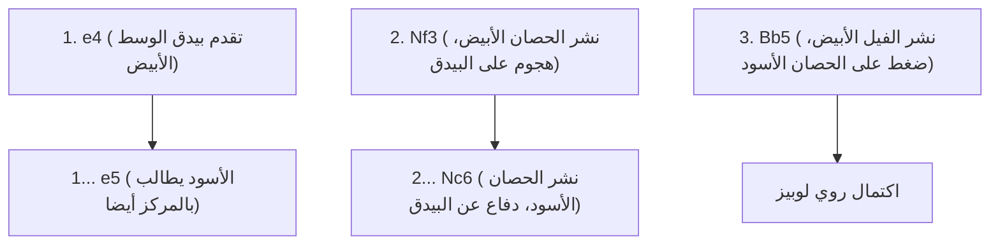
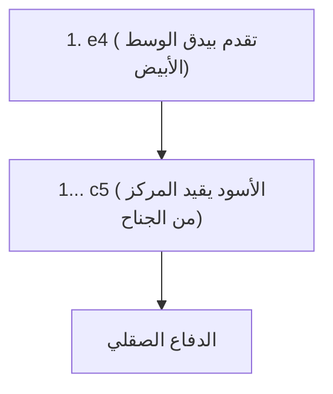

## 1. لغة العالم المشتركة "الشطرنج"

الشطرنج هو اللعبة اللوحية الأكثر شعبية، حيث يُقال إن مئات الملايين من الأشخاص حول العالم يلعبونها. على رقعة مكونة من 64 مربعاً 8×8 (بنمط مربعات بيضاء وسوداء)، تتقاتل القوات البيضاء والسوداء لمحاصرة (كش مات) "الملك" الخاص بالخصم.

على عكس الشوغي، "لا يمكن إعادة استخدام القطع المأسورة (لا توجد قاعدة للقطع المحمولة)"، مما يعني أنه مع تقدم اللعبة، تقل القطع على الرقعة وتصبح الرقعة أبسط وأوسع. لذلك، فإن بناء التشكيلة في الافتتاحية والحسابات الرياضية الدقيقة في النهاية (نهاية اللعبة) تصبح بالغة الأهمية.

## 2. حركات القطع والقواعد الخاصة

كل قطعة شطرنج لها حركاتها الفريدة.

- **البيدق (الجندي)**: يتقدم للأمام مربعاً واحداً فقط (يمكنه التقدم مربعين في البداية فقط). إنها قطعة خاصة تتحرك قطرياً للأمام فقط عند أسر العدو. عندما يصل إلى الحافة، يمكن ترقيته إلى أي قطعة يختارها.
- **الحصان (الفارس)**: يتحرك على شكل حرف L، وهو القطعة الوحيدة التي يمكنها القفز فوق القطع الأخرى. يلعب دوراً نشطاً في الافتتاحية عندما تكون الرقعة مزدحمة.
- **الفيل (رجل الدين)**: يمكنه التحرك قطرياً إلى أي مسافة. فيل المربعات البيضاء يمكنه التحرك فقط على المربعات البيضاء، وفيل المربعات السوداء يمكنه التحرك فقط على المربعات السوداء.
- **الرخ (القلعة/العربة)**: يمكنه التحرك عمودياً وأفقياً إلى أي مسافة. يُظهر قوة لا مثيل لها في النصف الثاني عندما تصبح الرقعة واسعة.
- **الوزير (الملكة)**: أقوى قطعة يمكنها التحرك عمودياً، أفقياً، وقطرياً إلى أي مسافة.
- **الملك**: يمكنه التحرك مربعاً واحداً فقط في جميع الاتجاهات. إذا تمت محاصرته، تخسر اللعبة.

### القواعد الخاصة التي يجب تذكرها: التبييت

أهم قاعدة خاصة في الشطرنج هي "**التبييت (Castling)**".

إنها حركة تجمع بين الدفاع والهجوم حيث يتم تحريك الملك والرخ في نفس الوقت دفعة واحدة، مما يخفي الملك بأمان في زاوية الرقعة بينما يجلب الرخ القوي إلى المركز. يمكن استخدامها "مرة واحدة فقط في المباراة"، ويمكن القول إنها الهدف الأهم في افتتاحية الشطرنج.

## 3. المبادئ الثلاثة الكبرى للافتتاحية (البداية)

نظراً لأن الشطرنج تمت دراسته على مدى مئات السنين، توجد "نظرية" واضحة للحركات الافتتاحية. يجب على المبتدئين التأكد أولاً من اتباع المبادئ الثلاثة التالية.

1. **السيطرة على المركز**: السيطرة على وسط الرقعة (المربعات الأربعة d4، d5، e4، e5) باستخدام البيادق والقطع الخاصة بك. إذا سيطرت على المركز، سيكون من الأسهل لقطعك التحرك في جميع الاتجاهات، ويمكنك أخذ زمام المبادرة.
2. **نشر القطع الصغيرة**: إخراج الحصان والفيل (القطع الصغيرة) إلى الخطوط الأمامية بسرعة. إذا قمت بإخراج الوزير في وقت مبكر لمجرد أنه قوي، فسينتهي بك الأمر إلى التعرض للاستهداف من قبل قطع الخصم الصغيرة والهروب.
3. **ضمان سلامة الملك (التبييت)**: قبل اشتباك الخطوط الأمامية، قم بالتبييت في أسرع وقت ممكن لإجلاء الملك إلى منطقة آمنة.

## 4. الافتتاحيات النموذجية (الحركات القياسية)

التحركات القليلة الأولى للاعب الأبيض (الحركة الأولى) واللاعب الأسود (الحركة الثانية) لها أسماء، وهناك المئات من الافتتاحيات. سنقدم بعض الافتتاحيات النموذجية.

### روي لوبيز (Ruy Lopez)

إنها الافتتاحية الملكية الأقدم والأكثر دراسة في الشطرنج. يستعد الأبيض فوراً لتبييت الملك بينما يستمر في ممارسة ضغط قوي على المركز.

### الدفاع الصقلي (Sicilian Defense)

مقابل دفع الأبيض لـ "e4"، لا يرد الأسود بشكل متماثل، بل يتحدى عن قصد بمعركة من الجناح (c5) كتكتيك هجومي. إنها افتتاحية تؤدي إلى معركة معقدة وشرسة للغاية، وتتميز بأعلى معدل فوز للأسود في الشطرنج الحديث.

## 5. وسط اللعبة ونهاية اللعبة

بعد انتهاء الافتتاحية، تدخل في "وسط اللعبة". هنا، تُختبر قدرتك في "التكتيكات" لأخذ قطع الخصم مجاناً (أو استبدالها بقطع ذات قيمة أقل) و "اللعب الموضعي" لتحسين التشكيلة على المدى الطويل.

وعندما يتبقى عدد قليل من القطع، تدخل في "نهاية اللعبة". في نهاية اللعبة، يصبح الهدف الأكبر هو "**تقديم البيدق إلى أقصى حد وترقيته إلى وزير (ترقية)**". يتوقف الملك نفسه عن الاختباء وينتقل إلى الخطوط الأمامية، متحوّلاً إلى قوة قوية تساعد في تقدم البيادق.

## 6. الخلاصة

الشطرنج هو فن قتالي فكري يستخدم المنطق والحساب والوعي المكاني بالكامل.
أولاً، تعلم كيفية تحريك القطع، وحاول اللعب في المباريات عبر الإنترنت (مثل Chess.com أو Lichess) مع وضع "السيطرة على المركز" و "التبييت" في الاعتبار. بالتأكيد ستُفتن بعمق الحرب على الرقعة.
