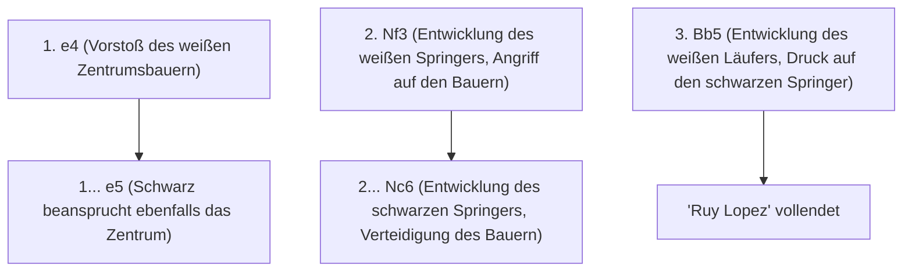
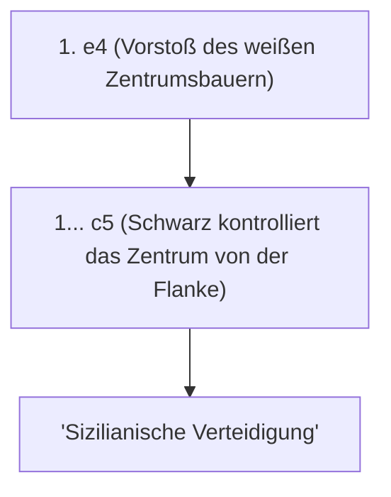

## 1. Die universelle Sprache „Schach“

Schach ist das beliebteste Brettspiel, das von schätzungsweise hunderten Millionen Menschen auf der ganzen Welt gespielt wird. Auf einem 8x8 Feld mit 64 Feldern (schwarz-weißes Karomuster) kämpfen weiße und schwarze Armeen, um den gegnerischen „König“ in die Enge zu treiben (schachmatt zu setzen).

Im Gegensatz zu Shogi gibt es die Regel nicht, geschlagene Figuren wiederzuverwenden (keine Drop-Regel), was bedeutet, dass sich die Anzahl der Figuren auf dem Brett im Laufe des Spiels verringert und das Brett einfacher und geräumiger wird. Daher sind der Aufbau der Formation in der Eröffnung und die präzise mathematische Berechnung im Endspiel von entscheidender Bedeutung.

## 2. Bewegung der Figuren und Sonderregeln

Jede Schachfigur hat eine einzigartige Bewegung.

- **Bauer (Pawn)**: Zieht nur ein Feld vorwärts (kann beim ersten Zug zwei Felder ziehen). Eine besondere Figur, die nur schräg vorwärts zieht, wenn sie eine gegnerische Figur schlägt. Wenn er das andere Ende des Brettes erreicht, kann er in eine beliebige Figur umgewandelt werden (Promotion).
- **Springer (Knight)**: Die einzige Figur, die sich in L-Form bewegt und über andere Figuren springen kann. Spielt in der Eröffnung, wenn das Brett voll ist, eine aktive Rolle.
- **Läufer (Bishop)**: Zieht beliebig weit diagonal. Der weißfeldrige Läufer kann sich immer nur auf weißen Feldern bewegen, der schwarzfeldrige Läufer immer nur auf schwarzen Feldern.
- **Turm (Rook)**: Zieht beliebig weit vertikal und horizontal. Er entfaltet in der zweiten Spielhälfte eine unvergleichliche Stärke, wenn das Brett leerer wird.
- **Dame (Queen)**: Die stärkste Figur, die beliebig weit vertikal, horizontal und diagonal ziehen kann.
- **König (King)**: Zieht nur ein Feld in jede Richtung. Wenn er in die Enge getrieben wird, haben Sie das Spiel verloren.

### Wichtige Sonderregel: Rochade (Castling)

Die wichtigste Sonderregel im Schach ist die „**Rochade (Castling)**“.
Es ist ein Zug, der Verteidigung und Angriff kombiniert, indem er den König und den Turm gleichzeitig bewegt, den König in einer sicheren Ecke des Brettes versteckt und den mächtigen Turm in die Mitte bringt. Man kann sagen, dass dies das wichtigste Ziel in der Schacheröffnung ist, das nur „einmal pro Spiel“ verwendet werden kann.

## 3. Die drei großen Prinzipien der Eröffnung

Da Schach seit Hunderten von Jahren studiert wird, gibt es eine klare „Theorie“ für die Eröffnungszüge (Eröffnung). Anfänger sollten zunächst immer die folgenden drei Prinzipien befolgen.

1. **Kontrolle des Zentrums**: Kontrollieren Sie das Zentrum des Brettes (die vier Felder d4, d5, e4, e5) mit Ihren eigenen Bauern und Figuren. Wenn Sie das Zentrum kontrollieren, können sich Ihre Figuren leichter in alle Richtungen bewegen, und Sie können die Initiative ergreifen.
2. **Entwicklung der Leichtfiguren**: Bringen Sie Springer und Läufer (Leichtfiguren) schnell an die Front. Wenn Sie die Dame zu Beginn wegen ihrer Stärke herausbringen, wird sie von gegnerischen kleinen Figuren ins Visier genommen und muss fliehen.
3. **Sicherheit des Königs (Rochade)**: Bevor die Frontlinien aufeinanderprallen, sollten Sie so schnell wie möglich rochieren, um den König in eine Sicherheitszone zu bringen.

## 4. Typische Eröffnungen (Theorie)

Die ersten Züge von Weiß (Anziehender) und Schwarz (Nachziehender) haben Namen, und es gibt Hunderte von Eröffnungen. Hier stellen wir einige typische vor.

### Ruy Lopez (Spanische Partie)

Dies ist die älteste und am besten erforschte klassische Eröffnung im Schach. Weiß bereitet sich sofort auf die Rochade des Königs vor und übt weiterhin starken Druck auf das Zentrum aus.

### Sizilianische Verteidigung (Sicilian Defense)

Wenn Weiß „e4“ spielt, antwortet Schwarz nicht symmetrisch, sondern wagt eine offensive Strategie, indem es das Zentrum von der Flanke (c5) angreift. Im modernen Schach ist es eine Eröffnung, die für Schwarz die höchste Gewinnrate aufweist und zu einem äußerst komplexen und heftigen Kampf wird.

## 5. Mittelspiel und Endspiel

Nach der Eröffnung beginnt das „Mittelspiel“. Hier werden Ihre Fähigkeiten in „Taktik“ (eine gegnerische Figur kostenlos schlagen oder gegen eine Figur mit geringerem Wert tauschen) und „Positionsspiel“ (langfristige Verbesserung der Formation) gefragt.

Wenn nur noch wenige Figuren übrig sind, beginnt das „Endspiel“. Das größte Ziel im Endspiel ist es, „**den Bauern bis zum anderen Ende vorzurücken und in eine Dame umzuwandeln (Promotion)**“. Auch der König selbst versteckt sich nicht mehr, sondern kommt an die Front und verwandelt sich in eine starke Streitmacht, die den Vormarsch der Bauern unterstützt.

## 6. Zusammenfassung

Schach ist ein intellektueller Kampfsport, der Logik, Berechnung und räumliches Vorstellungsvermögen in vollem Umfang nutzt.
Lernen Sie zunächst, wie sich die Figuren bewegen, und versuchen Sie, beim Online-Spiel (wie Chess.com oder Lichess) bewusst auf die „Kontrolle des Zentrums“ und die „Rochade“ zu achten. Sie werden sicherlich von der Tiefe des Krieges auf dem Brett fasziniert sein.
