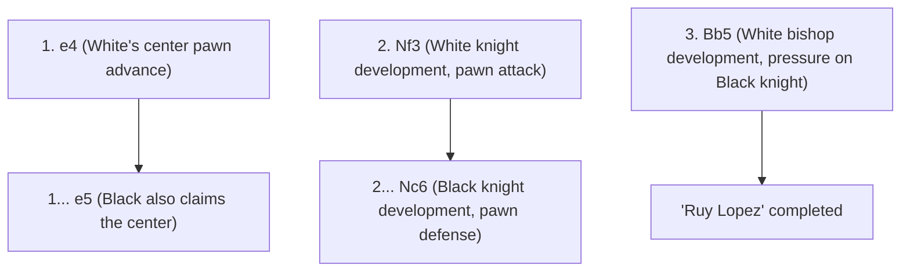
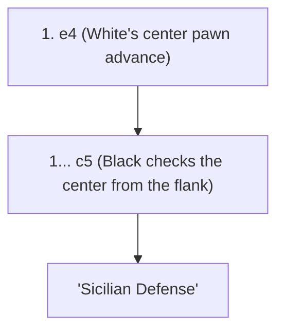

## 1. The Universal Language "Chess"

Chess is the most popular board game in the world, said to be played by hundreds of millions of people. On an 8x8 board of 64 squares (a checkered pattern of white and black), the white and black forces fight to corner (checkmate) each other's "King".

Unlike Shogi, "captured pieces cannot be reused (there is no drop rule)", so as the game progresses, the number of pieces on the board decreases, and the board becomes simpler and more expansive. Therefore, the formation construction in the opening and the precise mathematical calculation in the endgame are extremely important.

## 2. Piece Movement and Special Rules

Each chess piece moves in a unique way.

- **Pawn (Soldier)**: Moves forward only 1 square (can move 2 squares only on its first move). A special piece that moves diagonally forward only when capturing an enemy piece. When it reaches the end of the board, it can be promoted to any piece you like (Promotion).
- **Knight (Knight)**: The only piece that moves in an L-shape and can jump over other pieces. It is active in the opening when the board is crowded.
- **Bishop (Priest)**: Moves diagonally as far as it wants. A Bishop on a white square can only move on white squares, and a Bishop on a black square can only move on black squares.
- **Rook (Castle/Chariot)**: Moves vertically and horizontally as far as it wants. It shows unparalleled strength in the latter half of the game when the board becomes wide open.
- **Queen (Queen)**: The strongest piece that can move vertically, horizontally, and diagonally as far as it wants.
- **King (King)**: Moves 1 square in all directions. If this is cornered, you lose.

### Special Rule to Remember: Castling

The most important special rule in chess is "**Castling**".
It is a move that serves as both defense and attack, moving the King and the Rook simultaneously at once, hiding the King in a safe corner of the board while pulling out the powerful Rook to the center. It can be used "only once per game", and can be said to be the most important goal in the opening of chess.

## 3. The 3 Major Principles of the Opening

Since chess has been studied for hundreds of years, there is a clear "theory" for the moves in the opening. Beginners should first make sure to follow these 3 principles.

1. **Center Control**: Control the center of the board (the 4 squares d4, d5, e4, e5) with your own pawns and pieces. By controlling the center, your pieces can move easily in all directions, and you can take the initiative.
2. **Developing Minor Pieces**: Quickly bring out the Knights and Bishops (minor pieces) to the front line. If you bring out the Queen from the opening just because it is strong, it will be targeted by the opponent's minor pieces and you will end up running away.
3. **King Safety (Castling)**: Before the front lines clash, castle as early as possible to evacuate the King to a safe zone.

## 4. Typical Openings (Theory)

The first few moves of White (first player) and Black (second player) have names, and there are hundreds of openings. Here are some typical ones.

### Ruy Lopez

It is the oldest and most studied royal road opening in chess. White immediately prepares to castle the King while continuing to apply strong pressure to the center.

### Sicilian Defense

In response to White pushing "e4", Black deliberately challenges the fight from the flank (c5) instead of returning symmetrically. It is an extremely complex and fierce opening that boasts the highest winning percentage for Black in modern chess.

## 5. Middlegame and Endgame

After the opening ends, you enter the "Middlegame". Here, your ability in "Tactics" to take the opponent's pieces for free (or exchange them for pieces of lesser value) and "Positional Play" to improve your long-term formation is tested.

And when the pieces remain few, you enter the "Endgame". In the endgame, the biggest goal is to "**advance a pawn to the farthest rank and promote it to a Queen (Promotion)**". The King himself also stops hiding and transforms into a powerful fighting force that goes to the front line to help the march of the pawns.

## 6. Conclusion

Chess is an intellectual martial art that fully uses logic, calculation, and spatial awareness.
First, memorize how the pieces move, and try playing online matches (such as Chess.com or Lichess) while keeping "Center Control" and "Castling" in mind. You will surely be fascinated by the depth of the war on the board.
