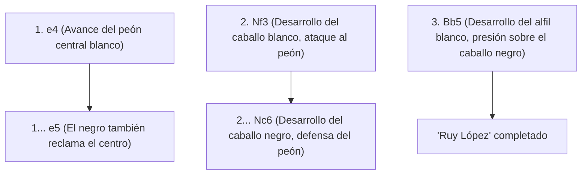
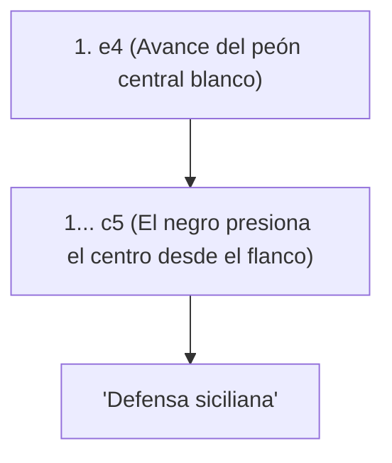

## 1. "Ajedrez", el idioma universal

El ajedrez es el juego de mesa más popular, jugado por cientos de millones de personas en todo el mundo. En un tablero de 8x8 con 64 casillas (con un patrón de cuadros blancos y negros), las fuerzas blancas y negras luchan para acorralar (dar jaque mate) al "rey" del oponente.

A diferencia del Shogi, "las piezas capturadas no se pueden reutilizar (no hay regla de piezas en mano)", por lo que a medida que avanza el juego, el número de piezas en el tablero disminuye y el tablero se vuelve más simple y vasto. Por esta razón, la formación de la estructura en la apertura y los cálculos matemáticos precisos en la fase final (final de partida) son extremadamente importantes.

## 2. Movimiento de las piezas y reglas especiales

Cada pieza de ajedrez tiene un movimiento único.

- **Peón (Soldado)**: Avanza solo una casilla hacia adelante (puede avanzar dos casillas en el primer movimiento). Es una pieza especial que se mueve en diagonal solo al capturar al enemigo. Cuando llega al extremo del tablero, se puede coronar (promocionar) a la pieza que desee.
- **Caballo (Caballero)**: Se mueve en forma de L y es la única pieza que puede saltar sobre otras piezas. Desempeña un papel activo en la apertura, cuando el tablero está congestionado.
- **Alfil (Obispo)**: Puede moverse en diagonal cualquier cantidad de casillas. Un alfil en casilla blanca solo puede moverse por casillas blancas, y un alfil en casilla negra solo puede moverse por casillas negras.
- **Torre (Castillo/Carro de guerra)**: Puede moverse vertical y horizontalmente cualquier cantidad de casillas. En la segunda mitad, cuando el tablero se abre, muestra una fuerza inigualable.
- **Reina (Dama)**: Es la pieza más fuerte, capaz de moverse vertical, horizontal y diagonalmente sin límite de casillas.
- **Rey (Monarca)**: Puede moverse una casilla en cualquier dirección. Si lo acorralan, pierdes.

### Regla especial que debes recordar: El enroque

La regla especial más importante del ajedrez es el "**enroque (Castling)**".
Es un movimiento que sirve tanto de defensa como de ataque, donde mueves el rey y la torre simultáneamente, escondiendo al rey en una esquina segura del tablero mientras sacas a la poderosa torre hacia el centro. Se puede utilizar "solo una vez por partida" y se puede decir que es el objetivo más importante en la apertura de ajedrez.

## 3. Los 3 grandes principios de la apertura (inicio)

Debido a que el ajedrez se ha estudiado durante cientos de años, existen "teorías" claras sobre los movimientos iniciales (aperturas). Los principiantes siempre deben seguir primero los siguientes tres principios.

1. **Control del centro**: Controla el centro del tablero (las 4 casillas d4, d5, e4, e5) con tus peones y piezas. Si controlas el centro, tus piezas podrán moverse libremente en todas las direcciones y tomarás la iniciativa.
2. **Desarrollo de piezas menores**: Lleva rápidamente al frente los caballos y alfiles (piezas menores). Si sacas a la reina en la apertura solo porque es fuerte, será blanco de las piezas menores del oponente y se verá obligada a huir.
3. **Seguridad del rey (Enroque)**: Antes de que choquen las líneas del frente, realiza el enroque lo más rápido posible para refugiar al rey en una zona segura.

## 4. Aperturas representativas (Teoría)

Los primeros movimientos de las blancas (primer jugador) y las negras (segundo jugador) tienen nombres y existen cientos de aperturas diferentes. A continuación se presentan algunas representativas.

### Apertura española o Ruy López (Ruy Lopez)

Es la apertura clásica más antigua y estudiada del ajedrez. Las blancas se preparan para enrocar rápidamente al rey mientras continúan ejerciendo una fuerte presión sobre el centro.

### Defensa siciliana (Sicilian Defense)

En respuesta al avance "e4" de las blancas, las negras no responden de forma simétrica, sino que desafían desde el flanco (c5) en una estrategia ofensiva. En el ajedrez moderno, ostenta la mayor tasa de victorias para las negras, siendo una apertura que se convierte en una batalla extremadamente compleja e intensa.

## 5. Medio juego y final del juego

Una vez que termina la apertura, se entra en el "medio juego". Aquí se pondrá a prueba tu habilidad para utilizar "tácticas" que capturen las piezas del oponente gratis (o las intercambien por piezas de menor valor) y el "juego posicional" para mejorar la estructura a largo plazo.

Y cuando quedan pocas piezas, se entra en el "final del juego". En el final, el mayor objetivo es "**avanzar el peón hasta el final para coronarlo en reina (promoción)**". El propio rey deja de esconderse, sale al frente y se transforma en una poderosa fuerza que ayuda a la marcha de los peones.

## 6. Resumen

El ajedrez es un arte marcial intelectual que utiliza al máximo la lógica, el cálculo y la capacidad de percepción espacial.
Primero, aprende cómo se mueven las piezas e intenta jugar partidas en línea (como en Chess.com o Lichess) siendo consciente del "control del centro" y del "enroque". Seguramente quedarás fascinado por la profundidad de la guerra en el tablero.
