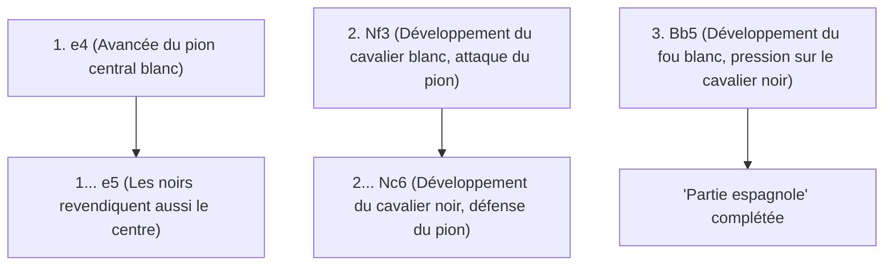
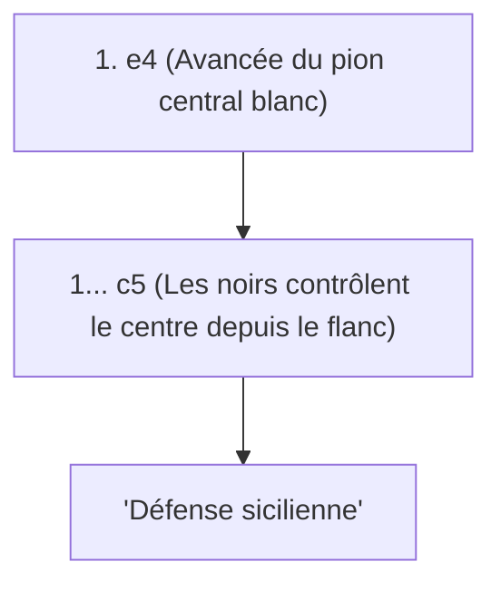

## 1. Le langage universel : les "Échecs"

Les échecs sont le jeu de plateau le plus populaire au monde, joué par des centaines de millions de personnes. Sur un plateau de 8×8 soit 64 cases (à damier noir et blanc), les armées blanches et noires s'affrontent pour acculer (faire échec et mat) le "roi" de l'adversaire.

Contrairement au Shogi, il n'y a pas de "réutilisation des pièces capturées" (pas de règle de parachutage). Au fur et à mesure que la partie avance, le nombre de pièces sur le plateau diminue, ce qui rend la configuration à la fois plus simple et plus vaste. Par conséquent, la construction de la formation en début de partie et les calculs mathématiques précis en fin de partie (finale) deviennent extrêmement importants.

## 2. Le mouvement des pièces et les règles spéciales

Chaque pièce d'échecs a un mouvement unique.

- **Pion (Soldat)** : Avance d'une seule case (peut avancer de deux cases uniquement lors de son premier mouvement). C'est une pièce spéciale qui avance en diagonale uniquement pour capturer un ennemi. Lorsqu'il atteint le bord opposé, il peut être promu (promotion) en la pièce de votre choix.
- **Cavalier (Chevalier)** : Se déplace en forme de "L" et est la seule pièce capable de sauter par-dessus d'autres pièces. Il est très utile en début de partie lorsque le plateau est encombré.
- **Fou (Évêque)** : Se déplace en diagonale sans limite de distance. Le fou sur les cases blanches ne se déplace que sur les cases blanches, et celui sur les cases noires ne se déplace que sur les cases noires.
- **Tour (Château/Char)** : Se déplace verticalement et horizontalement sans limite de distance. Elle fait preuve d'une force inégalée dans la seconde moitié du jeu lorsque le plateau se libère.
- **Dame (Reine)** : La pièce la plus puissante, capable de se déplacer verticalement, horizontalement et en diagonale sans limite de distance.
- **Roi** : Se déplace d'une seule case dans toutes les directions. Si vous êtes acculé au point de ne plus pouvoir le sauver, vous perdez.

### La règle spéciale à retenir : Le Roque

La règle spéciale la plus importante aux échecs est le "**Roque (Castling)**".
C'est un coup qui permet de déplacer simultanément le roi et la tour en une seule fois, cachant le roi dans un coin sûr du plateau tout en amenant la puissante tour au centre, combinant ainsi défense et attaque. C'est l'objectif le plus important du début de partie aux échecs, et il ne peut être utilisé qu'"une seule fois par partie".

## 3. Les 3 grands principes de l'ouverture

Les échecs ayant été étudiés pendant des centaines d'années, il existe une "théorie" claire pour les premiers coups (l'ouverture). Les débutants doivent d'abord s'assurer de respecter les 3 principes suivants :

1. **Contrôle du centre** : Contrôlez le centre du plateau (les 4 cases d'intersection : d4, d5, e4, e5) avec vos pions et pièces. Contrôler le centre permet à vos pièces de se déplacer plus facilement dans toutes les directions et de prendre l'initiative.
2. **Développement des pièces mineures** : Sortez rapidement les cavaliers et les fous (pièces mineures) sur la ligne de front. Sortir la dame dès le début, sous prétexte qu'elle est forte, vous obligera à fuir constamment car elle sera la cible des petites pièces adverses.
3. **Sécurité du roi (Roque)** : Avant que les lignes de front ne s'affrontent, effectuez le roque le plus tôt possible pour évacuer le roi vers une zone de sécurité.

## 4. Les ouvertures représentatives (Théorie)

Les premiers coups des Blancs (qui jouent en premier) et des Noirs (qui jouent en second) portent des noms, et il existe des centaines d'ouvertures. Voici quelques-unes des plus représentatives.

### Partie espagnole (Ruy Lopez)

C'est l'ouverture la plus ancienne et la plus étudiée des échecs, la voie royale. Les Blancs se préparent immédiatement à roquer leur roi tout en maintenant une forte pression sur le centre.

### Défense sicilienne (Sicilian Defense)

C'est une tactique offensive où, face à l'avancée "e4" des Blancs, les Noirs ne répondent pas de manière symétrique, mais osent attaquer depuis le flanc (c5). C'est l'ouverture qui offre le meilleur taux de victoire pour les Noirs dans les échecs modernes, entraînant des batailles extrêmement complexes et féroces.

## 5. Milieu de jeu et Finale

Une fois l'ouverture terminée, nous entrons dans le "milieu de jeu". Ici, on teste votre capacité en "tactique", qui consiste à capturer les pièces de l'adversaire gratuitement (ou à les échanger contre des pièces de moindre valeur), et en "jeu positionnel" pour améliorer votre formation à long terme.

Ensuite, lorsqu'il ne reste que quelques pièces, on entre dans la "finale". Dans la finale, l'objectif principal devient de "**faire avancer un pion jusqu'au bout pour le promouvoir en dame (promotion)**". Le roi lui-même cesse de se cacher et se transforme en une force puissante qui s'avance sur la ligne de front pour aider la marche des pions.

## 6. Conclusion

Les échecs sont un sport de combat intellectuel qui utilise pleinement la logique, le calcul et la perception spatiale.
Tout d'abord, apprenez comment les pièces se déplacent et essayez de jouer des parties en ligne (sur Chess.com ou Lichess) en gardant à l'esprit le "contrôle du centre" et le "roque". Vous serez certainement fasciné par la profondeur de cette guerre sur un plateau.
