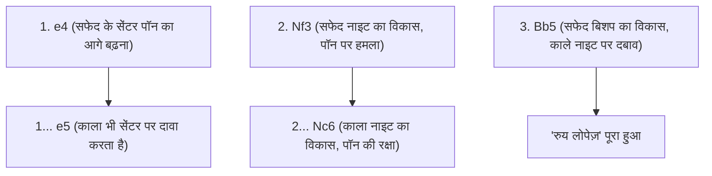
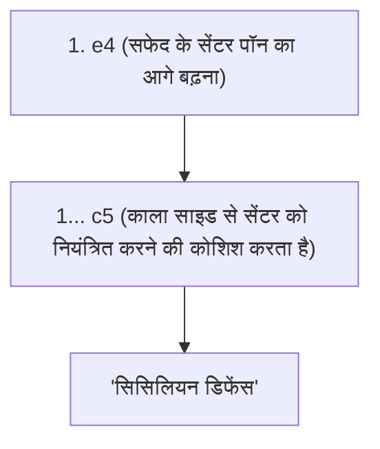

## 1. दुनिया भर में साझा भाषा "शतरंज" (Chess)

शतरंज यकीनन दुनिया का सबसे लोकप्रिय बोर्ड गेम है, जिसे करोड़ों लोग खेलते हैं। 8×8 के 64 खानों (सफेद और काले चेकरबोर्ड पैटर्न) पर, सफेद और काली सेनाएँ एक-दूसरे के "किंग" (राजा) को घेरने (चेकमेट करने) के लिए लड़ती हैं।

शोगी (जापानी शतरंज) के विपरीत, शतरंज में "कैप्चर किए गए मोहरों का पुन: उपयोग नहीं किया जा सकता (ड्रॉप रूल नहीं है)", जिसका मतलब है कि जैसे-जैसे गेम आगे बढ़ता है, बोर्ड पर मोहरों की संख्या कम होती जाती है और बोर्ड सरल और अधिक विस्तृत हो जाता है। इसलिए, शुरुआती फॉर्मेशन (array) बनाना और एंडगेम की सटीक गणितीय गणना बहुत महत्वपूर्ण हो जाती है।

## 2. मोहरों की चाल और विशेष नियम

शतरंज के हर मोहरे की एक अनोखी चाल होती है।

- **पॉन (Pawn / सैनिक)** : केवल 1 कदम आगे बढ़ता है (पहली चाल में 2 कदम आगे बढ़ सकता है)। यह एकमात्र मोहरा है जो दुश्मन को कैप्चर करते समय तिरछा चलता है। बोर्ड के अंत तक पहुँचने पर इसे किसी भी अन्य मोहरे में प्रमोट (Promotion) किया जा सकता है।
- **नाइट (Knight / घोड़ा)** : L-आकार में चलता है और यह एकमात्र मोहरा है जो अन्य मोहरों के ऊपर से छलांग लगा सकता है। यह शुरुआत में बहुत उपयोगी होता है जब बोर्ड पर जगह कम होती है।
- **बिशप (Bishop / ऊंट)** : तिरछे (डायगोनल) रूप से कितनी भी दूर जा सकता है। सफेद खाने वाला बिशप हमेशा सफेद खाने पर ही रहता है, और काले खाने वाला बिशप हमेशा काले खाने पर ही रहता है।
- **रुक (Rook / हाथी)** : क्षैतिज (horizontal) और लंबवत (vertical) रूप से कितनी भी दूर जा सकता है। गेम के बाद के हिस्से में जब बोर्ड खाली हो जाता है, तब यह अजेय शक्ति दिखाता है।
- **क्वीन (Queen / वज़ीर)** : क्षैतिज, लंबवत और तिरछे रूप से कितनी भी दूर जा सकता है। यह सबसे शक्तिशाली मोहरा है।
- **किंग (King / राजा)** : किसी भी दिशा में केवल 1 कदम चल सकता है। अगर इसे घेर लिया जाए (चेकमेट), तो आप गेम हार जाते हैं।

### याद रखने योग्य विशेष नियम: कैसलिंग (Castling)

शतरंज में सबसे महत्वपूर्ण विशेष नियम **कैसलिंग (Castling)** है।
यह एक ऐसी चाल है जो रक्षा और हमले दोनों का काम करती है, जहाँ किंग और रुक को एक साथ चलाया जाता है। किंग को बोर्ड के एक सुरक्षित कोने में छिपाया जाता है, जबकि शक्तिशाली रुक को केंद्र की ओर लाया जाता है। इसे "एक गेम में केवल एक बार" इस्तेमाल किया जा सकता है और यह शतरंज की शुरुआत (ओपनिंग) में सबसे महत्वपूर्ण लक्ष्यों में से एक है।

## 3. ओपनिंग (शुरुआत) के 3 प्रमुख सिद्धांत

चूंकि शतरंज का सैकड़ों वर्षों से अध्ययन किया गया है, इसलिए शुरुआती चालों (ओपनिंग) के लिए स्पष्ट "सिद्धांत" मौजूद हैं। शुरुआती खिलाड़ियों को हमेशा निम्नलिखित 3 सिद्धांतों का पालन करना चाहिए।

1. **सेंटर पर नियंत्रण** : अपने पॉन और मोहरों से बोर्ड के केंद्र (d4, d5, e4, e5 के 4 खाने) पर नियंत्रण हासिल करें। यदि आप केंद्र को नियंत्रित करते हैं, तो आपके मोहरों के लिए सभी दिशाओं में जाना आसान हो जाता है, और आप गेम पर पकड़ बना सकते हैं।
2. **माइनर पीस (Minor Pieces) का विकास** : नाइट और बिशप (माइनर पीस) को तेजी से आगे की लाइन में लाएं। हालांकि क्वीन शक्तिशाली है, लेकिन अगर आप इसे शुरुआत में ही बाहर ले आते हैं, तो दुश्मन के छोटे मोहरे इसे निशाना बनाएंगे और इसे भागना पड़ेगा।
3. **किंग की सुरक्षा (कैसलिंग)** : इससे पहले कि आगे की लाइनों में टकराव शुरू हो, किंग को जल्द से जल्द सुरक्षित क्षेत्र में ले जाने के लिए कैसलिंग करें।

## 4. प्रमुख ओपनिंग रणनीतियाँ (Theory)

सफेद (पहली चाल) और काले (दूसरी चाल) की पहली कुछ चालों के नाम होते हैं, और ऐसी सैकड़ों ओपनिंग रणनीतियाँ हैं। यहाँ कुछ प्रमुख रणनीतियों का परिचय दिया गया है।

### रुय लोपेज़ (Ruy Lopez)

यह शतरंज की सबसे पुरानी और सबसे ज्यादा अध्ययन की जाने वाली ओपनिंग में से एक है। सफेद अपने किंग की कैसलिंग की तैयारी करता है, साथ ही सेंटर पर मजबूत दबाव बनाए रखता है।

### सिसिलियन डिफेंस (Sicilian Defense)

जब सफेद "e4" खेलता है, तो काला सममित (symmetrical) चाल चलने के बजाय, साइड (c5) से आक्रामक रूप से खेलता है। आधुनिक शतरंज में काले रंग के लिए इसकी जीत की दर सबसे अधिक है, और यह एक बेहद जटिल और आक्रामक गेम बन जाता है।

## 5. मिडलगेम (Middle Game) और एंडगेम (Endgame)

ओपनिंग के बाद, गेम "मिडलगेम" में प्रवेश करता है। यहाँ "टैक्टिक्स (Tactics)" (प्रतिद्वंद्वी के मोहरों को मुफ्त में कैप्चर करना या कम मूल्य के मोहरों के साथ बदलना) और "पोजीशनल प्ले (Positional Play)" (लंबे समय तक बेहतर फॉर्मेशन बनाना) की क्षमताओं का परीक्षण किया जाता है।

जब बोर्ड पर कुछ ही मोहरे रह जाते हैं, तो गेम "एंडगेम" में प्रवेश करता है। एंडगेम में सबसे बड़ा लक्ष्य **पॉन को बोर्ड के अंतिम छोर तक ले जाना और उसे क्वीन में प्रमोट (Promotion) करना** होता है। यहाँ किंग खुद भी छिपना बंद कर देता है और पॉन को आगे बढ़ने में मदद करने के लिए एक शक्तिशाली मोहरे के रूप में आगे आता है।

## 6. निष्कर्ष

शतरंज एक बौद्धिक मार्शल आर्ट है जो तर्क, गणना और स्थानिक जागरूकता (spatial awareness) का पूरी तरह से उपयोग करता है।
सबसे पहले मोहरों की चाल सीखें, और "सेंटर पर नियंत्रण" और "कैसलिंग" को ध्यान में रखते हुए ऑनलाइन मैच (जैसे Chess.com या Lichess) खेलने का प्रयास करें। आप निश्चित रूप से बोर्ड पर होने वाले इस युद्ध की गहराई से मंत्रमुग्ध हो जाएंगे।
