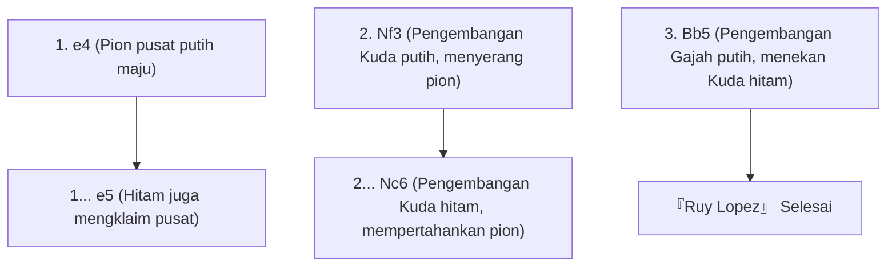
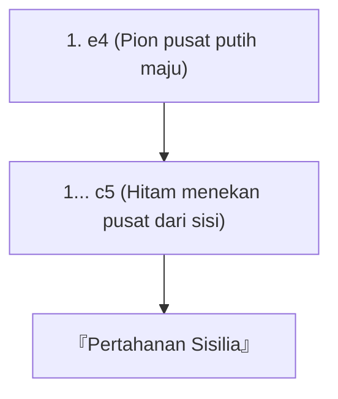

## 1. Bahasa Universal di Dunia, "Catur"

Catur adalah board game paling populer yang konon dimainkan oleh ratusan juta orang di dunia. Di atas 64 kotak 8x8 (pola kotak-kotak hitam putih), pasukan putih dan hitam bertarung untuk menyudutkan (skakmat) "Raja" lawan satu sama lain.

Berbeda dengan Shogi, "bidak yang diambil tidak dapat digunakan kembali (tidak ada aturan bidak di tangan)", sehingga seiring berjalannya permainan, bidak di atas papan akan berkurang, dan papan menjadi lebih sederhana dan luas. Oleh karena itu, pembangunan formasi di awal permainan dan perhitungan matematis yang presisi di akhir permainan (endgame) menjadi sangat penting.

## 2. Pergerakan Bidak dan Aturan Khusus

Setiap bidak catur memiliki pergerakan yang unik.

- **Pion (Prajurit)**: Maju 1 kotak ke depan (hanya pada langkah pertama bisa maju 2 kotak). Bidak khusus yang bergerak diagonal ke depan hanya saat mengambil bidak lawan. Jika mencapai ujung papan, dapat dipromosikan (promosi) menjadi bidak apa pun.
- **Kuda (Knight)**: Bergerak membentuk huruf L dan merupakan satu-satunya bidak yang dapat melompati bidak lain. Sangat berguna di awal permainan ketika papan masih penuh.
- **Gajah (Bishop)**: Bergerak diagonal sejauh apa pun. Gajah di kotak putih hanya bisa bergerak di kotak putih, dan gajah di kotak hitam hanya bisa bergerak di kotak hitam.
- **Benteng (Rook)**: Bergerak vertikal dan horizontal sejauh apa pun. Menunjukkan kekuatan yang tak tertandingi di babak kedua ketika papan menjadi lebih luas.
- **Ratu (Queen)**: Bidak terkuat yang bisa bergerak vertikal, horizontal, dan diagonal sejauh apa pun.
- **Raja (King)**: Bergerak 1 kotak ke segala arah. Jika raja tersudutkan, Anda kalah.

### Aturan Khusus yang Harus Diingat: Rokade

Aturan khusus yang paling penting dalam catur adalah "**Rokade (Castling)**".
Ini adalah langkah yang menggabungkan pertahanan dan serangan, di mana Raja dan Benteng dipindahkan secara bersamaan sekaligus, menyembunyikan Raja di sudut papan yang aman sambil menarik Benteng yang kuat ke tengah. Ini dapat dianggap sebagai tujuan paling penting dalam pembukaan catur, yang hanya bisa digunakan "sekali dalam 1 permainan".

## 3. 3 Prinsip Utama Pembukaan (Opening)

Karena catur telah dipelajari selama ratusan tahun, terdapat "teori" yang jelas mengenai langkah-langkah di awal permainan (pembukaan). Pemula harus selalu mematuhi 3 prinsip berikut.

1. **Penguasaan Pusat**: Menguasai bagian tengah papan (4 kotak: d4, d5, e4, e5) dengan pion atau bidak sendiri. Dengan menguasai pusat, bidak akan lebih mudah bergerak ke segala arah dan Anda dapat mengambil alih inisiatif.
2. **Pengembangan Bidak Minor**: Segera memajukan Kuda dan Gajah (bidak minor) ke garis depan. Jika mengeluarkan Ratu sejak awal karena kuat, ia akan menjadi sasaran bidak kecil lawan dan harus terus berlarian.
3. **Memastikan Keamanan Raja (Rokade)**: Sebelum garis depan bentrok, lakukan rokade secepat mungkin untuk mengevakuasi Raja ke tempat yang aman.

## 4. Pembukaan (Teori) yang Umum

Beberapa langkah pertama bagi pemain putih (langkah pertama) dan hitam (langkah kedua) memiliki nama, dan terdapat ratusan jenis pembukaan. Berikut ini adalah beberapa yang paling umum.

### Ruy Lopez

Ini adalah pembukaan klasik tertua dan paling banyak dipelajari dalam catur. Putih langsung bersiap untuk melakukan rokade Raja sambil terus memberikan tekanan kuat di pusat.

### Pertahanan Sisilia (Sicilian Defense)

Sebagai respons terhadap "e4" Putih, Hitam tidak merespons secara simetris, melainkan berani menantang dari sisi (c5) dalam taktik penyerangan ini. Ini adalah pembukaan yang sangat kompleks dan sengit, dengan rasio kemenangan tertinggi bagi pemain hitam dalam catur modern.

## 5. Babak Tengah (Middlegame) dan Akhir Permainan (Endgame)

Setelah pembukaan selesai, permainan memasuki "Babak Tengah (Middlegame)". Di sini, kemampuan "Taktik" untuk mengambil bidak lawan secara gratis (atau menukarnya dengan bidak yang bernilai lebih rendah) dan kemampuan "Permainan Posisional (Positional Play)" untuk memperbaiki formasi jangka panjang sangat diuji.

Kemudian, ketika jumlah bidak semakin sedikit, permainan memasuki "Akhir Permainan (Endgame)". Tujuan utama di endgame adalah "**memajukan pion sampai ke ujung dan mempromosikannya menjadi Ratu (Promosi)**". Raja sendiri berhenti bersembunyi dan berubah menjadi kekuatan tempur yang kuat, maju ke garis depan untuk membantu barisan pion.

## 6. Kesimpulan

Catur adalah olahraga intelektual yang menggunakan logika, perhitungan, dan kemampuan spasial secara penuh.
Pertama-tama, pelajarilah cara pergerakan bidak, dan cobalah bermain secara online (seperti di Chess.com atau Lichess) dengan mengingat "Penguasaan Pusat" dan "Rokade". Anda pasti akan terpesona oleh kedalaman perang di atas papan ini.
