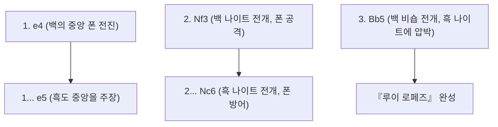
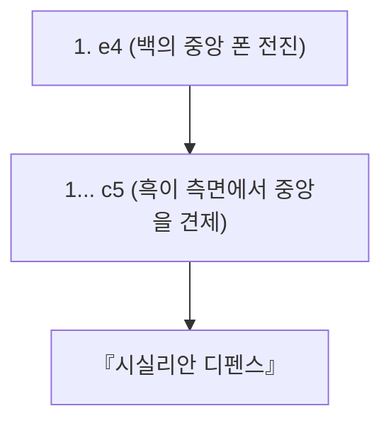

## 1. 세계 공통의 언어 「체스」

체스는 전 세계적으로 수억 명이 플레이하고 있다고 알려진 가장 인기 있는 보드게임입니다. 8×8의 64칸(흑백의 체크무늬) 위에서 백과 흑의 군대가 서로의 「킹(왕)」을 몰아넣기(체크메이트) 위해 싸웁니다.

쇼기(일본 장기)와 달리 「잡은 기물을 재사용할 수 없다(포획 기물 규칙이 없음)」는 점 때문에 게임이 진행될수록 반상의 기물이 줄어들고, 국면이 단순하면서도 광활해지는 것이 특징입니다. 따라서 초반의 진형 구축과 종반의 정밀한 수학적 계산(엔드게임)이 매우 중요해집니다.

## 2. 기물의 움직임과 특수 규칙

체스의 기물들은 각각 독특하게 움직입니다.

- **폰 (병사)**: 앞으로 1칸만 전진합니다 (처음에만 2칸 전진 가능). 적을 잡을 때만 대각선 앞으로 이동하는 특수한 기물입니다. 끝까지 도달하면 원하는 기물로 승격(프로모션)할 수 있습니다.
- **나이트 (기사)**: L자 형태로 움직이며, 다른 기물을 뛰어넘을 수 있는 유일한 기물입니다. 기물들이 밀집해 있는 초반에 활약합니다.
- **비숍 (성직자)**: 대각선으로 어디든 이동할 수 있습니다. 백색 칸의 비숍은 계속 백색 칸, 흑색 칸의 비숍은 계속 흑색 칸으로만 이동할 수 있습니다.
- **룩 (성·전차)**: 가로와 세로로 어디든 이동할 수 있습니다. 후반에 반상이 넓어지면 무적의 힘을 발휘합니다.
- **퀸 (여왕)**: 가로, 세로, 대각선으로 어디든 이동할 수 있는 최강의 기물입니다.
- **킹 (왕)**: 모든 방향으로 1칸만 이동할 수 있습니다. 이것이 궁지에 몰리면 패배합니다.

### 기억해야 할 특수 규칙: 캐슬링

체스에서 가장 중요한 특수 규칙이 「 **캐슬링 (Castling)** 」입니다.
킹과 룩을 한 번에 동시에 움직여, 킹을 안전한 구석으로 숨기면서 강력한 룩을 중앙으로 끌어내는 방어와 공격을 겸비한 수입니다. 「1경기에 1번만」 사용할 수 있는, 체스 초반의 가장 중요한 목표라고도 할 수 있습니다.

## 3. 오프닝(초반)의 3대 원칙

체스는 수백 년에 걸쳐 연구되어 왔기 때문에 초반의 수(오프닝)에는 명확한 「이론」이 존재합니다. 초보자는 먼저 다음의 3가지 원칙을 반드시 지키도록 합시다.

1. **중앙의 지배**: 반상의 중앙(d4, d5, e4, e5의 4칸)을 아군의 폰이나 기물로 제압합니다. 중앙을 지배하면 기물이 모든 방향으로 움직이기 쉬워져 주도권을 쥘 수 있습니다.
2. **마이너 피스의 전개**: 나이트와 비숍(마이너 피스)을 빠르게 전선으로 내보냅니다. 강하다고 해서 퀸을 초반부터 내보내면 상대의 작은 기물들에게 노려져 도망만 다니는 신세가 됩니다.
3. **킹의 안전 확보 (캐슬링)**: 전선이 격돌하기 전에 최대한 빨리 캐슬링을 하여 킹을 안전지대로 대피시킵니다.

## 4. 대표적인 오프닝(정석)

백번(선수)과 흑번(후수)의 첫 몇 수에는 이름이 붙어 있으며, 수백 가지의 오프닝이 존재합니다. 대표적인 것을 소개합니다.

### 루이 로페즈 (Ruy Lopez)

체스에서 가장 오래되고 가장 많이 연구된 정통 오프닝입니다. 백은 즉시 킹을 캐슬링할 준비를 갖추면서 중앙에 강한 압박을 계속 가합니다.

### 시실리안 디펜스 (Sicilian Defense)

백이 「e4」로 찔러온 것에 대해 흑이 대칭으로 받아치는 것이 아니라, 굳이 측면(c5)에서 싸움을 거는 공격적인 전법입니다. 현대 체스에서 흑번 최고 승률을 자랑하는, 매우 복잡하고 치열한 전투가 되는 오프닝입니다.

## 5. 미들게임과 엔드게임

오프닝이 끝나면 「미들게임(중반)」에 들어갑니다. 여기서는 상대의 기물을 공짜로 잡는(또는 가치가 낮은 기물과 교환하는) 「택틱스(전술)」와 장기적인 진형을 좋게 만드는 「포지셔널 플레이」 능력이 요구됩니다.

그리고 기물이 얼마 남지 않게 되면 「엔드게임(종반)」에 돌입합니다. 엔드게임에서는 「 **폰을 가장 끝까지 전진시켜 퀸으로 승격시키는 것 (프로모션)** 」이 최대의 목표가 됩니다. 왕(킹) 자신도 숨는 것을 멈추고 전선으로 나와 폰의 행군을 돕는 강력한 전력으로 변모합니다.

## 6. 요약

체스는 논리와 계산, 그리고 공간 인식 능력을 최대한 활용하는 지적 격투기입니다.
먼저 기물 움직이는 법을 익히고, 온라인 대전(Chess.com이나 Lichess 등)에서 「중앙 지배」와 「캐슬링」을 의식하면서 두어 보세요. 반상 위 전쟁의 깊이에 분명 매료될 것입니다.
