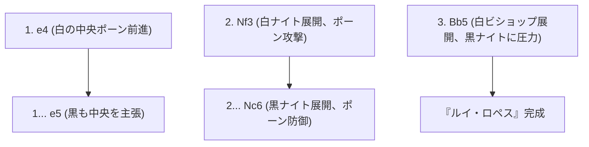
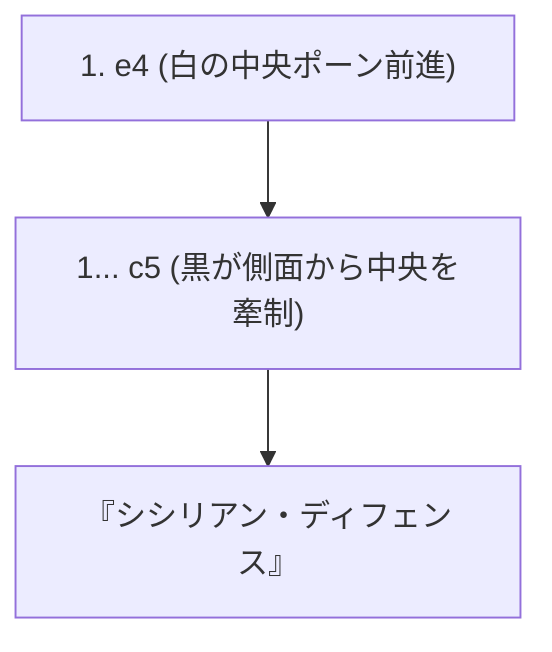

## 1. 世界共通の言語「チェス」

チェスは、世界で数億人がプレイしていると言われる最もポピュラーなボードゲームです。8×8の64マス（白黒の市松模様）の上で、白と黒の軍勢が互いの「キング（王）」を追い詰める（チェックメイトする）ために戦います。

将棋とは異なり「取った駒を再利用できない（持ち駒ルールがない）」ため、ゲームが進むにつれて盤上の駒が減り、盤面がシンプルかつ広大になっていくのが特徴です。そのため、序盤の陣形構築と、終盤の精密な数学的計算（エンドゲーム）が極めて重要になります。

## 2. 駒の動きと特殊ルール

チェスの駒はそれぞれ独特な動きをします。

- **ポーン (兵士)**: 前に1マスだけ進む（最初だけ2マス進める）。敵を取る時だけ斜め前に進む特殊な駒。端まで到達すると好きな駒に昇格（プロモーション）できる。
- **ナイト (騎士)**: L字型に動き、他の駒を飛び越えることができる唯一の駒。盤面が詰まっている序盤に活躍する。
- **ビショップ (僧侶)**: 斜めにどこまでも進める。白マスのビショップはずっと白マス、黒マスのビショップはずっと黒マスしか移動できない。
- **ルーク (城・戦車)**: 縦と横にどこまでも進める。後半に盤面が広くなると無類の強さを発揮する。
- **クイーン (女王)**: 縦、横、斜めにどこまでも進める最強の駒。
- **キング (王)**: 全方向に1マスだけ進める。これを追い詰められたら負け。

### 覚えておくべき特殊ルール：キャスリング

チェスで最も重要な特殊ルールが「**キャスリング (Castling)**」です。
キングとルークを一度に同時に動かし、キングを安全な盤面の隅に隠しつつ、強力なルークを中央に引っ張り出す防御と攻撃を兼ねた一手です。「1試合に1回だけ」使える、チェスの序盤における最重要の目標とも言えます。

## 3. オープニング（序盤）の3大原則

チェスは数百年かけて研究されてきたため、序盤の指し手（オープニング）には明確な「理論」が存在します。初心者はまず以下の3つの原則を必ず守るようにしましょう。

1. **センターの支配**: 盤面の中央（d4, d5, e4, e5の4マス）を自軍のポーンや駒で制圧する。中央を支配すれば、駒が全方向に動きやすくなり、主導権を握れます。
2. **マイナーピースの展開**: ナイトとビショップ（マイナーピース）を素早く前線に出す。強いからといってクイーンを序盤から出すと、相手の小駒に狙われて逃げ回る羽目になります。
3. **キングの安全確保 (キャスリング)**: 前線が激突する前に、なるべく早くキャスリングを行ってキングを安全地帯に避難させる。

## 4. 代表的なオープニング（定跡）

白番（先手）と黒番（後手）の最初の数手には名前がついており、何百種類ものオープニングが存在します。代表的なものを紹介します。

### ルイ・ロペス (Ruy Lopez)

チェスで最も古く、最も研究されている王道のオープニングです。白はすぐにキングをキャスリングする準備を整えつつ、中央への強い圧力をかけ続けます。

### シシリアン・ディフェンス (Sicilian Defense)

白が「e4」と突いてきたのに対し、黒が対称に返すのではなく、あえて側面（c5）から戦いを挑む攻撃的な戦法です。現代チェスにおいて黒番の最高勝率を誇る、極めて複雑で激しい戦いになるオープニングです。

## 5. ミドルゲームとエンドゲーム

オープニングが終わると「ミドルゲーム（中盤）」に入ります。ここでは相手の駒をタダ取りする（または少ない価値の駒と交換する）「タクティクス（戦術）」と、長期的な陣形を良くする「ポジショナルプレイ」の能力が問われます。

そして駒が残り少なくなると「エンドゲーム（終盤）」に突入します。エンドゲームでは「**ポーンを一番奥まで進めてクイーンに昇格させる（プロモーション）**」ことが最大の目標になります。王様（キング）自身も隠れるのをやめて、前線に出てポーンの行軍を助ける強力な戦力へと変貌します。

## 6. まとめ

チェスは、ロジックと計算、そして空間認識能力をフルに使う知的格闘技です。
まずは駒の動かし方を覚え、オンライン対戦（Chess.comやLichessなど）で「センター支配」と「キャスリング」を意識しながら指してみてください。盤上の戦争の奥深さに、きっと魅了されるはずです。
