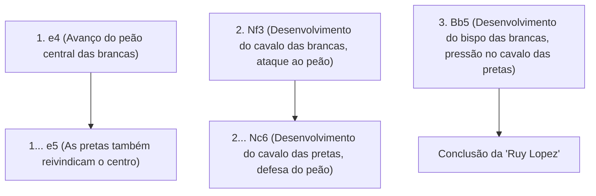
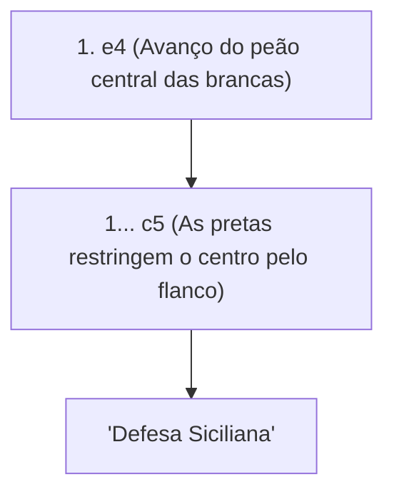

## 1. A Linguagem Universal: "Xadrez"

O xadrez é o jogo de tabuleiro mais popular, dito ser jogado por centenas de milhões de pessoas em todo o mundo. Em um tabuleiro de 8×8 com 64 casas (padrão quadriculado branco e preto), os exércitos branco e preto lutam para encurralar (dar xeque-mate) o "rei" um do outro.

Diferente do Shogi, "as peças capturadas não podem ser reutilizadas (não há regra de peças em mãos)", de modo que à medida que o jogo avança, as peças no tabuleiro diminuem, e o tabuleiro torna-se simples e vasto, o que é uma de suas características. Por isso, a construção da formação inicial e o cálculo matemático preciso no final (final de jogo) tornam-se extremamente importantes.

## 2. Movimentos das Peças e Regras Especiais

Cada peça de xadrez tem um movimento único.

- **Peão (Soldado)**: Move-se apenas 1 casa para frente (pode mover-se 2 casas apenas no primeiro movimento). É uma peça especial que se move diagonalmente para frente apenas ao capturar uma peça inimiga. Ao chegar ao extremo oposto, pode ser promovido (promoção) a qualquer peça desejada.
- **Cavalo (Cavaleiro)**: Move-se em forma de L e é a única peça que pode pular por cima de outras peças. É muito útil no início do jogo, quando o tabuleiro está congestionado.
- **Bispo (Monge/Clérigo)**: Pode mover-se diagonalmente o quanto quiser. O bispo das casas brancas só pode mover-se pelas casas brancas, e o bispo das casas pretas só pode mover-se pelas casas pretas para sempre.
- **Torre (Castelo/Carruagem)**: Pode mover-se verticalmente e horizontalmente o quanto quiser. Demonstra uma força inigualável na segunda metade do jogo, quando o tabuleiro se abre.
- **Rainha (Dama)**: A peça mais forte, que pode mover-se o quanto quiser verticalmente, horizontalmente e diagonalmente.
- **Rei**: Move-se apenas 1 casa em qualquer direção. Se for encurralado, você perde o jogo.

### Regra Especial Importante: Roque

A regra especial mais importante do xadrez é o **Roque (Castling)**.
É um movimento que combina defesa e ataque, movendo o rei e a torre simultaneamente de uma só vez, escondendo o rei em um canto seguro do tabuleiro enquanto traz a poderosa torre para o centro. Pode ser usado "apenas uma vez por jogo" e pode ser dito ser o objetivo mais importante na fase de abertura do xadrez.

## 3. Os 3 Grandes Princípios da Abertura

Como o xadrez foi estudado por centenas de anos, há uma "teoria" clara para os movimentos iniciais (aberturas). Os iniciantes devem sempre certificar-se de seguir os 3 princípios abaixo primeiro.

1. **Controle do Centro**: Controlar o centro do tabuleiro (as 4 casas d4, d5, e4 e e5) com seus peões e peças. Se você controlar o centro, suas peças poderão mover-se mais facilmente em todas as direções e você tomará a iniciativa.
2. **Desenvolvimento das Peças Menores**: Trazer os cavalos e bispos (peças menores) para a linha de frente rapidamente. Se você tirar a rainha logo no início só porque é forte, ela acabará sendo alvo das peças menores do oponente e terá que fugir.
3. **Segurança do Rei (Roque)**: Antes que as linhas de frente entrem em conflito, faça o roque o mais rápido possível para evacuar o rei para uma zona segura.

## 4. Aberturas Representativas (Teoria)

Os primeiros movimentos das Brancas (primeiro a jogar) e Negras (segundo a jogar) têm nomes, e existem centenas de tipos de aberturas. Apresentaremos as representativas.

### Ruy Lopez

É a abertura clássica mais antiga e mais estudada do xadrez. As brancas preparam-se para fazer o roque do rei rapidamente, mantendo forte pressão sobre o centro.

### Defesa Siciliana (Sicilian Defense)

Em resposta às brancas jogando "e4", em vez de responder simetricamente, as pretas ousam provocar uma batalha agressiva pelo flanco (c5). É uma abertura que resulta em batalhas extremamente complexas e ferozes, possuindo a maior taxa de vitória para as pretas no xadrez moderno.

## 5. Meio-jogo e Final de Jogo

Após a abertura terminar, entra-se no "meio-jogo". Aqui, suas habilidades em "táticas" para capturar peças do oponente de graça (ou trocá-las por peças de menor valor) e "jogo posicional" para melhorar a formação de longo prazo são postas à prova.

E quando restam poucas peças, entra-se no "final de jogo". No final de jogo, o maior objetivo é **avançar um peão até a última fileira e promovê-lo a uma rainha (promoção)**. O próprio rei também para de se esconder e se transform em uma força poderosa que vai para a linha de frente para ajudar na marcha do peão.

## 6. Conclusão

O xadrez é uma arte marcial intelectual que faz pleno uso da lógica, cálculo e percepção espacial.
Primeiro, aprenda como as peças se movem e tente jogar partidas online (como Chess.com ou Lichess), tendo em mente o "controle do centro" e o "roque". Você certamente ficará fascinado pela profundidade da guerra no tabuleiro.
