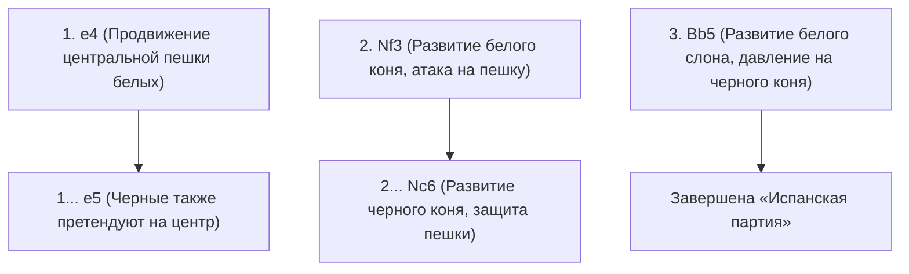
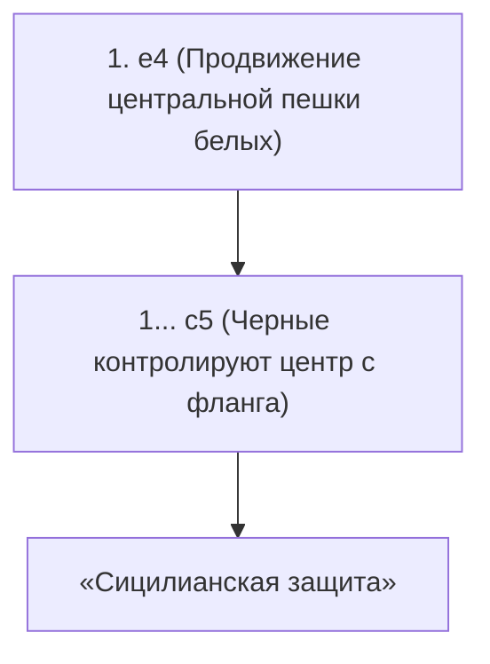

## 1. Универсальный язык мира: «Шахматы»

Шахматы — это самая популярная настольная игра в мире, в которую играют сотни миллионов людей. На доске 8×8 из 64 клеток (черно-белый клетчатый узор) белые и черные войска сражаются, чтобы загнать в угол (поставить мат) «короля» противника.

В отличие от сёги, здесь «взятые фигуры нельзя использовать снова (нет правила сброса фигур)», поэтому по ходу игры количество фигур на доске уменьшается, а позиция становится более простой и открытой. В связи с этим построение формации в дебюте и точные математические расчеты в конце игры (эндшпиль) становятся крайне важными.

## 2. Ходы фигур и особые правила

У каждой шахматной фигуры есть свои уникальные ходы.

- **Пешка (Pawn)**: Ходит только на 1 клетку вперед (может пойти на 2 клетки только при первом ходе). Это особая фигура, которая при взятии фигуры противника ходит по диагонали вперед. Дойдя до конца доски, она может превратиться (провести превращение) в любую желаемую фигуру.
- **Конь (Knight)**: Ходит буквой «Г» и является единственной фигурой, способной перепрыгивать через другие фигуры. Он особенно полезен в дебюте, когда доска переполнена.
- **Слон (Bishop)**: Может двигаться по диагонали на любое расстояние. Слон на белых полях всегда ходит только по белым полям, а слон на черных полях — только по черным.
- **Ладья (Rook)**: Может двигаться по вертикали и горизонтали на любое расстояние. Она демонстрирует непревзойденную силу во второй половине игры, когда доска становится более открытой.
- **Ферзь (Queen)**: Самая сильная фигура, которая может двигаться по вертикали, горизонтали и диагонали на любое расстояние.
- **Король (King)**: Может ходить на 1 клетку в любом направлении. Если его загонят в угол, вы проиграете.

### Особое правило, которое следует помнить: Рокировка

Самое важное особое правило в шахматах — это «**Рокировка (Castling)**».
Это ход, который сочетает в себе защиту и атаку: король и ладья двигаются одновременно, пряча короля в безопасный угол доски и выводя мощную ладью в центр. Это можно использовать «только один раз за матч», и это можно назвать важнейшей целью в шахматном дебюте.

## 3. Три главных принципа дебюта (начала игры)

Поскольку шахматы изучались сотни лет, существует четкая «теория» дебютных ходов. Новичкам следует в первую очередь придерживаться следующих трех принципов.

1. **Контроль центра**: Захватывайте центр доски (4 клетки: d4, d5, e4, e5) своими пешками и фигурами. Если вы контролируете центр, вашим фигурам будет легче двигаться во всех направлениях, и вы перехватите инициативу.
2. **Развитие легких фигур**: Быстро выводите коней и слонов (легкие фигуры) на передовую. Если вы выведете ферзя на ранней стадии только потому, что он сильный, он станет мишенью для меньших фигур противника, и вам придется им убегать.
3. **Обеспечение безопасности короля (Рокировка)**: Прежде чем начнется столкновение на передовой, как можно скорее сделайте рокировку, чтобы эвакуировать короля в безопасную зону.

## 4. Типичные дебюты (теория)

Первые несколько ходов за белых (первый ход) и черных (второй ход) имеют названия, и существуют сотни различных дебютов. Вот несколько типичных из них.

### Испанская партия (Ruy Lopez)

Это самый старый и наиболее изученный классический дебют в шахматах. Белые немедленно готовятся к рокировке короля, продолжая оказывать сильное давление на центр.

### Сицилианская защита (Sicilian Defense)

В ответ на ход белых «e4» черные не отвечают симметрично, а намеренно вступают в борьбу с фланга (c5) — это агрессивная стратегия. Это дебют, который приводит к чрезвычайно сложной и ожесточенной борьбе, и может похвастаться самым высоким процентом побед за черных в современных шахматах.

## 5. Миттельшпиль и эндшпиль

Когда дебют заканчивается, начинается «миттельшпиль (середина игры)». Здесь проверяется ваша способность к «тактике» — бесплатному взятию фигур противника (или обмену на фигуры меньшей ценности) — и к «позиционной игре», направленной на улучшение вашей формации в долгосрочной перспективе.

Затем, когда фигур остается мало, игра переходит в «эндшпиль (конец игры)». В эндшпиле главная цель — «**провести пешку на самый дальний ряд и превратить ее в ферзя (превращение)**». Сам король перестает прятаться, выходит на передовую и превращается в мощную боевую единицу, помогающую продвижению пешек.

## 6. Заключение

Шахматы — это интеллектуальное боевое искусство, в котором в полной мере используются логика, расчет и пространственное восприятие.
Для начала выучите, как ходят фигуры, и попробуйте сыграть онлайн (например, на Chess.com или Lichess), помня о «контроле центра» и «рокировке». Вы обязательно будете очарованы глубиной этой войны на доске.
