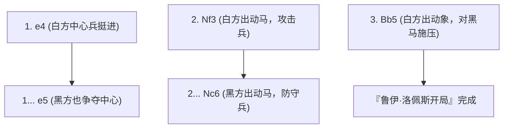
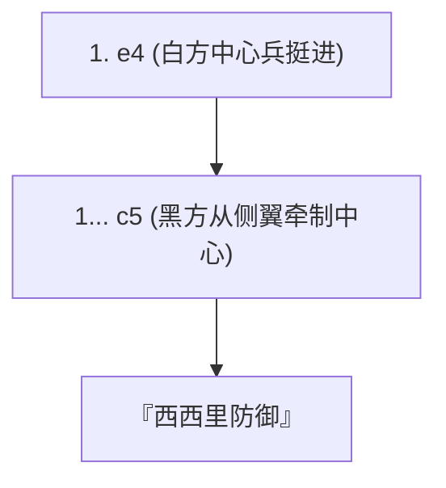

## 1. 世界共通语言“国际象棋”

国际象棋是世界上拥有数亿玩家、最受欢迎的棋盘游戏。在 8×8 的64个格子（黑白相间的棋盘）上，白方与黑方的军队为了逼死（将死）对方的“国王 (King)”而展开战斗。

与日本将棋不同，国际象棋“无法重新使用吃掉的棋子（没有打入规则）”，因此随着游戏进行，盘面上的棋子会越来越少，局面也会变得简单而广阔。正因如此，开局的阵型构建与残局（Endgame）精准的数学计算就显得尤为重要。

## 2. 棋子的移动与特殊规则

国际象棋的每种棋子都有其独特的走法。

- **兵 (Pawn)** ：只能向前走一格（仅在第一步时可选择走两格）。是唯一一种在吃掉敌方棋子时必须斜向移动的特殊棋子。走到对方底线时，可以升变（Promotion）为任意一种自己想要的棋子。
- **马 (Knight)** ：走“L”型，是唯一可以越过其他棋子移动的棋子。在盘面拥挤的开局阶段非常活跃。
- **象 (Bishop)** ：只能沿斜线无限移动。白格象永远只能走白格，黑格象永远只能走黑格。
- **车 (Rook)** ：可以沿横线或竖线无限移动。在后半段盘面变得广阔时能发挥出无与伦比的威力。
- **后 (Queen)** ：可以沿横线、竖线和斜线无限移动，是最强的棋子。
- **王 (King)** ：可以向所有方向移动一格。一旦被逼死就输了。

### 必须记住的特殊规则：王车易位

国际象棋中最重要的特殊规则就是“ **王车易位 (Castling)** ”。
同时移动国王和车，既能将国王藏匿在盘面角落的安全地带，又能将强大的车调动到中央，是一步兼具防御与攻击的妙棋。这可以说是国际象棋开局阶段中“每局只能使用一次”的最重要目标。

## 3. 开局的三大原则

因为国际象棋经过了数百年的研究，所以开局（Opening）阶段存在着明确的“理论”。初学者请务必首先遵守以下三个原则。

1. **控制中心** ：用己方的兵或棋子压制盘面的中心（d4, d5, e4, e5 四个格子）。只要控制了中心，棋子就能更方便地向所有方向移动，从而掌握主动权。
2. **出动轻子** ：迅速将马和象（轻子）调动到前线。虽然王后很强，但如果在开局就出动，很容易被对方的小兵当作目标而到处逃窜。
3. **确保国王安全 (王车易位)** ：在前线发生激烈冲突之前，尽早进行王车易位，让国王避难到安全地带。

## 4. 典型的开局（定式）

白方（先手）和黑方（后手）在最初的几步棋都有各自的名称，总共存在数百种开局。这里介绍几种具有代表性的开局。

### 鲁伊·洛佩斯开局 (Ruy Lopez)

这是国际象棋中最古老、被研究得最透彻的王道开局。白方在准备迅速让国王进行王车易位的同时，持续对中心施加巨大的压力。

### 西西里防御 (Sicilian Defense)

面对白方挺进“e4”，黑方不采取对称的回应，而是刻意从侧翼（c5）挑起战斗的攻击性战法。在现代国际象棋中，这是黑方胜率最高，同时也极度复杂和激烈的开局。

## 5. 中局与残局

开局结束后，游戏进入“中局（Middlegame）”。在这个阶段，白吃对方棋子（或者以较小价值的棋子交换）的“战术（Tactics）”，以及改善长期阵型的“局面走法（Positional Play）”能力将面临考验。

当剩下的棋子寥寥无几时，便进入了“残局（Endgame）”。在残局阶段，“ **将兵推进到最底线使其升变为王后（升变）** ”将成为最大的目标。连国王自己也不再隐藏，而是作为强大的战力走到前线，协助兵的行军。

## 6. 总结

国际象棋是一项需要充分运用逻辑、计算以及空间认知能力的智力格斗。
请先记住棋子的走法，然后尝试在在线对战平台（如 Chess.com 或 Lichess）上带着“控制中心”和“王车易位”的意识去下棋。你一定会被这盘上战争的深奥之处所深深吸引。
