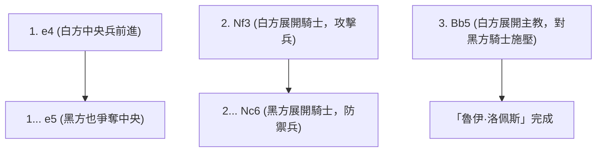
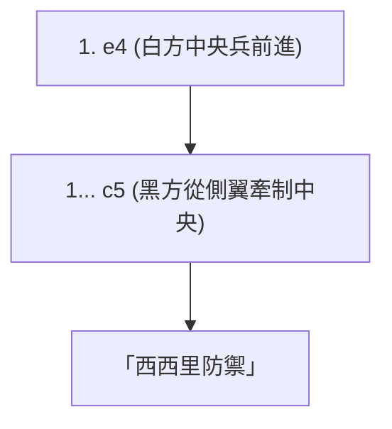

## 1. 世界共通的語言「西洋棋」

西洋棋（Chess）是世界上最受歡迎的桌上遊戲，據說有數億人在遊玩。在 8×8 的 64 個格子（黑白相間的棋盤）上，黑白雙方的軍隊為了追擊（將死）對方的「國王（King）」而戰。

與日本將棋不同的是，西洋棋「無法重新使用吃掉的棋子（沒有打入規則）」，因此隨著遊戲進行，盤面上的棋子會減少，變得更簡單且廣闊。因此，開局的陣型建立，以及殘局的精密數學計算（Endgame）變得極為重要。

## 2. 棋子的移動與特殊規則

西洋棋的棋子各有獨特的移動方式。

- **兵 (Pawn)**: 只能向前走一格（只有第一步可走兩格）。只有在吃敵方棋子時才能斜前方移動的特殊棋子。當走到最後一排時，可以升變（Promotion）為自己喜歡的棋子。
- **騎士 (Knight)**: 走 L 字型，是唯一能越過其他棋子的棋子。在棋盤擁擠的開局階段非常活躍。
- **主教 (Bishop)**: 可以在對角線上無限移動。白格主教只能在白格上移動，黑格主教只能在黑格上移動。
- **城堡 (Rook)**: 可以在直橫方向無限移動。到了後半局盤面變得廣闊時，會發揮無與倫比的強度。
- **皇后 (Queen)**: 可以在直橫、對角線方向無限移動的最強棋子。
- **國王 (King)**: 全方向只能移動一格。如果被逼到無路可走（將死）就輸了。

### 必須記住的特殊規則：入堡

西洋棋中最重要的特殊規則就是「 **入堡 (Castling)** 」。
這是將國王與城堡同時移動，把國王隱藏到安全的盤面角落，同時把強大的城堡拉到中央，兼具防禦與攻擊的一步棋。這是一場比賽只能使用一次，可以說是西洋棋開局階段最重要的目標。

## 3. 開局的 3 大原則

由於西洋棋經過數百年的研究，開局的走法存在著明確的「理論」。初學者請務必先遵守以下 3 個原則。

1. **控制中心**: 用己方的兵或棋子壓制盤面的中央（d4, d5, e4, e5 這 4 個格子）。只要控制了中心，棋子往各個方向移動都會變得更容易，就能掌握主動權。
2. **展開輕子**: 迅速將騎士與主教（輕子）推進到前線。如果因為覺得皇后很強就在開局時出動，反而會被對方的小棋子盯上而只能四處逃竄。
3. **確保國王的安全 (入堡)**: 在前線發生衝突前，盡快進行入堡，將國王避難至安全地帶。

## 4. 代表性的開局（定石）

白方（先手）與黑方（後手）的最初幾步棋都有命名，存在著數百種開局。以下介紹幾個代表性的開局。

### 魯伊·洛佩斯 (Ruy Lopez)

這是西洋棋中最古老、被研究得最多的王道開局。白方在準備讓國王盡快入堡的同時，持續對中央施加強大的壓力。

### 西西里防禦 (Sicilian Defense)

這是面對白方挺進「e4」時，黑方不以對稱方式回應，而是刻意從側翼（c5）發起戰鬥的攻擊性戰法。在現代西洋棋中，這是黑方勝率最高的開局，會形成極為複雜且激烈的戰局。

## 5. 中局與殘局

開局結束後就會進入「中局 (Middlegame) 」。在這裡，考驗的是白吃對手棋子（或是用低價值棋子交換高價值棋子）的「戰術 (Tactics) 」，以及改善長期陣型的「局面戰略 (Positional Play) 」能力。

當棋子所剩無幾時，就會突入「殘局 (Endgame) 」。在殘局中，「 **將兵前進到最後一排並升變為皇后 (Promotion)** 」會成為最大的目標。國王 (King) 本身也不再躲藏，而是轉變為走到前線幫助兵前進的強大戰力。

## 6. 總結

西洋棋是一項充分運用邏輯、計算與空間認知能力的智力格鬥技。
首先請記住棋子的移動方式，並在線上對戰（如 Chess.com 或 Lichess 等）中，試著有意識地「控制中心」與「入堡」。您一定會被這場盤上戰爭的奧妙所吸引。
