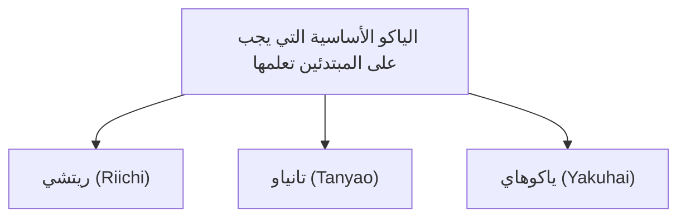

## 1. لعبة ألغاز تنافسية لـ 4 لاعبين باستخدام 136 قطعة

الماهجونغ (Mahjong) هي لعبة طاولة نشأت في الصين وتطورت في اليابان بشكلها المستقل المعروف باسم "الماهجونغ الريتشي" (Riichi Mahjong). في السنوات الأخيرة، تقدمت نحو الاحتراف من خلال مسابقات مثل دوري M-League، وتم إعادة تقييم جوانبها كرياضة ذهنية متقدمة.

للوهلة الأولى، قد تبدو اللعبة صعبة لوجود العديد من القطع (البلاطات) المكتوبة عليها رموز وأحرف صينية، ولكن في جوهرها هي **لعبة ألغاز لمطابقة المجموعات** تمامًا مثل ألعاب الورق كـ "البوكر" و"الرامي".
القاعدة الأساسية بسيطة للغاية: " **الشخص الذي يجمع 14 قطعة لتكوين الشكل المحدد (شكل الفوز أو الأغاري) أسرع من أي شخص آخر هو الفائز (ويحصل على النقاط)** ".

## 2. الشكل الأساسي للفوز (أغاري): "4 مينتسو" و "1 أتاما"

يوجد إجمالي 34 نوعًا من قطع الماهجونغ، 4 قطع من كل نوع، مما يجعل المجموع 136 قطعة تُستخدم في اللعبة.
عندما تبدأ اللعبة، يتم توزيع 13 قطعة على كل لاعب. يتناوب اللاعبون على تكرار "سحب قطعة واحدة من الجدار (تسومو)، والتخلص من قطعة واحدة غير مرغوب فيها (دا)"، لترتيب القطع في يدهم.

الهدف النهائي (شكل الفوز) هو تكوين **"4 مينتسو" و "1 أتاما" بإجمالي 14 قطعة** .

### ما هو المينتسو (Mentsu)؟
إنه مجموعة مكونة من 3 قطع. هناك طريقتان لتكوينه كما يلي:
1. **شونيتسو (Shuntsu)** : ترتيب 3 قطع من نفس النوع بتسلسل رقمي، مثل "1・2・3" أو "5・6・7". (وهو الأسهل في التكوين)
2. **كوتسو (Koutsu)** : تجميع 3 قطع متطابقة تمامًا، مثل "شرق・شرق・شرق" أو "3・3・3".

### ما هو الأتاما (Jantou)؟
إنه زوج من قطعتين متطابقتين تمامًا، مثل "شمال・شمال" أو "9・9".

إذا قمت بتكوين "4 مجموعات من الشونيتسو أو الكوتسو" في يدك، وأكملت أخيرًا "مجموعة واحدة من الأتاما"، فستصل إلى حالة "الفوز (أغاري)".

## 3. لماذا نحتاج إلى الياكو (Yaku)؟

على الرغم من أن الهدف هو تكوين "4 مينتسو و 1 أتاما"، إلا أن هناك قاعدة أخرى في الماهجونغ يجب الالتزام بها تمامًا.
وهي قاعدة " **لا يمكنك الفوز إلا إذا كانت يدك تحتوي على 'ياكو (Yaku)' واحد على الأقل (شرط الـ 1 هان)** ".

تمامًا كما هو الحال في البوكر حيث توجد توزيعات مثل "زوج واحد" أو "فلاش"، فإن الماهجونغ يحتوي أيضًا على "ياكو" يتحقق عند تكوين مجموعات معينة. كلما كان الياكو أصعب، زادت النقاط.

### 3 ياكو أساسية يجب على المبتدئين تعلمها أولاً

يوجد في الماهجونغ حوالي 40 نوعًا من الياكو، ولكن في البداية يكفي أن تتعلم الـ 3 التالية لتتمكن من اللعب.

1. **ريتشي (Riichi)** :
   ياكو يتحقق عندما تصل إلى حالة "باقي قطعة واحدة للفوز (تينباي)"، حيث تضع عصا 1000 نقطة وتعلن "ريتشي!". إنه أقوى سحر يحقق الياكو بمجرد الإعلان عنه، بغض النظر عن شكل اليد. ولكن يشترط أن تكون في حالة "مينزين (Menzen)"، أي أنك لم تقم بأي "نداء" (بون أو تشي) لأخذ قطع من لاعبين آخرين.
2. **تانياو (Tanyao)** :
   ياكو يتم فيه تكوين **"4 مينتسو و 1 أتاما" باستخدام "القطع الرقمية من 2 إلى 8" فقط** ، دون استخدام "القطع الرقمية 1 و 9" و "القطع الرمزية (الرياح الأربعة والتنانين الثلاثة)" على الإطلاق. إنه سهل التكوين ويتحقق حتى إذا قمت بـ "النداء" لأخذ قطع الآخرين، مما يجعله أحد أكثر الياكو استخدامًا في الماهجونغ الحديث.
3. **ياكوهاي (Yakuhai)** :
   **ياكو يتحقق بمجرد جمع 3 قطع (تكوين كوتسو)** من قطع رمزية معينة (تنانين بيضاء أو خضراء أو حمراء، أو رياح مقعدك). نظرًا لأنه يلبي شرط الياكو بمجرد جمع 3 قطع فقط، فهو بمثابة تذكرة سريعة للتوجه نحو الفوز بأسرع ما يمكن.

## 4. الهجوم والدفاع: معضلة التقدم والتراجع (Oshi-Hiki)

ما يجعل الماهجونغ ممتعة هو أنها ليست مجرد لعبة لإكمال أحجيتك الخاصة.
حتى إذا كنت ترغب في الفوز، فقد يسبقك الخصم ويعلن "ريتشي" أولاً.

إذا أعلن الخصم ريتشي، وقمت أنت بالتخلص من قطعة خطرة (وهي القطعة التي يحتاجها الخصم للفوز)، فسيؤدي ذلك إلى " **الوقوع في الفخ (رون)** "، وسيتعين عليك دفع الكثير من النقاط للخصم.
هنا يواجه اللاعب الخيار الحاسم.

- **التقدم (Oshi)** : المخاطرة بالوقوع في الفخ واللعب بقطع خطرة سعيًا لتحقيق الفوز الخاص بك.
- **التراجع (Betaori)** : التخلي تمامًا عن فوزك، والتركيز على الدفاع من خلال التخلص فقط من القطع الآمنة التي لا يمكن للخصم الفوز بها أبدًا.

تعتبر القدرة على تقييم الموقف وتحديد "التقدم أم التراجع" النقطة الأهم التي تميز مهارة اللاعب في الماهجونغ، وفي عالم الاحتراف، يتم إجراء حسابات احتمالات متقدمة وتخمين (قراءة) ليد الخصم.

## 5. النسبة الذهبية بين الحظ والمهارة

نظرًا لأن القطع التي يتم توزيعها في البداية وتلك التي يتم سحبها من الجدار عشوائية، فإن الماهجونغ تعتبر لعبة تعتمد بشدة على عنصر الحظ على المدى القصير. فمن الممكن جدًا أن "يفوز مبتدئ تعلم القواعد بالأمس على لاعب محترف في مباراة واحدة فقط".

ومع ذلك، عند تكرار عشرات أو مئات المباريات، يتقارب عنصر الحظ، وتظهر "المهارة" بشكل واضح في النتائج من خلال قرارات التقدم والتراجع، وكفاءة القطع (سرعة تجميع الأحجية)، وتقييم المواقف.
ملاحقة القيمة المتوقعة طويلة الأجل رغم التخبط في حظ غير منطقي. الماهجونغ هي لعبة طاولة ذات جاذبية عميقة يمكن القول إنها تمثل نموذجًا مصغرًا للحياة.
