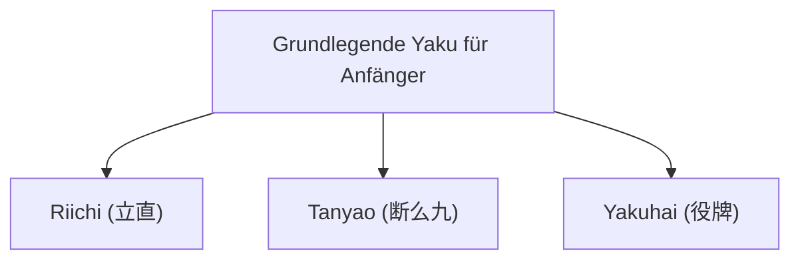

## 1. Ein Puzzle-Spiel für 4 Spieler mit 136 Ziegeln

Mahjong ist ein Tischspiel, das seinen Ursprung in China hat und sich in Japan als eigenständiges "Riichi-Mahjong" weiterentwickelt hat. In den letzten Jahren wird es durch die Professionalisierung, wie etwa die M.League, als hochgradig anspruchsvoller Denksport neu bewertet.

Auf den ersten Blick mag es aufgrund der vielen Ziegel (Pai) mit chinesischen Schriftzeichen und Symbolen kompliziert wirken, aber im Kern ist es ein **Set-Matching-Puzzlespiel**, ähnlich wie "Poker" oder "Rommé" bei Kartenspielen.
Die Grundregel ist sehr einfach: "**Wer als Erster durch Kombination von 14 Ziegeln eine bestimmte Form (die Gewinnhand) bildet, gewinnt (und erhält Punkte)**".

## 2. Die Grundform des Gewinnens: "4 Sets" und "1 Paar"

Es gibt insgesamt 34 verschiedene Mahjong-Ziegel, von denen jeder viermal vorhanden ist, was insgesamt 136 Ziegel ergibt.
Zu Beginn des Spiels erhält jeder Spieler 13 Ziegel. Die Spieler wechseln sich ab, ziehen jeweils einen Ziegel von der Mauer (Tsumo) und werfen einen nicht benötigten Ziegel ab (Dahai), um ihre Hand zu vervollständigen.

Das endgültige Ziel (die Gewinnhand) besteht darin, **"4 Sets" (Mentsu) und "1 Paar" (Atama/Jantou)** aus insgesamt 14 Ziegeln zu bilden.

### Was ist ein Set (Mentsu)?
Es ist eine Gruppe von 3 Ziegeln. Es gibt die folgenden zwei Arten, sie zu bilden:
1. **Folge (Shuntsu)**: 3 Ziegel derselben Farbe in numerischer Reihenfolge, wie "1-2-3" oder "5-6-7". (Am einfachsten zu bilden)
2. **Drilling (Koutsu)**: 3 exakt gleiche Ziegel, wie "Ost-Ost-Ost" oder "3-3-3".

### Was ist ein Paar (Atama / Jantou)?
Ein Paar (Kopf) besteht aus 2 exakt gleichen Ziegeln, wie "Nord-Nord" oder "9-9".

Wenn man in seiner Hand "4 Sets aus Folgen oder Drillingen" und am Ende "1 Paar" fertigstellt, hat man "gewonnen (Agari)".

## 3. Warum braucht man Gewinnmuster (Yaku)?

Das Ziel ist es, "4 Sets und 1 Paar" zu bilden, aber es gibt noch eine weitere Regel im Mahjong, die unbedingt beachtet werden muss.
Diese lautet: "**Man kann nur gewinnen, wenn die Hand mindestens ein 'Yaku' (Gewinnmuster) enthält (1-Han-Minimum-Regel)**".

So wie es beim Poker Hände wie "One Pair" oder "Flush" gibt, gibt es auch beim Mahjong "Yaku", die erfüllt sind, wenn man bestimmte Kombinationen bildet. Je schwieriger das Yaku, desto höher die Punktzahl.

### 3 grundlegende Yaku, die Anfänger zuerst lernen sollten

Es gibt etwa 40 verschiedene Yaku im Mahjong, aber für den Anfang reicht es völlig aus, nur die folgenden 3 zu kennen, um spielen zu können.

1. **Riichi (立直)**:
   Ein Yaku, bei dem man ein 1000-Punkte-Stäbchen setzt und "Riichi!" deklariert, wenn man nur noch einen Ziegel vom Gewinn entfernt ist ("Tenpai"). Es ist der ultimative Zauber, der bei jeder Handform ein Yaku garantiert, solange man ihn nur deklariert. Voraussetzung ist jedoch, dass man "Menzen" (eine geschlossene Hand) hat, also keine Ziegel von anderen Spielern gerufen hat (Pon, Chii).
2. **Tanyao (断么九)**:
   Ein Yaku, bei dem man 4 Sets und 1 Paar **ausschließlich aus den "Zahlenziegeln 2 bis 8"** bildet, ohne "1er und 9er" oder "Wind-/Drachenziegel (Ost/Süd/West/Nord, Weiß/Grün/Rot)" zu verwenden. Da es leicht zu bilden ist und auch gilt, wenn man Ziegel von anderen Spielern ruft ("Naki" / offene Hand), ist es eines der am häufigsten verwendeten Yaku im modernen Mahjong.
3. **Yakuhai (役牌)**:
   Ein Yaku, das allein dadurch erfüllt wird, dass man **3 bestimmte Ehrenziegel (Weiß, Grün, Rot oder den eigenen Platzwind) sammelt (zu einem Koutsu/Drilling macht)**. Da man nur 3 Ziegel sammeln muss, um die Yaku-Bedingung zu erfüllen, ist es das "Express-Ticket" auf dem schnellsten Weg zum Gewinn.

## 4. Angriff und Verteidigung: Das Dilemma von Push und Fold

Das Faszinierende an Mahjong ist, dass es nicht nur ein Spiel ist, bei dem man sein eigenes Puzzle vervollständigt.
Selbst wenn man selbst gewinnen möchte, kann es passieren, dass ein Gegner zuerst "Riichi" anmeldet.

Wenn man in dieser Situation einen gefährlichen Ziegel (den Gewinnziegel des Gegners) abwirft, obwohl der Gegner Riichi angemeldet hat, nennt man das "**Furikomi (Ron)**" (Hineinspielen), und man muss dem Gegner eine große Menge an Punkten zahlen.
Hier steht der Spieler vor der ultimativen Wahl:

- **Push (Angriff)**: Man nimmt das Risiko des Furikomi in Kauf und spielt gefährliche Ziegel, um die eigene Gewinnhand zu erreichen.
- **Fold (Rückzug / Betaori)**: Man gibt die eigene Gewinnhand komplett auf und wirft nur noch sichere Ziegel ab, mit denen der Gegner unmöglich gewinnen kann, um sich auf die Verteidigung zu konzentrieren.

Genau diese Situationsbeurteilung zwischen "Push" und "Fold" ist der wichtigste Punkt, der die wahre Stärke im Mahjong unterscheidet, und in der Profiliga werden hochkomplexe Wahrscheinlichkeitsrechnungen und Einschätzungen (Reads) der gegnerischen Hände durchgeführt.

## 5. Das goldene Verhältnis von Glück und Können

Da die anfangs ausgeteilten Ziegel und die von der Mauer gezogenen Ziegel zufällig sind, ist Mahjong kurzfristig ein Spiel mit einem sehr hohen Glücksfaktor. Es ist absolut möglich, dass "ein Anfänger, der die Regeln erst gestern gelernt hat, in einem einzigen Spiel gegen einen Profi gewinnt".

Wenn man jedoch Dutzende oder Hunderte von Spielen spielt, gleicht sich der Glücksfaktor aus, und das "Können" – wie die Entscheidungen bei Push/Fold, die Ziegel-Effizienz (die Geschwindigkeit beim Puzzeln) und die Situationsbeurteilung – spiegelt sich deutlich in den Ergebnissen wider.
Langfristige Erwartungswerte verfolgen, während man scheinbar unvernünftigem Glück ausgesetzt ist: Mahjong ist ein tiefgründiges, faszinierendes Tischspiel, das man geradezu als Mikrokosmos des Lebens bezeichnen kann.
