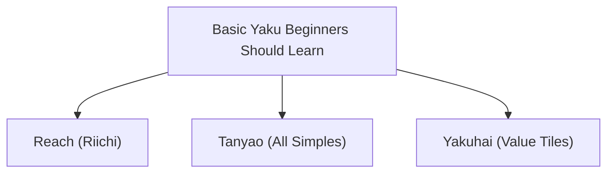

## 1. A 4-Player Puzzle Game Using 136 Tiles

Mahjong is a table game that originated in China and evolved independently in Japan as "Reach (Riichi) Mahjong." In recent years, with the professionalization of leagues like the M.League, its aspect as an advanced mind sport is being re-evaluated.

At first glance, it may seem difficult with many tiles bearing Chinese characters and symbols, but its essence is a **set-matching puzzle game**, much like "Poker" or "Rummy" in playing cards.
The basic rule is extremely simple: "**Combine 14 tiles and be the first to create a designated pattern (winning hand) to win (and receive points).**"

## 2. The Basic Winning Shape: "4 Melds" and "1 Pair"

There are 34 types of Mahjong tiles in total, with 4 of each, making a total of 136 tiles.
When the game starts, each player is dealt 13 tiles. Players take turns repeating the process of "drawing one tile from the wall (Tsumo) and discarding one unwanted tile (Daa)" to align their hands.

The final goal (winning hand) is to create **a total of 14 tiles consisting of "4 melds (mentsu)" and "1 pair (atama)"**.

### What is a Meld (Mentsu)?
It is a group of 3 tiles. There are two ways to make them:
1. **Sequence (Shuntsu)**: A set of 3 tiles of the same suit in numerical order, such as "1-2-3" or "5-6-7". (The easiest to make)
2. **Triplet (Kotsu)**: A set of 3 identical tiles, such as "East-East-East" or "3-3-3".

### What is a Pair (Atama / Jantou)?
It is a pair of 2 identical tiles, such as "North-North" or "9-9".

Within your hand, if you create "4 sets of sequences or triplets" and finally complete "1 set of a pair," it results in a "win (Agari)".

## 3. Why are Hand Roles (Yaku) Necessary?

While the goal is to make "4 melds and 1 pair," there is another absolute rule in Mahjong that must be followed.
That rule is: "**You cannot win unless your hand contains at least one 'Yaku' (1-Han minimum requirement).**"

Just like hands like "One Pair" or "Flush" in Poker, Mahjong has "Yaku" that are established when specific combinations are made. The more difficult the Yaku, the higher the points.

### The 3 Basic Yaku Beginners Should Learn First

There are about 40 types of Yaku in Mahjong, but you can enjoy the game sufficiently by just remembering the following 3 at first.

1. **Reach (Riichi)**:
   A Yaku where you place a 1000-point stick and declare "Reach!" when you are "one tile away from winning (Tenpai)". It is the ultimate magic that establishes a Yaku regardless of the shape of your hand, as long as you declare it. However, the condition is that your hand must be in a "closed (Menzen)" state, meaning you haven't called tiles (Pon, Chii) from other players.
2. **Tanyao (All Simples)**:
   A Yaku made by **creating 4 melds and 1 pair using only "number tiles from 2 to 8"**, completely avoiding "number tiles 1 and 9" and "honor tiles (East, South, West, North, White, Green, Red)". It is easy to make and remains valid even if you "call" tiles from others, making it one of the most used Yaku in modern Mahjong.
3. **Yakuhai (Value Tiles)**:
   A Yaku that is **established simply by collecting 3 specific honor tiles** (White, Green, Red, or your wind tile) to make a triplet (Kotsu). Since you only need to align 3 tiles to satisfy the Yaku condition, it acts as an express ticket to head toward a win as fast as possible.

## 4. Offense and Defense: The Dilemma of Pushing and Pulling

What makes Mahjong interesting is that it's not just a game of completing your own puzzle.
Even if you want to win, an opponent might declare "Reach" before you do.

If an opponent has declared Reach and you discard a dangerous tile (the opponent's winning tile), it results in "**dealing in (Ron)**," and you must pay a large number of points to the opponent.
Here, players are forced to make an ultimate choice.

- **Push (Oshi)**: Prepare for the risk of dealing in and aggressively play dangerous tiles aiming for your own win.
- **Pull / Fold (Betaori)**: Completely give up on your own win and focus solely on defense by discarding only safe tiles that the opponent can never win on.

This situational judgment of "pushing and pulling (oshi-hiki)" is the most crucial point that separates Mahjong skills, and in the professional world, advanced probability calculations and predicting (reading) opponents' hands are performed.

## 5. The Golden Ratio of Luck and Skill

Because the initially dealt tiles and the tiles drawn from the wall are random, Mahjong is a game where the element of luck is very strong in the short term. It is entirely possible for a beginner who learned the rules yesterday to beat a professional in a single match.

However, when repeated over dozens or hundreds of matches, the element of luck converges, and "skills" such as the judgment of pushing and pulling, tile efficiency (the speed of building the puzzle), and situational awareness clearly reflect on the results.
Pursuing long-term expected value while being tossed by unreasonable luck. Mahjong is a table game with a profound charm that can be called a microcosm of life.
