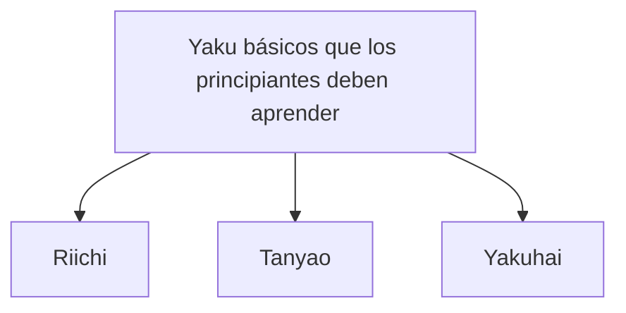

## 1. Un juego de rompecabezas para 4 jugadores usando 136 fichas

El Mahjong es un juego de mesa originario de China que evolucionó en Japón en el "Riichi Mahjong" único. En los últimos años, con la profesionalización de la M.League, ha sido reevaluado por su faceta como un [deporte mental](/es/p/game-poker-rules/) de alto nivel.

A primera vista, puede parecer difícil por la gran cantidad de fichas con caracteres y símbolos chinos, pero en esencia es un **juego de rompecabezas de formar conjuntos**, igual que el "Póker" o el "Rummy" de las cartas.
Las reglas básicas son muy simples: "**Quien combine 14 fichas y logre la forma predeterminada (forma ganadora o agari) antes que los demás, gana (y recibe puntos)**".

## 2. La forma básica de ganar: "4 conjuntos (mentsu)" y "1 par (atama)"

Hay un total de 34 tipos de fichas de Mahjong, con 4 de cada tipo, sumando un total de 136 fichas utilizadas.
Al inicio del juego, se reparten 13 fichas a cada jugador. En su turno, el jugador "roba una ficha de la muralla (tsumo) y descarta una ficha que no necesita (dahai)" repetidamente para ir ordenando su mano.

El objetivo final (la forma ganadora) es crear **un total de 14 fichas con "4 conjuntos (mentsu)" y "1 par (atama)"**.

### ¿Qué es un conjunto (mentsu)?
Es un grupo de 3 fichas. Hay dos maneras de formarlos:
1. **Secuencia (Shuntsu)**: Tres fichas del mismo palo en orden numérico, como "1, 2, 3" o "5, 6, 7". (Es el más fácil de hacer).
2. **Trío (Koutsu)**: Tres fichas exactamente iguales, como "Este, Este, Este" o "3, 3, 3".

### ¿Qué es un par (atama/jantou)?
Es un par de dos fichas idénticas, como "Norte, Norte" o "9, 9".

Dentro de tu mano, si logras crear "4 conjuntos de secuencias o tríos" y al final completas "1 par", logras una victoria o "Agari".

## 3. ¿Por qué es necesario tener una mano válida (yaku)?

Aunque el objetivo es formar "4 conjuntos y 1 par", hay otra regla en el Mahjong que debe cumplirse absolutamente.
Esa regla es: "**No puedes ganar a menos que tu mano contenga al menos un 'Yaku' (restricción de 1 han)**".

Al igual que en el póker existen manos como "Un par" o "Color", en el Mahjong también existen "Yaku" que se logran al formar ciertas combinaciones. Cuanto más difícil es el yaku, mayor es la puntuación.

### Los 3 yaku básicos que un principiante debe aprender primero

Existen alrededor de 40 tipos de yaku en el Mahjong, pero para empezar es suficiente con aprender estos 3 para jugar:

1. **Riichi**:
   Un yaku donde declaras "¡Riichi!" pagando un palito de 1000 puntos cuando estás a "solo una ficha de la forma ganadora (tenpai)". Es la magia más fuerte ya que, sin importar la forma, con solo declararlo se cumple el yaku. Sin embargo, la condición es que debes estar en estado "cerrado (menzen)", es decir, no haber reclamado fichas de otros jugadores (pon, chii).
2. **Tanyao**:
   Un yaku donde formas 4 conjuntos y 1 par **usando exclusivamente "fichas numéricas del 2 al 8"**, sin usar "fichas numéricas del 1 y 9" ni "fichas de honor (Este, Sur, Oeste, Norte, Blanco, Verde, Rojo)". Es fácil de hacer y se cumple incluso si haces "llamadas (naki)" para tomar fichas de otros, por lo que es uno de los yaku más usados en el Mahjong moderno.
3. **Yakuhai**:
   Un yaku que se logra **simplemente al formar un trío (koutsu) de ciertas fichas de honor** (Blanco, Verde, Rojo, o el viento del jugador). Como solo necesitas reunir 3 fichas para cumplir la condición del yaku, es el boleto exprés más rápido hacia la victoria.

## 4. Ataque y defensa: El dilema de presionar o retirarse (Oshi-Hiki)

Lo interesante del Mahjong es que no es simplemente un juego de completar tu propio rompecabezas.
Incluso si quieres ganar, a veces un oponente declarará "Riichi" primero.

Si descartas una ficha peligrosa (la ficha ganadora del oponente) cuando ha declarado Riichi, terminarás **"pagando (Ron)"** y tendrás que entregar una gran cantidad de puntos al oponente.
Aquí es donde el jugador se enfrenta a la decisión definitiva:

- **Presionar (Oshi)**: Asumir el riesgo de pagar y descartar fichas peligrosas para intentar conseguir tu propia victoria.
- **Retirarse (Betaori)**: Abandonar por completo tu propia victoria y concentrarte en defender descartando únicamente fichas seguras con las que el oponente definitivamente no pueda ganar.

Este juicio situacional de "presionar o retirarse" es el punto clave que divide la habilidad en el Mahjong. En el mundo profesional, se realizan cálculos de probabilidad avanzados y suposiciones (lecturas) de la mano del oponente.

## 5. La proporción áurea entre suerte y habilidad

En el Mahjong, las fichas repartidas al principio y las fichas robadas de la muralla son aleatorias, por lo que a corto plazo es un juego con un factor de suerte muy fuerte. Es perfectamente posible que "un principiante que aprendió las reglas ayer, gane una sola partida contra un profesional".

Sin embargo, tras repetir decenas o cientos de partidas, el factor suerte converge, y la "habilidad", como las decisiones de presionar o retirarse, la eficiencia de las fichas (velocidad para armar el rompecabezas) y el juicio situacional, se refleja claramente en los resultados.
Perseguir el valor esperado a largo plazo mientras se es zarandeado por la suerte irracional. El Mahjong es un juego de mesa de profundo encanto que bien puede considerarse un microcosmos de la vida.
