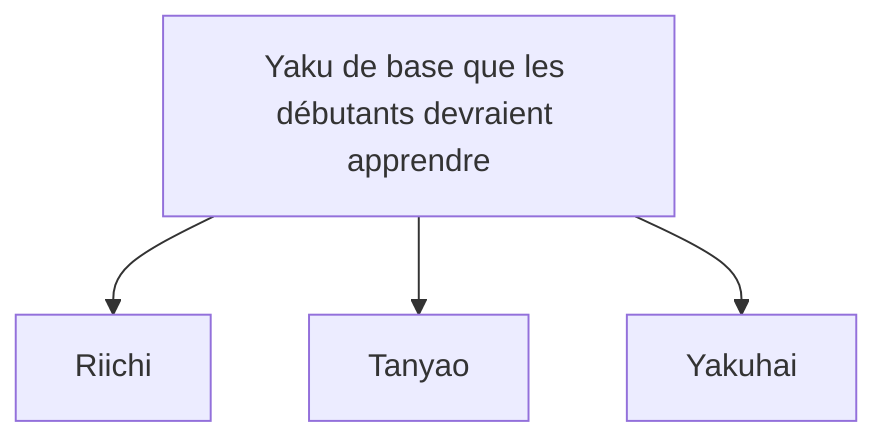

## 1. Un jeu de puzzle à 4 joueurs utilisant 136 tuiles

Le Mahjong est un jeu de table originaire de Chine qui a évolué au Japon pour devenir le « Mahjong Riichi ». Récemment, avec la professionnalisation à travers des ligues comme la M.League, il est réévalué comme un sport cérébral de haut niveau.

À première vue, cela semble difficile avec de nombreuses tuiles comportant des caractères chinois et des symboles, mais son essence est la même que le « Poker » ou le « Rami » avec des cartes à jouer : un **jeu de puzzle consistant à assembler des combinaisons**.
La règle de base est très simple : « **La personne qui combine 14 tuiles pour former une figure déterminée (main gagnante) plus rapidement que quiconque gagne (reçoit des points)** ».

## 2. La forme de base d'une main gagnante : « 4 Mentsu » et « 1 Atama »

Il y a 34 types de tuiles de Mahjong, chacune en 4 exemplaires, pour un total de 136 tuiles utilisées.
Au début du jeu, 13 tuiles sont distribuées à chaque joueur. Les joueurs, à tour de rôle, « piochent une tuile du mur (Tsumo) et jettent une tuile inutile (Daa) », arrangeant ainsi leur main.

Le but final (la main gagnante) est de former **un total de 14 tuiles composées de « 4 Mentsu » et « 1 Atama »**.

### Qu'est-ce qu'un Mentsu ?
C'est un groupe de 3 tuiles. Il y a 2 façons de les créer :
1. **Shuntsu (Suite)** : 3 tuiles de la même famille dans l'ordre numérique, comme « 1, 2, 3 » ou « 5, 6, 7 ». (Le plus facile à faire)
2. **Koutsu (Brelan)** : 3 tuiles exactement identiques, comme « Est, Est, Est » ou « 3, 3, 3 ».

### Qu'est-ce qu'un Atama (Tête) ?
C'est une paire de 2 tuiles exactement identiques, comme « Nord, Nord » ou « 9, 9 ».

Dans votre main, si vous formez « 4 ensembles de Shuntsu ou de Koutsu » et que vous complétez enfin « 1 ensemble d'Atama », cela devient un « Agari (victoire) ».

## 3. Pourquoi les Yaku (combinaisons) sont-ils nécessaires ?

Bien que le but soit de faire « 4 Mentsu » et « 1 Atama », il y a une autre règle au Mahjong qui doit absolument être respectée.
C'est la règle stipulant que « **vous ne pouvez pas gagner si votre main ne contient pas au moins un "Yaku" (contrainte d'un Han)** ».

Tout comme il y a des combinaisons comme la « Paire » ou la « Couleur » au poker, le Mahjong a aussi des « Yaku » qui sont établis lorsque des combinaisons spécifiques sont formées. Plus le Yaku est difficile, plus les points sont élevés.

### 3 Yaku de base que les débutants devraient apprendre en premier

Il existe environ 40 types de Yaku au Mahjong, mais au début, il suffit d'en mémoriser trois pour jouer.

1. **Riichi** :
   Le Yaku où vous payez un bâton de 1000 points et déclarez « Riichi ! » lorsqu'il vous manque « une tuile pour avoir une main gagnante (Tenpai) ». Quelle que soit la forme, déclarer cela est une magie puissante qui établit le Yaku. Cependant, la condition est que vous devez être dans un état de « main fermée (Menzen) », ce qui signifie que vous n'avez pas pris de tuiles aux autres joueurs (Pon, Chii).
2. **Tanyao** :
   Un Yaku où vous formez 4 Mentsu et 1 Atama en utilisant **uniquement les « tuiles numérotées de 2 à 8 »**, sans utiliser les « tuiles numérotées 1 et 9 » ni les « tuiles d'honneur (Vents et Dragons) ». Parce qu'il est facile à faire et reste valide même si vous « appelez (naki) » des tuiles d'autres joueurs, c'est l'un des Yaku les plus utilisés dans le Mahjong moderne.
3. **Yakuhai** :
   Un Yaku qui est établi simplement **en rassemblant 3 tuiles d'honneur spécifiques (Dragons Blanc, Vert, Rouge ou votre tuile de Vent) (en faisant un Koutsu)**. Remplir la condition de Yaku en n'en rassemblant que 3 est un ticket express vers la victoire.

## 4. Attaque et défense : Le dilemme de pousser ou se retirer

Ce qui rend le Mahjong intéressant, c'est qu'il ne s'agit pas seulement de compléter son propre puzzle.
Même si vous voulez gagner, il arrive que votre adversaire déclare un « Riichi » en premier.

Si votre adversaire a déclaré un Riichi et que vous jetez une tuile dangereuse (la tuile gagnante de votre adversaire), cela devient un « **Furikomi (Ron)** », et vous devrez payer beaucoup de points à votre adversaire.
Ici, le joueur fait face au choix ultime.

- **Pousser (Oshi)** : Accepter le risque de Furikomi et jouer des tuiles dangereuses dans le but de gagner soi-même.
- **Se retirer (Betaori)** : Abandonner complètement sa propre victoire et se concentrer sur la défense en ne jetant que des tuiles sûres sur lesquelles l'adversaire ne peut absolument pas gagner.

Ce jugement de situation entre « pousser et se retirer » est le point le plus important qui sépare les niveaux de compétence au Mahjong, et dans le monde professionnel, des calculs de probabilités très poussés et la déduction (lecture) de la main de l'adversaire sont effectués.

## 5. Le nombre d'or de la chance et des compétences

Le Mahjong est un jeu où le facteur chance est très fort à court terme, car les tuiles distribuées initialement et les tuiles piochées dans le mur sont aléatoires. Il est tout à fait possible qu'« un débutant qui a appris les règles hier gagne une partie contre un professionnel ».

Cependant, lorsqu'il est répété sur des dizaines ou des centaines de parties, le facteur chance converge, et la « compétence » telle que le jugement de pousser/se retirer, l'efficacité des tuiles (la vitesse d'assemblage du puzzle) et le jugement de la situation se reflètent clairement dans les résultats.
Poursuivre la valeur attendue à long terme tout en étant à la merci d'une chance déraisonnable. Le Mahjong est un jeu de table avec un attrait profond que l'on peut qualifier de microcosme de la vie.
