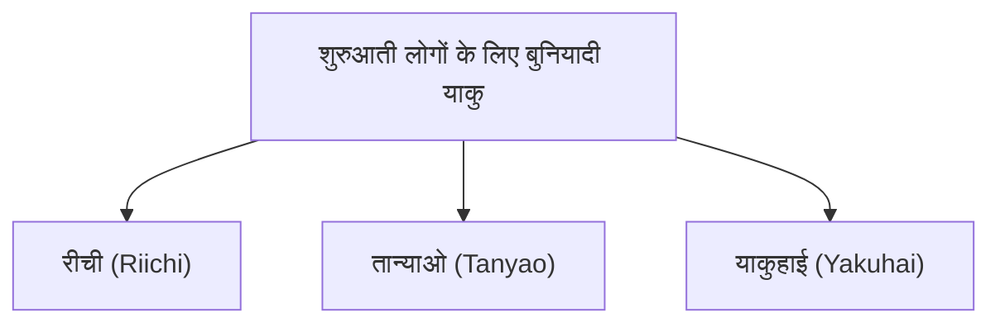

## 1. 136 टाइलों का उपयोग करने वाला 4 खिलाड़ियों का पज़ल गेम

महजोंग (Mahjong) एक टेबल गेम है जिसकी उत्पत्ति चीन में हुई और जापान में यह अपने अनूठे "रीची (Riichi) महजोंग" के रूप में विकसित हुआ। हाल के वर्षों में, M-लीग (M-League) जैसे पेशेवर प्रतियोगिताओं के बढ़ने के साथ, एक उच्च-स्तरीय दिमागी खेल के रूप में इसके पहलुओं का पुनर्मूल्यांकन किया जा रहा है।

पहली नज़र में, यह कांजी और प्रतीकों के साथ लिखे गए कई टाइलों (Pai) के कारण मुश्किल लग सकता है, लेकिन इसका सार ताश के खेल "पोकर" या "रम्मी" के समान ही एक **सेट मैचिंग पज़ल गेम** है।
मूल नियम बहुत सरल है: " **14 टाइलों को मिलाकर, जो कोई भी सबसे पहले निर्धारित आकार (अगारी आकार) बनाता है वह जीत जाता है (अंक प्राप्त करता है)** "।

## 2. अगारी का मूल आकार: "4 मेन्त्सु" और "1 अतामा"

महजोंग टाइलें कुल 34 प्रकार की होती हैं, जिनमें से प्रत्येक की 4 टाइलें होती हैं, जिससे कुल 136 टाइलों का उपयोग होता है।
जब गेम शुरू होता है, तो प्रत्येक खिलाड़ी को 13 टाइलें बांटी जाती हैं। खिलाड़ी बारी-बारी से "दीवार से 1 टाइल खींचने (त्सुमो) और 1 अनावश्यक टाइल को फेंकने (दा)" की प्रक्रिया को दोहराते हैं, और अपने हाथ (हाथ की टाइलें) को व्यवस्थित करते हैं।

अंतिम लक्ष्य (अगारी आकार) **"4 मेन्त्सु" और "1 अतामा" की कुल 14 टाइलें** बनाना है।

### मेन्त्सु (Mentsu) क्या है?
यह 3 टाइलों के 1 समूह को संदर्भित करता है। इसे बनाने के निम्नलिखित 2 तरीके हैं:
1. **शुन्त्सु (Shuntsu)**: "1・2・3" या "5・6・7" की तरह, एक ही प्रकार की 3 टाइलों को संख्यात्मक क्रम में व्यवस्थित किया जाता है। (यह बनाने में सबसे आसान है)
2. **कोत्सु (Koutsu)**: "पूर्व・पूर्व・पूर्व" या "3・3・3" की तरह, बिल्कुल एक समान 3 टाइलों का संग्रह।

### अतामा (Atama/Jantou) क्या है?
यह "उत्तर・उत्तर" या "9・9" की तरह बिल्कुल समान 2 टाइलों की जोड़ी है।

यदि आप अपने हाथ में "शुन्त्सु या कोत्सु के 4 सेट" बनाते हैं और अंत में "अतामा का 1 सेट" पूरा करते हैं, तो यह "अगारी (जीत/Ron)" माना जाता है।

## 3. हाथ के याकु (Yaku) की आवश्यकता क्यों है?

"4 मेन्त्सु और 1 अतामा" बनाना लक्ष्य है, लेकिन महजोंग में एक और नियम है जिसका सख्ती से पालन करना चाहिए।
वह नियम है, " **कम से कम 1 या उससे अधिक 'याकु' (Yaku) शामिल हुए बिना आप अगारी (जीत) प्राप्त नहीं कर सकते (1 हान की सीमा)** "।

जैसे पोकर में "वन पेयर" और "फ्लैश" जैसे हाथ होते हैं, महजोंग में भी कुछ विशिष्ट संयोजनों को बनाने पर "याकु" बनता है। याकु जितना कठिन होता है, अंक उतने ही अधिक होते हैं।

### 3 मूल याकु जो शुरुआती लोगों को सबसे पहले याद रखने चाहिए

महजोंग में लगभग 40 प्रकार के याकु होते हैं, लेकिन शुरुआत में केवल निम्नलिखित 3 को याद रखकर आप आसानी से खेल सकते हैं।

1. **रीची (Riichi)**:
   जब आप "अगारी आकार (तेनपाई) से केवल 1 टाइल दूर" हों, तो 1000 अंकों की स्टिक रखकर "रीची!" घोषित करने का याकु। चाहे कोई भी आकार हो, यह सबसे शक्तिशाली जादू है जो केवल घोषणा करने से बन जाता है। हालांकि, शर्त यह है कि आपको "मेन्जेन" (Menzen) स्थिति में होना चाहिए, जिसका अर्थ है कि आपने किसी अन्य खिलाड़ी की टाइल (पोन/ची) नहीं ली है।
2. **तान्याओ (Tanyao)**:
   "1 और 9 की संख्या वाली टाइलों" और "ऑनर टाइलों (पूर्व, दक्षिण, पश्चिम, उत्तर, सफेद, हरा, लाल)" का बिल्कुल उपयोग किए बिना, **केवल "2 से 8 की संख्या वाली टाइलों" के साथ 4 मेन्त्सु और 1 अतामा बनाने का याकु**। इसे बनाना आसान है और यह अन्य खिलाड़ियों से टाइल लेकर ("नाकी") भी बन सकता है, इसलिए यह आधुनिक महजोंग में सबसे अधिक उपयोग किए जाने वाले याकु में से एक है।
3. **याकुहाई (Yakuhai)**:
   किसी विशिष्ट ऑनर टाइल (सफेद, हरा, लाल, या अपनी हवा की टाइल) की **3 टाइलें इकट्ठा करने (कोत्सु बनाने) मात्र से बनने वाला याकु**। सिर्फ 3 टाइलें मिलाने से याकु की शर्त पूरी हो जाती है, इसलिए यह सबसे तेज़ गति से अगारी तक पहुंचने का एक्सप्रेस टिकट है।

## 4. आक्रमण और रक्षा: पुश-एंड-पुल का द्वंद्व (Oshi-Hiki Dilemma)

महजोंग की सबसे दिलचस्प बात यह है कि यह केवल अपनी पज़ल पूरी करने का खेल नहीं है।
भले ही आप अगारी प्राप्त करना चाहते हों, हो सकता है कि कोई प्रतिद्वंद्वी पहले "रीची" कर दे।

यदि प्रतिद्वंद्वी ने रीची कर दिया है और आप एक खतरनाक टाइल (प्रतिद्वंद्वी की अगारी टाइल) फेंक देते हैं, तो इसे " **फुरिकोमी (रोन / Ron)** " कहा जाता है, और आपको प्रतिद्वंद्वी को भारी मात्रा में अंक चुकाने पड़ते हैं।
यहां खिलाड़ी को एक महत्वपूर्ण चुनाव का सामना करना पड़ता है।

- **पुश (Oshi)**: फुरिकोमी के जोखिम को उठाकर, अपनी अगारी का लक्ष्य रखते हुए खतरनाक टाइल से मुकाबला करना।
- **पुल / पीछे हटना (Betaori)**: अपनी अगारी को पूरी तरह से छोड़ देना और पूरी तरह से रक्षा करने के लिए केवल सुरक्षित टाइलें फेंकना जिससे प्रतिद्वंद्वी निश्चित रूप से अगारी प्राप्त न कर सके।

इस "पुश-एंड-पुल" (Oshi-Hiki) स्थिति का आकलन ही महजोंग में कौशल को अलग करने वाला सबसे बड़ा बिंदु है, और पेशेवर दुनिया में, उन्नत संभाव्यता गणना और प्रतिद्वंद्वी के हाथों का अनुमान (पढ़ना) किया जाता है।

## 5. भाग्य और कौशल का स्वर्णिम अनुपात

महजोंग में शुरू में बांटी गई टाइलें और दीवार से खींची गई टाइलें यादृच्छिक (random) होती हैं, इसलिए अल्पावधि में भाग्य का तत्व बहुत मजबूत होता है। "कल नियम सीखने वाला कोई शुरुआती खिलाड़ी, एक पेशेवर को 1 मैच में हरा दे", ऐसा होना आम बात है।

हालांकि, जब इसे दर्जनों या सैकड़ों मैचों में दोहराया जाता है, तो भाग्य का तत्व कम हो जाता है, और पुश-एंड-पुल का निर्णय, टाइल दक्षता (पज़ल बनाने की गति), और स्थिति का आकलन जैसे "कौशल" स्पष्ट रूप से परिणामों में परिलक्षित होते हैं।
अनुचित भाग्य के बावजूद, दीर्घकालिक उम्मीदों का पीछा करना। महजोंग एक टेबल गेम है जिसमें एक गहरा आकर्षण है जिसे जीवन का सूक्ष्म रूप भी कहा जा सकता है।
