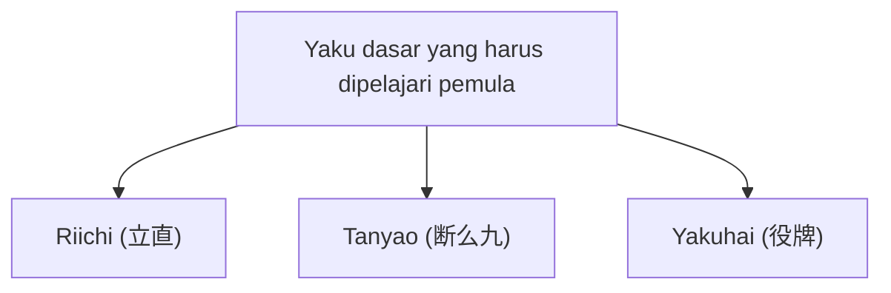

## 1. Permainan teka-teki 4 pemain menggunakan 136 ubin

Mahjong adalah permainan meja yang berasal dari Tiongkok dan berevolusi di Jepang sebagai permainan unik "Riichi Mahjong". Dalam beberapa tahun terakhir, dengan berkembangnya liga profesional seperti M-League, permainan ini kembali dinilai sebagai olahraga otak tingkat tinggi.

Sekilas, permainan ini mungkin terlihat sulit dengan banyaknya ubin (pai) yang bertuliskan karakter Tiongkok dan simbol, namun pada intinya ini adalah **permainan teka-teki mencocokkan set** yang mirip dengan "Poker" atau "Rummy" dalam permainan kartu.
Aturan dasarnya sangat sederhana, yaitu "**Kumpulkan 14 ubin, dan orang yang paling cepat membentuk pola yang ditentukan (pola kemenangan) menang (mendapatkan poin)**".

## 2. Pola kemenangan dasar: "4 set" dan "1 kepala"

Secara total, ada 34 jenis ubin Mahjong, masing-masing terdiri dari 4 buah, sehingga total yang digunakan adalah 136 ubin.
Saat permainan dimulai, setiap pemain dibagikan 13 ubin. Pemain secara bergiliran mengulangi proses "mengambil 1 ubin dari tumpukan (tsumo) dan membuang 1 ubin yang tidak diperlukan (da)", untuk menyusun ubin di tangan mereka.

Tujuan akhir (pola kemenangan) adalah membentuk **total 14 ubin yang terdiri dari "4 set (mentsu)" dan "1 kepala (atama)"**.

### Apa itu set (mentsu)?
Itu adalah kelompok yang terdiri dari 3 ubin. Ada dua cara untuk membuatnya:
1. **Shuntsu (urutan)**: 3 ubin dengan jenis yang sama yang diurutkan berdasarkan angka, seperti "1-2-3" atau "5-6-7". (Paling mudah dibuat)
2. **Koutsu (tris)**: 3 ubin yang benar-benar sama, seperti "Timur-Timur-Timur" atau "3-3-3".

### Apa itu kepala (jantou)?
Itu adalah sepasang ubin yang benar-benar sama, seperti "Utara-Utara" atau "9-9".

Jika Anda membuat "4 set shuntsu atau koutsu", dan akhirnya menyelesaikan "1 set kepala" dari ubin di tangan, itu menjadi "kemenangan (agari)".

## 3. Mengapa tangan (yaku) diperlukan?

Meskipun tujuannya adalah membuat "4 set dan 1 kepala", Mahjong memiliki satu aturan lain yang mutlak harus dipatuhi.
Aturannya adalah "**Anda tidak bisa menang kecuali jika tangan Anda memiliki minimal satu 'yaku' (aturan wajib 1-han)**".

Sama seperti "One Pair" atau "Flush" di Poker, Mahjong juga memiliki "yaku" yang terpenuhi ketika Anda membuat kombinasi tertentu. Semakin sulit yaku tersebut, semakin tinggi poin yang didapatkan.

### 3 yaku dasar yang harus dipelajari pemula pertama kali

Ada sekitar 40 jenis yaku di Mahjong, tetapi untuk pemula cukup mengingat 3 jenis berikut untuk bisa bermain:

1. **Riichi (立直)**:
   Yaku yang dideklarasikan dengan mengeluarkan tongkat 1000 poin dan menyerukan "Riichi!" saat Anda "kurang 1 ubin lagi menuju pola kemenangan (tenpai)". Ini adalah sihir terkuat karena yaku ini sah selama Anda mendeklarasikannya, terlepas dari apa bentuk tangan Anda. Akan tetapi, syaratnya adalah tangan Anda harus berada dalam kondisi "tertutup (menzen)", tanpa mengambil ubin pemain lain (pon, chii).
2. **Tanyao (断么九)**:
   Yaku yang membuat 4 set dan 1 kepala **hanya dengan "angka 2-8"**, tanpa menggunakan "angka 1 dan 9" serta "ubin huruf (Timur, Selatan, Barat, Utara, Putih, Hijau, Merah)". Yaku ini mudah dibuat dan sah meskipun Anda "memanggil (naki)" ubin pemain lain, menjadikannya salah satu yaku yang paling sering digunakan dalam Mahjong modern.
3. **Yakuhai (役牌)**:
   Yaku yang sah **hanya dengan mengumpulkan 3 (membuat koutsu) ubin huruf tertentu** (Putih, Hijau, Merah, atau ubin angin Anda sendiri). Karena memenuhi syarat yaku hanya dengan 3 ubin, ini adalah tiket ekspres yang memungkinkan Anda menuju kemenangan dengan sangat cepat.

## 4. Serangan dan pertahanan: Dilema dorong dan tarik

Hal yang membuat Mahjong menarik adalah permainan ini bukan hanya sekadar menyelesaikan teka-teki Anda sendiri.
Bahkan ketika Anda ingin menang, lawan mungkin akan melakukan "Riichi" terlebih dahulu.

Jika Anda membuang ubin berbahaya (ubin kemenangan lawan) saat lawan telah mendeklarasikan Riichi, itu akan menjadi "**kemenangan dari buangan lawan (ron)**", dan Anda harus membayar sejumlah besar poin kepada lawan.
Di sinilah pemain dipaksa untuk membuat pilihan ekstrem.

- **Dorong (Oshi)**: Mengambil risiko untuk menang dan membuang ubin berbahaya guna mencapai kemenangan Anda sendiri.
- **Tarik (Betaori)**: Menyerah sepenuhnya pada kemenangan Anda sendiri, dan fokus pada pertahanan dengan hanya membuang ubin aman yang mutlak tidak akan membuat lawan menang.

Penilaian situasi "dorong dan tarik" inilah yang paling membedakan kemampuan pemain dalam Mahjong, dan di dunia profesional, perhitungan probabilitas tingkat tinggi serta memprediksi (membaca) tangan lawan terus dilakukan.

## 5. Rasio emas antara keberuntungan dan kemampuan

Mahjong memiliki elemen keberuntungan jangka pendek yang sangat kuat, karena ubin yang dibagikan di awal dan ubin yang ditarik dari tumpukan bersifat acak. "Pemula yang baru belajar aturan kemarin bisa menang 1 pertandingan melawan pemain profesional" adalah hal yang biasa terjadi.

Namun, jika dimainkan berulang kali dalam puluhan atau ratusan pertandingan, elemen keberuntungan akan menyusut, dan "kemampuan" seperti penilaian dorong dan tarik, efisiensi ubin (kecepatan menyusun teka-teki), serta penilaian situasi akan terlihat jelas pada hasilnya.
Mengejar nilai harapan jangka panjang sambil dipermainkan oleh keberuntungan yang tidak masuk akal. Mahjong adalah permainan meja dengan daya tarik mendalam yang bisa dikatakan sebagai miniatur kehidupan.
