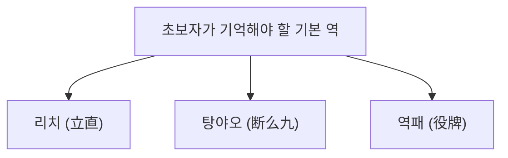

## 1. 136장의 패를 사용하는 4인 대전 퍼즐 게임

마작(麻雀)은 중국을 기원으로 하며, 일본에서 독자적인 '리치(立直) 마작'으로 진화를 이룬 테이블 게임입니다. 최근에는 M리그 등 프로 경기화가 진행되며 고도의 두뇌 스포츠로서의 측면이 재평가되고 있습니다.

언뜻 보면 한자나 기호가 적힌 패(파이)가 많아 어려워 보일 수 있지만, 본질은 트럼프의 '포커'나 '러미'와 같은 **세트 맞추기 퍼즐 게임** 입니다.
기본 규칙은 매우 심플해서, "**14장의 패를 조합하여 누구보다 빨리 정해진 형태(화료 형태)를 만든 사람이 승리(득점을 얻음)**"라는 것입니다.

## 2. 화료의 기본 형태: "4몸통(멘츠)"과 "1머리(아타마)"

마작패는 총 34종류가 있으며, 각각 4장씩 총 136장을 사용합니다.
게임이 시작되면 각 플레이어에게 13장의 패가 나누어집니다. 플레이어는 순서대로 '산에서 1장을 뽑고(쯔모), 필요 없는 패를 1장 버리는(타)' 과정을 반복하며 손패를 맞추어 갑니다.

최종적인 골(화료 형태)은 **"4개의 몸통(멘츠)"과 "1개의 머리(아타마)" 총 14장** 을 만드는 것입니다.

### 몸통(멘츠)이란?
3장 1조의 그룹을 뜻합니다. 다음의 2가지 만드는 방법이 있습니다.
1. **슌쯔(順子)**: '1·2·3'이나 '5·6·7'처럼 같은 종류의 패를 숫자의 순서대로 3장 나열한 것. (가장 만들기 쉽다)
2. **코츠(刻子)**: '동·동·동'이나 '3·3·3'처럼 완전히 같은 패를 3장 모은 것.

### 머리(작두)란?
'북·북'이나 '9·9'처럼 완전히 같은 패를 2장 모은 페어입니다.

손패 안에서 '슌쯔나 코츠를 4세트' 만들고 마지막으로 '머리를 1세트' 완성하면 '화료(和了, 아가리)'가 됩니다.

## 3. 왜 역(야쿠)이 필요한가?

'4몸통·1머리'를 만드는 것이 목표이지만, 마작에는 또 하나 절대 지켜야 할 규칙이 있습니다.
그것은 "**최소한 1개 이상의 '역(야쿠)'이 포함되어 있어야만 화료할 수 있다 (1판 묶음)**"라는 규칙입니다.

포커에 '원 페어'나 '플러시' 등의 족보가 있듯이, 마작에도 특정 조합을 만들었을 때 성립하는 '역'이 있습니다. 역이 어려울수록 점수가 높아집니다.

### 초보자가 가장 먼저 외워야 할 3가지 기본 역

마작에는 약 40종류의 역이 있지만, 처음에는 다음 3가지만 기억해도 충분히 즐길 수 있습니다.

1. **리치(立直)**:
   "앞으로 1장이면 화료할 수 있는 형태(텐파이)"가 되었을 때, 1000점봉을 내고 "리치!"라고 선언하는 역. 어떤 형태이든 선언하기만 하면 역이 성립하는 최강의 마법입니다. 단, 다른 사람의 패를 가져오지(울기/퐁·치) 않은 "멘젠(門前)" 상태여야 한다는 조건이 있습니다.
2. **탕야오(断么九)**:
   '1과 9의 숫자패'와 '자패(동남서북·백발중)'를 일절 사용하지 않고, **"2~8의 숫자패"만으로 4몸통·1머리를 만드는 역** 입니다. 만들기 쉽고, 다른 사람의 패를 가져오는 '울기'를 해도 성립하기 때문에 현대 마작에서 가장 많이 사용되는 역 중 하나입니다.
3. **역패(役牌)**:
   특정 자패(백·발·중, 또는 자신의 바람 패)를 **3장 모으는(코츠로 만드는) 것만으로 성립하는 역** 입니다. 단 3장만 모으면 역의 조건을 만족하기 때문에, 가장 빠르게 화료를 향해 갈 수 있는 특급권입니다.

## 4. 공격과 수비: 밀고 당기기의 딜레마

마작이 재미있는 이유는 그저 자신의 퍼즐을 완성하기만 하는 게임이 아니라는 점에 있습니다.
자신이 화료하고 싶어 해도 상대가 먼저 '리치'를 걸어올 때가 있습니다.

상대가 리치를 걸었는데 자신이 위험한 패(상대의 화료 패)를 버리게 되면 "**쏘임(론)**"이 되어 상대에게 다액의 점수를 지불해야 합니다.
여기서 플레이어는 궁극의 선택을 강요받습니다.

- **밀기(오시)**: 쏘일 위험을 각오하고, 자신의 화료를 목표로 위험한 패를 승부한다.
- **내리기(베타오리)**: 자신의 화료를 완전히 포기하고, 상대가 절대 화료할 수 없는 안전한 패만을 버리며 수비에 전념한다.

이 '밀고 당기기'의 상황 판단이야말로 마작의 실력을 나누는 최대의 포인트이며, 프로의 세계에서는 고도의 확률 계산과 상대의 패에 대한 추측(읽기)이 이루어지고 있습니다.

## 5. 운과 실력의 황금비

마작은 처음에 배부받는 패나 산에서 뽑아오는 패가 무작위이기 때문에 단기적으로는 운의 요소가 매우 강한 게임입니다. '어제 규칙을 배운 초보자가 프로를 상대로 1경기만 이기는' 일이 흔하게 일어날 수 있습니다.

그러나 수십 경기, 수백 경기를 반복하면 운의 요소는 수렴하고 밀고 당기기의 판단, 패 효율(퍼즐을 맞추는 속도), 상황 판단 등의 '실력'이 명확하게 성적에 나타납니다.
불합리한 운에 농락당하면서도 장기적인 기댓값을 쫓는다. 마작은 인생의 축소판이라고도 할 수 있는 심오한 매력을 가진 테이블 게임입니다.
