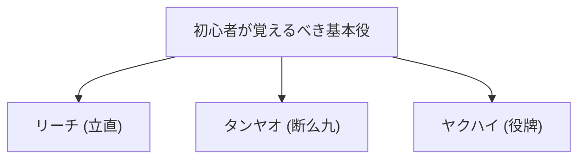

## 1. 136枚の牌を使った4人対戦のパズルゲーム

麻雀（マージャン）は、中国を起源とし、日本で独自の「リーチ（立直）麻雀」として進化を遂げたテーブルゲームです。近年ではMリーグなどのプロ競技化が進み、高度な頭脳スポーツとしての側面が再評価されています。

一見すると漢字や記号が書かれた牌（パイ）が多くて難しそうに見えますが、本質はトランプの「ポーカー」や「ラミー」と同じ**セット合わせのパズルゲーム**です。
基本ルールは非常にシンプルで、「**14枚の牌を組み合わせて、誰よりも早く決められた形（アガリ形）を作った人が勝ち（得点をもらえる）**」というものです。

## 2. アガリの基本形：「4メンツ」と「1アタマ」

麻雀牌は全部で34種類あり、それぞれ4枚ずつ、合計136枚を使います。
ゲームが始まると、各プレイヤーに13枚の牌が配られます。プレイヤーは順番に「山から1枚引いて（ツモ）、いらない牌を1枚捨てる（打）」を繰り返し、手牌を揃えていきます。

最終的なゴール（アガリ形）は、**「4つのメンツ」と「1つのアタマ」の合計14枚**を作ることです。

### メンツ（面子）とは？
3枚1組のグループのことです。以下の2種類の作り方があります。
1. **シュンツ（順子）**: 「1・2・3」や「5・6・7」のように、同じ種類の牌を数字の順番に3枚並べたもの。（最も作りやすい）
2. **コーツ（刻子）**: 「東・東・東」や「3・3・3」のように、全く同じ牌を3枚揃えたもの。

### アタマ（雀頭）とは？
「北・北」や「9・9」のように、全く同じ牌を2枚揃えたペアのことです。

手牌の中で、「シュンツかコーツを4セット」作り、最後に「アタマを1セット」完成させれば「アガリ（和了）」となります。

## 3. なぜ手役（役）が必要なのか？

「4メンツ・1アタマ」を作るのがゴールですが、麻雀にはもう一つ絶対に守らなければならないルールがあります。
それは「**最低でも1つ以上の『役（ヤク）』が含まれていなければアガれない（1ハン縛り）**」というルールです。

ポーカーで「ワンペア」や「フラッシュ」などの役があるように、麻雀にも特定の組み合わせを作った時に成立する「役」があります。役が難しいほど点数が高くなります。

### 初心者が最初に覚えるべき3つの基本役

麻雀には約40種類の役がありますが、最初は以下の3つだけ覚えれば十分に遊べます。

1. **リーチ（立直）**:
   「あと1枚でアガリの形（テンパイ）」になった時に、1000点棒を出して「リーチ！」と宣言する役。どんな形でも、宣言さえすれば役が成立する最強の魔法です。ただし、他の人の鳴き（ポン・チー）をしていない「門前（メンゼン）」の状態であることが条件です。
2. **タンヤオ（断么九）**:
   「1と9の数字牌」と「字牌（東南西北・白發中）」を一切使わず、**「2〜8の数字牌」だけで4メンツ・1アタマを作る役**。作りやすく、他の人の牌をもらう「鳴き」をしても成立するため、現代麻雀で最も使われる役の一つです。
3. **ヤクハイ（役牌）**:
   特定の字牌（白・發・中、または自分の風の牌）を**3枚揃える（コーツにする）だけで成立する役**。たった3枚揃えるだけで役の条件を満たすため、最速でアガリに向かえる特急券です。

## 4. 攻撃と守備：押し引きのジレンマ

麻雀が面白いのは、ただ自分のパズルを完成させるだけのゲームではない点にあります。
自分がアガリたいと思っても、相手が先に「リーチ」をかけてくることがあります。

相手がリーチをかけているのに、自分が危険な牌（相手のアガリ牌）を捨ててしまうと「**振り込み（ロン）**」となり、相手に多額の点数を支払わなければなりません。
ここでプレイヤーは究極の選択を迫られます。

- **押し**: 振り込むリスクを覚悟で、自分のアガリを目指して危険な牌を勝負する。
- **引き（ベタオリ）**: 自分のアガリを完全に諦め、相手が絶対にアガれない安全な牌だけを捨てて守りに徹する。

この「押し引き」の状況判断こそが、麻雀の実力を分ける最大のポイントであり、プロの世界では高度な確率計算と相手の手の推測（読み）が行われています。

## 5. 運と実力の黄金比

麻雀は、最初に配られる牌や、山から引いてくる牌がランダムであるため、短期的には運の要素が非常に強いゲームです。「昨日ルールを覚えた初心者が、プロに1試合だけ勝つ」ということが普通に起こり得ます。

しかし、何十試合、何百試合と繰り返すと、運の要素は収束し、押し引きの判断、牌効率（パズルを組むスピード）、状況判断などの「実力」が明確に成績に表れます。
理不尽な運に翻弄されながらも、長期的な期待値を追う。麻雀は、人生の縮図とも言える奥深い魅力を持ったテーブルゲームなのです。
