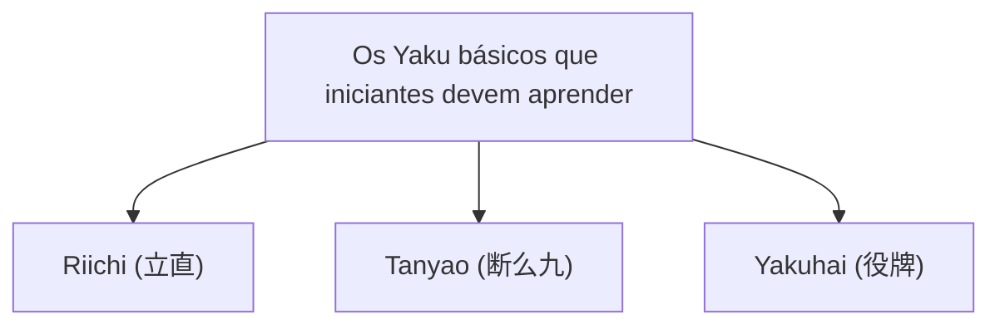

## 1. Um jogo de quebra-cabeça competitivo para 4 jogadores usando 136 peças

O Mahjong é um jogo de mesa originário da China que evoluiu de forma única no Japão como "Mahjong Riichi (立直)". Nos últimos anos, tem se profissionalizado cada vez mais, através de competições como a M-League, e seu aspecto como um [esporte mental](/pt/p/game-poker-rules/) altamente sofisticado tem sido reavaliado.

À primeira vista, pode parecer difícil por ter muitas peças (tiles) com caracteres chineses e símbolos, mas em sua essência é um **jogo de quebra-cabeça de combinação de conjuntos**, assim como o "Poker" ou o "Rummy" de cartas.
As regras básicas são muito simples: "**Aquele que combinar 14 peças e formar o padrão pré-determinado (a mão vencedora) mais rápido que os outros vence (ganha pontos)**".

## 2. A forma básica da mão vencedora: "4 Mentsu" e "1 Atama"

Existem 34 tipos de peças de Mahjong no total, e usam-se 4 de cada, totalizando 136 peças.
Quando o jogo começa, 13 peças são distribuídas para cada jogador. Os jogadores se revezam repetindo o processo de "comprar 1 peça do muro (Tsumo) e descartar 1 peça indesejada (Daa)", até organizarem sua mão.

O objetivo final (a mão vencedora) é formar um total de 14 peças consistindo em **"4 Mentsu (conjuntos)" e "1 Atama (par/cabeça)"**.

### O que é um Mentsu?
É um grupo de 3 peças. Existem duas formas de criá-los:
1. **Shuntsu (Sequência)**: 3 peças do mesmo naipe em ordem numérica, como "1-2-3" ou "5-6-7". (É o mais fácil de fazer)
2. **Koutsu (Trinca)**: 3 peças exatamente iguais, como "Leste-Leste-Leste" ou "3-3-3".

### O que é a Atama (Par)?
É um par de 2 peças exatamente iguais, como "Norte-Norte" ou "9-9".

Em sua mão, se você formar "4 conjuntos de Shuntsu ou Koutsu" e por fim completar "1 conjunto de Atama", você "Vence" (Agari).

## 3. Por que precisamos de Yaku (Mãos Valiosas)?

Embora o objetivo seja formar "4 Mentsu e 1 Atama", existe outra regra no Mahjong que deve ser estritamente seguida.
Essa regra é que "**Você não pode vencer a menos que sua mão contenha pelo menos 1 'Yaku' (restrição de 1 Han)**".

Assim como existem mãos no Poker como "One Pair" ou "Flush", o Mahjong também possui "Yaku" que são estabelecidos ao criar combinações específicas. Quanto mais difícil for o Yaku, maior será a pontuação.

### Os 3 Yaku básicos que os iniciantes devem aprender primeiro

Existem cerca de 40 tipos de Yaku no Mahjong, mas para começar, basta aprender os 3 a seguir para poder jogar confortavelmente.

1. **Riichi (立直)**:
   Um Yaku declarado dizendo "Riichi!" ao colocar um bastão de 1000 pontos quando você está "a 1 peça de distância de completar a mão (Tenpai)". É uma magia suprema que se torna um Yaku independentemente da forma da mão, contanto que seja declarado. No entanto, a condição é que você deve estar em um estado de "Menzen" (Mão Fechada), sem ter pego peças descartadas por outros (Pon, Chii).
2. **Tanyao (断么九)**:
   Um Yaku feito formando 4 Mentsu e 1 Atama **usando apenas "peças numéricas de 2 a 8"**, sem usar nenhuma "peça numérica 1 e 9" e "peças de honra (Leste, Sul, Oeste, Norte, Branco, Verde, Vermelho)". É um dos Yaku mais usados no Mahjong moderno porque é fácil de fazer e ainda é válido mesmo se você "roubar" as peças dos outros jogadores.
3. **Yakuhai (役牌)**:
   Um Yaku que se torna válido **apenas reunindo 3 peças (fazendo um Koutsu)** de certas peças de honra (Branco, Verde, Vermelho, ou a peça do seu vento). É um bilhete expresso em direção à vitória o mais rápido possível, pois atende à condição de Yaku reunindo apenas 3 peças.

## 4. Ataque e Defesa: O dilema de avançar ou recuar

O que torna o Mahjong interessante não é apenas ser um jogo onde você completa seu próprio quebra-cabeça.
Mesmo que você queira vencer, o oponente pode declarar "Riichi" primeiro.

Se você descartar uma peça perigosa (a peça que o oponente precisa para vencer) enquanto o oponente declarou Riichi, isso resulta em um "**Ron (Descarte direto)**", e você terá que pagar uma grande quantidade de pontos ao oponente.
Aqui, o jogador é forçado a fazer a escolha final.

- **Avançar (Oshi)**: Arriscar-se e jogar uma peça perigosa com o objetivo de buscar sua própria vitória.
- **Recuar (Betaori)**: Desistir completamente de vencer e descartar apenas peças seguras com as quais o oponente definitivamente não pode ganhar, focando inteiramente na defesa.

Essa decisão de "avançar ou recuar" é o maior ponto que divide as habilidades no Mahjong. No mundo profissional, são feitos cálculos avançados de probabilidade e inferências (leituras) sobre a mão do oponente.

## 5. A proporção áurea de sorte e habilidade

No Mahjong, como as peças distribuídas inicialmente e as peças compradas do muro são aleatórias, é um jogo onde o elemento da sorte é muito forte no curto prazo. É perfeitamente possível que "um iniciante que aprendeu as regras ontem vença um profissional em uma única partida".

No entanto, quando repetido dezenas ou centenas de vezes, o fator sorte converge, e a "habilidade" através de decisões de avanço e recuo, eficiência de peças (velocidade em montar o quebra-cabeça) e avaliação situacional refletem-se claramente nos resultados.
Buscando o valor esperado a longo prazo enquanto se é manipulado pela sorte irracional. O Mahjong é um jogo de mesa com um charme profundo que pode ser chamado de um microcosmo da vida.
