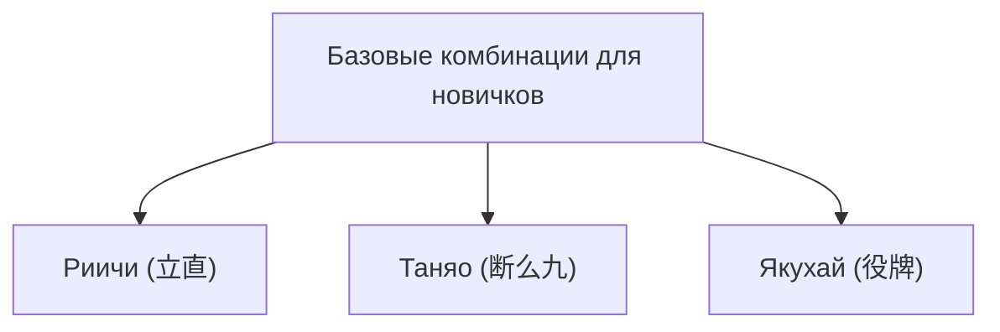

## 1. Головоломка для 4 игроков со 136 костями

Маджонг — это настольная игра, зародившаяся в Китае и получившая уникальное развитие в Японии в виде «риичи-маджонга». В последние годы она стала профессиональной дисциплиной, примером чему служит M.League, и её статус как высокоинтеллектуального вида спорта получил новое признание.

На первый взгляд игра может показаться сложной из-за большого количества костей (тайлов) с иероглифами и символами, но по своей сути она представляет собой такую же **головоломку на сбор сетов**, как карточные покер или рамми.
Базовые правила предельно просты: «**Побеждает (и получает очки) тот, кто, комбинируя 14 костей, быстрее других соберет определенную выигрышную форму**».

## 2. Базовая выигрышная форма: «4 сета» и «1 пара»

Всего в маджонге 34 вида костей, по 4 штуки каждого вида — в сумме 136 костей.
В начале игры каждому игроку раздается по 13 костей. Игроки по очереди повторяют действие: «берут 1 кость из стены (цумо) и сбрасывают 1 ненужную», выстраивая свою руку.

Конечная цель (выигрышная форма) — собрать **«4 сета» и «1 пару», то есть всего 14 костей**.

### Что такое сет (менцу)?
Это группа из 3 костей. Существуют два способа их составления:
1. **Шунцу (последовательность)**: Три кости одной масти с последовательными числами, например «1・2・3» или «5・6・7». (Собрать проще всего)
2. **Коцу (тройка)**: Три абсолютно одинаковые кости, например «Восток・Восток・Восток» или «3・3・3».

### Что такое пара (дзянто / атама)?
Это пара абсолютно одинаковых костей, например «Север・Север» или «9・9».

Если в руке собрать «4 сета (шунцу или коцу)» и в конце добавить «1 пару», это будет означать «победу» (агари).

## 3. Зачем нужны комбинации (яку)?

Собрать «4 сета и 1 пару» — это главная цель, но в маджонге есть еще одно правило, которое нужно строго соблюдать.
Оно гласит: «**Нельзя выиграть, если в руке нет хотя бы одной “комбинации” (яку)**» (правило обязательного яку).

Подобно тому, как в покере есть комбинации вроде «пары» или «флеша», в маджонге тоже существуют свои «комбинации», которые засчитываются при составлении определенного набора. Чем сложнее комбинация, тем выше ее стоимость в очках.

### 3 базовые комбинации, которые нужно выучить новичкам первыми

В маджонге около 40 видов комбинаций, но для начала достаточно запомнить эти три, чтобы полноценно играть.

1. **Риичи (立直)**:
   Комбинация, при которой игрок объявляет «Риичи!», когда до победы остается всего одна кость (состояние «тенпай»), и ставит палочку в 1000 очков. Это сильнейшая магия: независимо от формы руки, одного лишь объявления достаточно для получения комбинации. Однако условием является состояние «закрытой руки» (мендзен) — без использования чужих сброшенных костей (пон, чи).
2. **Таняо (断么九)**:
   **Комбинация из 4 сетов и 1 пары, составленная исключительно из «числовых костей от 2 до 8»**, без использования «единиц и девяток» и «буквенных костей» (ветра и драконы). Эту комбинацию легко собрать, и она засчитывается даже при взятии чужих костей («открытии» руки), что делает её одной из самых популярных в современном маджонге.
3. **Якухай (役牌)**:
   **Комбинация, для которой достаточно собрать 3 одинаковые (коцу) определенные буквенные кости** (Драконы: Белый, Зеленый, Красный, или кости вашего ветра). Сбор всего 3 костей уже выполняет условие наличия яку, поэтому это настоящий «билет на экспресс» к быстрой победе.

## 4. Атака и защита: дилемма принятия решений

Маджонг интересен тем, что это не просто игра на сбор своей собственной головоломки.
Даже если вы хотите победить, противник может первым объявить «риичи».

Если противник объявил риичи, а вы сбросите опасную кость (ту, которая нужна ему для победы), это приведет к «**набросу (рон)**», и вам придется заплатить противнику большую сумму очков.
Здесь игроки сталкиваются с главным выбором:

- **Атака (оши)**: Рискуя набросить, играть опасными костями и стремиться к собственной победе.
- **Защита (хики / бетаори)**: Полностью отказаться от своей победы и сбрасывать только безопасные кости (с которыми противник точно не сможет выиграть), сосредоточившись на глухой защите.

Именно этот баланс принятия решений (оши-хики) в ситуациях атаки и защиты является главным критерием мастерства в маджонге. В мире профессионалов здесь применяются сложные вероятностные расчеты и чтение (предугадывание) руки противника.

## 5. Золотое сечение удачи и мастерства

Поскольку кости раздаются случайно, а из стены они тоже берутся наугад, в краткосрочной перспективе фактор удачи в маджонге очень силен. Вполне обычным делом может быть ситуация, когда «новичок, выучивший правила вчера, выигрывает у профессионала в одной партии».

Однако на дистанции десятков и сотен матчей фактор удачи сглаживается, и на первый план выходит «мастерство»: правильность решений в атаке и защите, эффективность розыгрыша (скорость сборки головоломки) и умение оценивать ситуацию на столе, что отчетливо отражается на результатах.
Следование долгосрочному математическому ожиданию вопреки капризам судьбы — вот в чем заключается глубокое, как сама жизнь, очарование маджонга.
