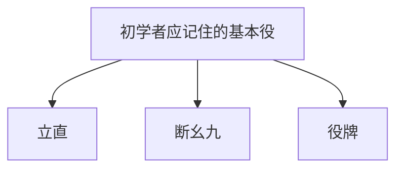

## 1. 使用136张牌的4人对战益智游戏

麻将（マージャン），起源于中国，并在日本作为独特的“立直麻将”发展演变而成的桌游。近年来随着M联赛等职业赛事的推进，其作为高度智力体育的侧面正受到重新评价。

乍看之下，写有汉字和符号的牌很多，似乎很难，但其本质与扑克牌的“扑克”或“拉密牌”一样，都是 **凑套的益智游戏** 。
基本规则非常简单：“ **组合14张牌，比任何人都要快地做出规定的形状（和牌形状）的人获胜（能够获得分数）** ”。

## 2. 和牌的基本形状：“4面子”与“1雀头”

麻将牌共有34种，每种4张，总计使用136张。
游戏开始时，每位玩家会被分发13张牌。玩家轮流重复“从牌山中摸1张牌（摸牌），丢弃1张不需要的牌（打牌）”的动作，来凑齐手牌。

最终的目标（和牌形状）是，做出 **“4个面子”与“1个雀头”共计14张牌** 。

### 什么是面子？
即3张1组的牌组。有以下2种组成方式。
1. **顺子** ：“1・2・3”或“5・6・7”这样，将同种类的牌按数字顺序排列的3张牌。（最容易凑成）
2. **刻子** ：“东・东・东”或“3・3・3”这样，凑齐3张完全相同的牌。

### 什么是雀头（对子）？
“北・北”或“9・9”这样，凑齐2张完全相同的牌组成的对子。

在手牌中，凑齐“4组顺子或刻子”，最后完成“1组雀头”即为“和牌”。

## 3. 为什么需要手役（役种）？

虽然目标是凑齐“4面子・1雀头”，但麻将中还有一个绝对必须遵守的规则。
那就是“ **如果没有包含至少1个以上的‘役’，就不能和牌（1番起和）** ”的规则。

就像扑克中有“一对”或“同花”等牌型一样，麻将中也有在凑成特定组合时成立的“役”。役种难度越高，分数就越高。

### 初学者首先应该记住的3个基本役种

麻将中大约有40种役，但最初只要记住以下3个就足以进行游戏了。

1. **立直** ：
   在“还差1张牌就能和牌的形状（听牌）”时，拿出1000点棒并宣告“立直！”的役。无论什么形状，只要宣告就能使役成立的最强魔法。但是，前提条件必须是未吃碰其他玩家牌的“门前清”状态。
2. **断幺九** ：
   完全不使用“1和9的数字牌”以及“字牌（东南西北・白发中）”， **仅使用“2〜8的数字牌”来凑齐4面子・1雀头的役** 。容易凑成，而且即使通过“鸣牌（吃碰）”拿别人的牌也能成立，因此是现代麻将中最常用的役种之一。
3. **役牌** ：
   **只要凑齐3张特定的字牌（白・发・中，或者自己风位的风牌）即可成立的役** 。仅仅凑齐3张就能满足役的条件，是能够最快迈向和牌的特快车票。

## 4. 进攻与防守：攻防的困境

麻将的有趣之处在于，它并不仅仅是一个完成自己拼图的游戏。
即使自己想要和牌，对手有时也会抢先宣告“立直”。

在对手宣告立直的情况下，如果自己丢弃危险牌（对手的和牌），就会造成“ **放铳（点炮）** ”，必须向对手支付大量分数。
在这里，玩家会被迫做出终极选择。

- **进攻（推）** ：做好放铳风险的觉悟，以自己和牌为目标，打出危险牌进行决胜。
- **防守（弃和）** ：完全放弃自己和牌，只丢弃对手绝对无法和牌的安全牌，彻底防守。

这种“攻守”的情况判断正是区分麻将实力的最大要点，在职业选手的世界里，他们会进行高度的概率计算和对手手牌的推测（读牌）。

## 5. 运气与实力的黄金比例

麻将由于最初分发的牌和从牌山中摸来的牌都是随机的，所以在短期内运气成分非常强。“昨天才学会规则的初学者，在仅仅1局的比赛中战胜职业选手”的情况也是完全可能发生的。

然而，当经过几十局、几百局的重复后，运气成分会逐渐收敛，攻防的判断、牌效（凑齐拼图的速度）、情况判断等“实力”就会明确地体现在成绩上。
尽管会被不讲理的运气所捉弄，但依然要追求长期的期望值。麻将，就是一款可以说是人生缩影、具有深奥魅力的桌游。
