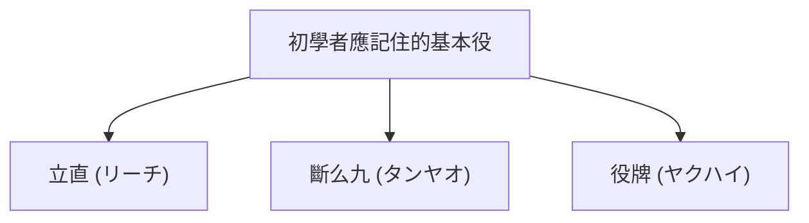

## 1. 使用136張牌的4人對戰益智遊戲

麻將（Mahjong）起源於中國，在日本獨自進化為「立直（リーチ）麻將」的桌上遊戲。近年來，隨著M聯盟（M-League）等職業賽事的發展，其作為高度智力運動的一面重新受到重視。

乍看之下，寫著漢字與記號的牌（Tile）數量繁多，似乎很困難，但其本質與撲克牌的「撲克」或「拉密（Rummikub）」一樣，都是 **湊套數的益智遊戲** 。
基本規則非常簡單，就是「 **將14張牌進行組合，比任何人都要快做出規定的形式（胡牌形），即為獲勝（可獲得分數）** 」。

## 2. 胡牌的基本型：「4面子」與「1雀頭」

麻將牌總共有34種，每種各4張，合計使用136張。
遊戲開始時，會發給每位玩家13張牌。玩家將依序重複「從牌山摸1張牌（自摸），並丟棄1張不要的牌（打）」，藉此湊齊手牌。

最終的目標（胡牌形），是湊成 **「4個面子」與「1個雀頭」合計14張牌** 。

### 什麼是面子？
即3張1組的組合。有以下2種組成方法。
1. **順子（シュンツ）** ：如「1・2・3」或「5・6・7」般，將同種類的牌依數字順序排列的3張牌。（最容易湊成）
2. **刻子（コーツ）** ：如「東・東・東」或「3・3・3」般，湊齊3張完全相同的牌。

### 什麼是雀頭（アタマ）？
如「北・北」或「9・9」般，湊齊2張完全相同之牌的對子。

在手牌中，湊齊「4組順子或刻子」，最後完成「1組雀頭」，即為「胡牌（和了）」。

## 3. 為什麼需要手役（役）？

雖然目標是湊成「4面子・1雀頭」，但麻將中還有一個絕對必須遵守的規則。
那就是「 **至少必須包含1個以上的『役（ヤク）』才能胡牌（1翻起胡）** 」的規則。

如同撲克牌中有「一對」或「同花」等牌型，麻將中也有湊成特定組合時才成立的「役」。役的難度越高，分數也就越高。

### 初學者最先應記住的3個基本役

麻將約有40種役，但一開始只要記住以下3種，就足以享受遊玩的樂趣。

1. **立直（リーチ）** ：
   在「只差1張牌就能胡牌的形式（聽牌）」時，拿出1000點棒並宣告「立直！」的役。無論是什麼形式，只要宣告就能成立的最強魔法。不過，條件是必須處於沒有拿取他人捨牌（碰・吃）的「門前（メンゼン）」狀態。
2. **斷么九（タンヤオ）** ：
   完全不使用「1和9的數字牌」與「字牌（東南西北・白發中）」， **僅用「2〜8的數字牌」湊成4面子・1雀頭的役** 。容易湊成，且即使拿取他人的牌「鳴牌（吃碰）」也能成立，是現代麻將中最常使用的役之一。
3. **役牌（ヤクハイ）** ：
   只要將特定的字牌（白・發・中，或是自己方位的風牌） **湊齊3張（做成刻子）就能成立的役** 。只需湊齊3張便滿足役的條件，是能以最快速度邁向胡牌的特快車票。

## 4. 攻擊與防守：攻防的兩難

麻將之所以有趣，在於它不僅僅是一款完成自己拼圖的遊戲。
即便自己想胡牌，對手有時也會搶先宣告「立直」。

當對手已經立直時，若自己丟出危險的牌（對手的胡牌），就會變成「 **放銃（ロン，即點炮）** 」，必須支付給對手高額的分數。
此時玩家將被迫做出終極的抉擇。

- **攻（押し）** ：做好放銃風險的覺悟，為了自己的胡牌而打出危險牌一決勝負。
- **守（引き / ベタオリ）** ：完全放棄自己的胡牌，只丟出對手絕對無法胡的「安全牌」，貫徹防守。

這種「攻防」的狀況判斷，正是決定麻將實力最大的關鍵，而在職業的世界中，更會進行高度的機率計算與對手手牌的推測（讀牌）。

## 5. 運氣與實力的黃金比例

麻將因為一開始發放的牌，以及從牌山摸來的牌都是隨機的，所以在短期內是一款運氣成分非常強的遊戲。「昨天才剛學會規則的初學者，在1場比賽中戰勝職業選手」，這種事是完全可能發生的。

然而，當重複進行幾十場、幾百場比賽後，運氣的成分將會收斂，而攻防判斷、牌效（組合拼圖的速度）、狀況判斷等「實力」，將會明確地反映在成績上。
儘管被不講理的運氣所捉弄，卻仍追求長期的期望值。麻將，正是一款具有如人生縮影般深奧魅力的桌上遊戲。
