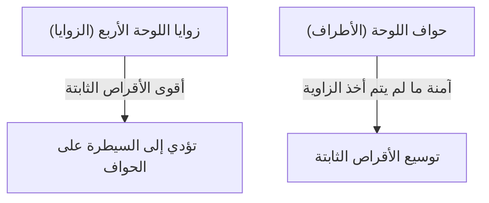

## 1. دقيقة للتعلم، وعمر بأكمله للإتقان

أوثيلو (ريفرسي) هي لعبة لوحية ابتكرها الياباني غورو هاسيغاوا في عام 1973، وهي محبوبة في جميع أنحاء العالم.
القواعد بسيطة للغاية. "قم بمحاصرة أقراص خصمك لقلبها إلى لونك" و"في النهاية، يفوز من لديه عدد أكبر من الأقراص بلونه على اللوحة (التي تتكون من 8×8 بمجموع 64 مربعًا)". هذا كل شيء.

ومع ذلك، يكاد يكون من المستحيل على المبتدئ أن يفوز على لاعب متمرس. وذلك لأن أوثيلو تمتلك نظرية استراتيجية عميقة تتعارض مع الحدس، وهي " **تقليل أقراصك عمدًا في المرحلة الافتتاحية** ".

## 2. قيمة "الأقراص الثابتة" التي لا يمكن قلبها أبدًا

من أهم المفاهيم في أوثيلو هو " **الأقراص الثابتة** ".
ويشير هذا إلى "الأقراص التي لا يمكن للخصم قلبها أبدًا حتى نهاية اللعبة، بغض النظر عما يفعله".

الأقراص الموضوعة في " **الزوايا (الزوايا الأربع)** " للوحة لا يمكن محاصرتها من أي اتجاه، مما يجعلها أقوى الأقراص الثابتة. بمجرد تأمين زاوية، يمكنك استخدامها كنقطة انطلاق لتحويل الأقراص الموجودة على الحواف إلى أقراص ثابتة واحدًا تلو الآخر.
لذلك، يمكن القول إن استراتيجية أوثيلو تتمحور أساسًا حول لعبة " **كيفية منع الخصم من أخذ الزوايا، وتأمينها لنفسك** ".

## 3. خطورة لعبتي "X" و "C" لمنع الخصم من أخذ الزوايا

لمنع فقدان الزوايا، القاعدة الذهبية هي عدم وضع الأقراص في المربعات المجاورة مباشرة للزوايا.
في مصطلحات أوثيلو، تسمى المربعات المائلة إلى الداخل من الزاوية بـ " **X (إكس)** "، وتسمى المربعات التي تقع أعلى وأسفل ويمين ويسار الزاوية بـ " **C (سي)** ".

- **خطورة لعب X**: إذا وضعت قرصًا في المربع X، فيمكن لخصمك فورًا محاصرة ذلك القرص وأخذ "الزاوية". لذلك، يُعتبر اللعب في X خلال المرحلة الافتتاحية إلى المتوسطة "عملًا انتحاريًا".
- **خطورة لعب C**: وبالمثل، وضع قرص في المربع C يحمل خطرًا كبيرًا جدًا لفقدان الزاوية، لذا يجب تجنبه ما لم تكن لاعبًا خبيرًا.

## 4. لماذا يعتبر "عدم أخذ الأقراص في الافتتاحية" استراتيجية قوية؟ (نظرية درجة الانفتاح)

يفرح المبتدئون عند وجود "أماكن تتيح محاصرة الكثير من الأقراص" ويقومون بقلبها. ومع ذلك، هذه هي أسوأ خطوة يمكن القيام بها في أوثيلو.

في أوثيلو، هناك قاعدة تنص على أنه عندما يزداد عدد أقراصك، تقل "الأماكن التي يمكنك اللعب فيها بعد ذلك"، وعندما يزداد عدد أقراص خصمك، تزداد "الأماكن التي يمكنك اللعب فيها". ويُطلق على هذا اسم " **نظرية درجة الانفتاح** ".

إذا أخذت الكثير من الأقراص في المرحلة الافتتاحية، فستنكشف أقراصك على الجزء الخارجي من اللوحة، ولن يتبقى لك أماكن للعب فيها لاحقًا. عندما تصل إلى حالة لا توجد فيها أماكن للعب (انعدام الخيارات)، ستُجبر في النهاية على اللعب في "أماكن خطيرة لا ترغب في اللعب فيها (X و C)".
ويسمى هذا في مصطلحات أوثيلو " **طريق مسدود (تمرير)** " أو " **حركة إجبارية** ".

يقوم اللاعبون الأقوياء، من المرحلة الافتتاحية وحتى المتوسطة، بتجميع أقراصهم بأصغر قدر ممكن في "وسط اللوحة" (التقسيم الداخلي)، وجعل الخصم يحيط بهم من الخارج. ثم يقومون تدريجيًا بحرمان الخصم من الأماكن التي يمكنه اللعب فيها، وفي النهاية يجبرون الخصم على اللعب في X، ليستولوا هم على الزوايا.

## 5. 3 خطوات لكي يفوز المبتدئ

إذا كنت ترغب في الفوز في أوثيلو، فإن مجرد اتباع القواعد الثلاث التالية سيجعلك أقوى بكثير.

1. **اقلب "قرصًا واحدًا فقط" في الافتتاحية**: حتى لو كانت هناك أماكن يمكنك فيها أخذ الكثير من الأقراص، تحلى بالصبر، والتزم بـ "التقسيم الداخلي" بقلب قرص واحد فقط في وسط اللوحة.
2. **حافظ على عدد أقراصك قليلًا**: دع الخصم يحيط بك من الخارج، بينما تختبئ أنت في الداخل.
3. **لا تلعب أبدًا في X و C**: لا تقترب أبدًا من المنطقة المحيطة بالزوايا حتى تصل إلى طريق مسدود وتُجبر على ذلك.

## 6. الخلاصة

أوثيلو هي لعبة يتم فيها قمع "الرغبات الحدسية (الرغبة في قلب الكثير من الأقراص)" بواسطة العقل المنطقي.
هذه الطبيعة الاستراتيجية المتمثلة في التخلي عن المكاسب قصيرة الأجل من أجل تحقيق النصر النهائي (الأقراص الثابتة) تحمل دروسًا عميقة تنطبق أيضًا على الأعمال التجارية والاستثمار. في المرة القادمة التي تلعب فيها، تأكد من تجربة استراتيجية "الحفاظ على عدد أقراص أقل".
