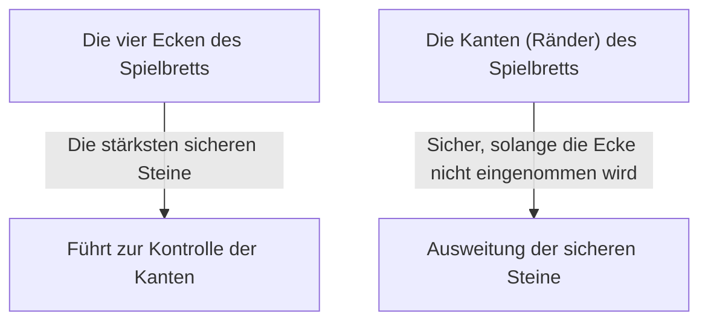

## 1. Eine Minute zum Lernen, ein Leben lang zum Meistern

Othello (Reversi) ist ein Brettspiel, das 1973 vom Japaner Goro Hasegawa erfunden wurde und auf der ganzen Welt beliebt ist.
Die Regeln sind extrem einfach: „Man schließt die gegnerischen Steine ein und dreht sie in die eigene Farbe um“ und „Am Ende gewinnt derjenige, der auf dem Spielbrett (8×8, also 64 Felder) mehr Steine in seiner eigenen Farbe hat“. Das ist alles.

Allerdings ist es für einen Anfänger fast unmöglich, gegen einen erfahrenen Spieler zu gewinnen. Denn bei Othello gibt es eine kontraintuitive, aber tiefgehende strategische Theorie, die besagt: „**In der Eröffnungsphase hält man die Anzahl der eigenen Steine absichtlich gering**“.

## 2. Der Wert der „sicheren Steine“, die niemals umgedreht werden können

Eines der wichtigsten Konzepte bei Othello sind die „**sicheren Steine**“.
Dies bezieht sich auf „Steine, die der Gegner bis zum Ende des Spiels absolut nicht umdrehen kann, egal was er tut“.

Steine, die in den „**Ecken**“ des Spielbretts platziert werden, können aus keiner Richtung eingeschlossen werden und sind daher die stärksten sicheren Steine. Hat man erst einmal eine Ecke erobert, kann man von dort ausgehend nach und nach auch die Steine an den Kanten zu sicheren Steinen machen.
Aus diesem Grund kann man sagen, dass die Strategie von Othello im Grunde ein Spiel ist, bei dem es darum geht: „**Wie man verhindert, dass der Gegner die Ecken einnimmt, während man selbst die Ecken erobert**“.

## 3. Die Gefahr des „X-Zugs“ und „C-Zugs“, um die Ecken zu schützen

Um zu verhindern, dass die Ecken eingenommen werden, ist es eine eiserne Regel, keine Steine auf die Felder direkt neben den Ecken zu setzen.
In der Othello-Terminologie werden die Felder diagonal innerhalb der Ecken als „**X**“ und die Felder direkt oben, unten, links und rechts neben den Ecken als „**C**“ bezeichnet.

- **Die Gefahr des X-Zugs**: Wenn Sie einen Stein auf X setzen, kann der Gegner diesen Stein sofort einschließen und die „Ecke“ erobern. Deshalb gilt ein X-Zug in der Eröffnungs- bis Mittelphase als „Selbstmord“.
- **Die Gefahr des C-Zugs**: Ebenso ist das Setzen eines Steins auf C mit einem sehr hohen Risiko verbunden, die Ecke zu verlieren, und sollte daher vermieden werden, es sei denn, man ist ein Experte.

## 4. Warum ist es stark, „in der Eröffnungsphase keine Steine zu nehmen“? (Mobilitätstheorie)

Anfänger freuen sich oft, wenn es „Orte gibt, an denen man viele Steine einschließen kann“, und drehen sie um. Dies ist jedoch der schlimmste Fehler, den man bei Othello machen kann.

Bei Othello gibt es die Regel, dass „die Orte, an denen man als Nächstes ziehen kann“, weniger werden, wenn man viele eigene Steine hat, und „die Orte, an denen man ziehen kann“, mehr werden, wenn der Gegner viele Steine hat. Dies wird als „**Mobilitätstheorie**“ (Kaihoudo-Theorie) bezeichnet.

Wenn man in der Eröffnungsphase zu viele Steine nimmt, werden die eigenen Steine an der Außenseite des Spielbretts freigelegt, und es gibt keinen Platz mehr für den nächsten Zug. Wenn man keine Zugmöglichkeiten (keine Optionen) hat, ist man letztendlich gezwungen, an „gefährlichen Orten (wie X oder C), an denen man eigentlich nicht ziehen möchte“, zu spielen.
Dies wird im Othello-Jargon als „**Patt (Passen)**“ oder „**erzwungener Zug**“ bezeichnet.

Starke Spieler halten ihre Steine von der Eröffnungs- bis zur Mittelphase so klein wie möglich „in der Mitte des Spielbretts“ (Nakawari) und lassen den Gegner die Außenseite umschließen. Dann nehmen sie dem Gegner nach und nach die Zugmöglichkeiten weg, zwingen ihn schließlich zu einem Zug auf X und erobern so die Ecken.

## 5. Drei Schritte zum Sieg für Anfänger

Wenn Sie bei Othello gewinnen möchten, werden Sie durch das bloße Befolgen der folgenden drei Regeln dramatisch stärker.

1. **In der Eröffnungsphase nur „einen einzigen“ umdrehen**: Selbst wenn es Orte gibt, an denen Sie viele Steine nehmen können, halten Sie sich zurück und bestehen Sie auf das „Nakawari“, bei dem Sie nur einen Stein in der Mitte des Spielbretts umdrehen.
2. **Die Anzahl der eigenen Steine gering halten**: Lassen Sie den Gegner die Außenseite umschließen, während Sie sich im Inneren verstecken.
3. **Niemals auf X und C ziehen**: Greifen Sie niemals auf den Bereich um die Ecken zu, bis Sie durch ein Patt dazu gezwungen werden.

## 6. Fazit

Othello ist ein Spiel, bei dem man das „intuitive Verlangen (viele Steine umdrehen zu wollen)“ mit logischer Vernunft unterdrückt.
Die Strategie, kurzfristige Gewinne aufzugeben und nach dem endgültigen Sieg (sichere Steine) zu streben, bietet eine tiefe Lektion, die auch für Geschäfte und Investitionen gilt. Wenn Sie das nächste Mal spielen, sollten Sie unbedingt die Strategie ausprobieren, „die Anzahl Ihrer Steine gering zu halten“.
