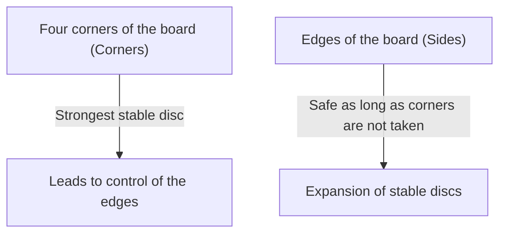

## 1. A Minute to Learn, a Lifetime to Master

Othello (Reversi) is a board game invented in 1973 by Goro Hasegawa in Japan and is loved all over the world.
The rules are extremely simple. "Sandwich the opponent's discs to flip them to your color" and "The winner is the one with more of their color on the board (8x8, 64 squares) at the end." That's all.

However, it is almost impossible for a beginner to beat an experienced player. This is because Othello has a deep strategic theory that goes against intuition: "**intentionally keeping your discs few in the opening**".

## 2. The Value of "Stable Discs" That Can Never Be Flipped

One of the most important concepts in Othello is the "**stable disc**".
This refers to "a disc that can never be flipped by the opponent no matter what they do until the end of the game."

Discs placed in the "**corners**" of the board can never be sandwiched from any direction, making them the strongest stable discs. Once you take a corner, you can use it as a starting point to turn the discs on the edges into stable discs one after another.
Therefore, the strategy of Othello can be fundamentally described as a game of "**how to prevent the opponent from taking the corners while taking them yourself**".

## 3. The Danger of "X-Squares" and "C-Squares" to Prevent Giving Up Corners

To avoid having your corners taken, it is an ironclad rule not to place a disc on the squares immediately adjacent to the corners.
In Othello terminology, the squares diagonally inside the corners are called "**X-squares**", and the squares directly above, below, left, and right of the corners are called "**C-squares**".

- **The Danger of X-Squares**: If you place a disc on an X-square, the opponent can immediately sandwich that disc and take the "corner". Therefore, playing on an X-square in the early to middle stages is considered a "suicidal act."
- **The Danger of C-Squares**: Similarly, placing a disc on a C-square carries a very high risk of having the corner taken, so it should be avoided unless you are an expert.

## 4. Why is "Not Taking Discs in the Opening" Strong? (Mobility Theory)

Beginners are often happy to flip discs whenever they find a place where they can "sandwich many." However, this is the worst possible move you can make in Othello.

In Othello, there is a rule that when you have many discs, "the places you can play next" decrease, and when the opponent has many discs, "the places you can play" increase. This is called "**mobility theory**".

If you take too many discs in the opening, your discs will be exposed to the outside of the board, and you will have no places left to play. When you run out of places to play (no options left), you will eventually be forced to play in a "dangerous place you don't really want to play (X or C)."
In Othello terminology, this is called being "**forced to pass**" or a "**forced move**".

Strong players try to keep their discs as small as possible in the "center of the board" (inside moves) during the early to middle stages, forcing the opponent to surround the outside. Then, they gradually take away the opponent's available moves, finally forcing the opponent to play on an X-square, allowing them to steal the corner.

## 5. 3 Steps for Beginners to Win

If you want to win at Othello, just following these 3 rules will make you dramatically stronger.

1. **Flip "only one" in the opening**: Even if there are places where you can take many, hold back and thoroughly execute "inside moves" (Nakawari), flipping only one disc in the center of the board.
2. **Keep your discs few**: Let the opponent surround the outside, while you hide inside.
3. **Never play on X and C**: Absolutely do not touch the area around the corners until you run out of moves and are forced to.

## 6. Conclusion

Othello is a game of suppressing "intuitive desires (wanting to flip many)" with logical reason.
The strategy of discarding short-term gains to secure the final victory (stable discs) holds deep lessons that also apply to business and investing. The next time you play, please try the strategy of "keeping your discs few."
