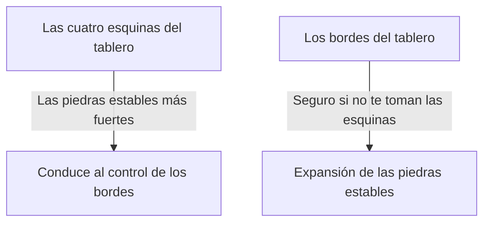

## 1. Un minuto para aprender, toda una vida para dominar

Othello (Reversi) es un juego de mesa inventado en 1973 por el japonés Goro Hasegawa y amado en todo el mundo.
Las reglas son extremadamente simples: "atrapa las piedras del oponente para voltearlas a tu color" y "al final gana quien tenga más de su color en el tablero (64 casillas de 8x8)". Solo eso.

Sin embargo, es casi imposible que un principiante le gane a un jugador experimentado. Esto se debe a que en Othello existe una profunda teoría estratégica contraintuitiva: "**mantén intencionalmente pocas piedras propias al principio**".

## 2. El valor de las "piedras estables" que nunca pueden ser volteadas

Uno de los conceptos más importantes en Othello son las "**piedras estables**".
Se refieren a "las piedras que el oponente nunca podrá voltear sin importar lo que haga hasta el final del juego".

Las piedras colocadas en las "**esquinas**" del tablero no pueden ser atrapadas desde ninguna dirección, por lo que se convierten en las piedras estables más fuertes. Una vez que tomas una esquina, puedes usarla como punto de partida para convertir las piedras de los bordes en piedras estables una tras otra.
Por lo tanto, la estrategia de Othello se reduce fundamentalmente al juego de "**cómo evitar que el oponente tome las esquinas mientras tú las tomas**".

## 3. El peligro de jugar en las posiciones "X" y "C" para no ceder las esquinas

Para no ceder las esquinas, la regla de oro es no colocar piedras en las casillas inmediatamente adyacentes a la esquina.
En la terminología de Othello, la casilla diagonalmente interior a la esquina se llama "**X**", y las casillas arriba, abajo, izquierda y derecha de la esquina se llaman "**C**".

- **El peligro de jugar en X**: Si colocas una piedra en X, el oponente puede atrapar esa piedra de inmediato y tomar la "esquina". Por lo tanto, jugar en X en la fase inicial o media se considera un "acto suicida".
- **El peligro de jugar en C**: De manera similar, colocar una piedra en C tiene un riesgo muy alto de que te tomen la esquina, por lo que a menos que seas un experto, debes evitarlo.

## 4. ¿Por qué es fuerte "no atrapar piedras al principio"? (Teoría de la movilidad)

Los principiantes se alegran de voltear piedras cuando ven un "lugar donde pueden atrapar muchas". Sin embargo, esta es la peor jugada que puedes hacer en Othello.

En Othello, existe la regla de que cuando tus piedras aumentan, "los lugares donde puedes jugar a continuación" disminuyen, y cuando las piedras del oponente aumentan, "los lugares donde tú puedes jugar" aumentan. A esto se le llama la "**teoría de la movilidad**".

Si atrapas muchas piedras al principio del juego, tus piedras quedarán expuestas en la parte exterior del tablero, y no tendrás lugares para jugar a continuación. Cuando te quedas sin lugares para jugar (sin opciones), finalmente te ves obligado a jugar en "lugares peligrosos donde realmente no quieres jugar (como X o C)".
En la terminología de Othello, esto se llama "**quedarse sin movimientos (pasar)**" o "**movimiento forzado**".

Los jugadores fuertes, en la fase inicial y media, agrupan sus piedras lo más pequeñas posible en el "centro del tablero" (nakawari) y dejan que el oponente rodee el exterior. Luego privan gradualmente al oponente de sus lugares para jugar, obligándolo finalmente a jugar en X, y así es como ellos roban las esquinas.

## 5. 3 pasos para que un principiante gane

Si quieres ganar en Othello, puedes hacerte dramáticamente más fuerte simplemente siguiendo estas 3 reglas:

1. **Voltea "solo 1 piedra" al principio**: Aunque haya lugares donde puedas atrapar muchas, aguanta la tentación y cíñete al "nakawari" (dividir por el medio), que consiste en voltear solo 1 piedra en el centro del tablero.
2. **Mantén pocas de tus piedras**: Deja que el oponente rodee el exterior y escóndete en el interior.
3. **Nunca juegues en X ni en C**: Hasta que no tengas más opciones y te veas forzado, no pongas nunca las manos cerca de las esquinas.

## 6. Resumen

Othello es un juego de reprimir el "deseo intuitivo (querer voltear mucho)" con la razón lógica.
Esa naturaleza estratégica de abandonar las ganancias a corto plazo para buscar la victoria final (piedras estables) conlleva profundas lecciones que también se aplican a los negocios y a la inversión. La próxima vez que juegues, asegúrate de probar la estrategia de "mantener tus piedras en número bajo".
