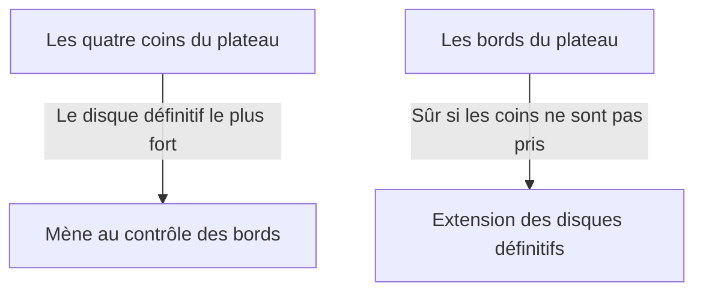

## 1. Une minute pour apprendre, toute une vie pour maîtriser

L'Othello (Reversi) est un jeu de société inventé en 1973 par le Japonais Goro Hasegawa et qui est apprécié dans le monde entier.
Les règles sont extrêmement simples. Il suffit « d'encadrer les disques de l'adversaire pour les retourner à sa couleur » et « celui qui a le plus de disques de sa couleur sur le plateau (64 cases de 8×8) à la fin gagne ».

Cependant, il est presque impossible pour un débutant de battre un joueur expérimenté. En effet, l'Othello possède une théorie stratégique profonde et contre-intuitive selon laquelle « **en début de partie, on minimise délibérément le nombre de ses disques** ».

## 2. La valeur du « disque définitif » qui ne sera jamais retourné

L'un des concepts les plus importants à l'Othello est le « **disque définitif** ».
Il désigne « un disque que l'adversaire ne pourra absolument jamais retourner, quoi qu'il fasse, jusqu'à la fin de la partie ».

Les disques placés dans les « **coins** » (les quatre angles) du plateau ne peuvent être encadrés depuis aucune direction, ce qui en fait les disques définitifs les plus forts. Une fois qu'un coin est pris, on peut s'en servir comme point de départ pour transformer tour à tour les disques des bords en disques définitifs.
Par conséquent, on peut dire que la stratégie fondamentale de l'Othello est un jeu consistant à se demander « **comment prendre les coins tout en empêchant l'adversaire de le faire** ».

## 3. Le danger des coups « X » et « C » pour éviter de donner les coins

Pour ne pas se faire prendre un coin, la règle d'or est de ne pas placer de disque sur les cases immédiatement adjacentes au coin.
Dans le jargon de l'Othello, les cases en diagonale vers l'intérieur par rapport au coin sont appelées « **X** », et les cases en haut, en bas, à gauche et à droite du coin sont appelées « **C** ».

- **Le danger du coup X** : Si vous placez un disque en X, l'adversaire pourra immédiatement encadrer ce disque pour prendre le « coin ». Par conséquent, jouer en X au début et au milieu de la partie est considéré comme un « acte suicidaire ».
- **Le danger du coup C** : De la même manière, placer un disque en C comporte un risque très élevé de se faire prendre le coin et doit être évité à moins d'être un joueur expert.

## 4. Pourquoi est-il fort de « ne pas prendre de disques en début de partie » ? (Théorie de la mobilité)

Les débutants sont contents de voir un endroit où ils peuvent « encadrer beaucoup de disques » et les retournent. Cependant, c'est le pire coup à jouer à l'Othello.

À l'Othello, il existe une règle selon laquelle plus on a de disques, moins on a d'« endroits où jouer au prochain tour », et plus l'adversaire a de disques, plus on a d'« endroits où jouer ». On appelle cela la « **théorie de la mobilité** ».

Si l'on prend beaucoup de disques en début de partie, ses propres disques sont exposés vers l'extérieur du plateau, et il n'y a plus d'endroits où jouer par la suite. Lorsqu'on se retrouve sans endroit où jouer (sans options), on est finalement forcé de jouer dans un « endroit dangereux où l'on ne veut pas vraiment jouer (X ou C) ».
C'est ce qu'on appelle en termes d'Othello « **passer son tour** » ou un « **coup forcé** ».

Les bons joueurs, du début au milieu de la partie, essaient de regrouper leurs disques de manière aussi compacte que possible au « centre du plateau » (le coup du centre) et laissent l'adversaire encercler l'extérieur. Ensuite, ils privent peu à peu l'adversaire de ses coups possibles, pour finalement le forcer à jouer en X, et ainsi s'emparer des coins.

## 5. 3 étapes pour que les débutants gagnent

Si vous voulez gagner à l'Othello, il suffit de respecter les 3 règles suivantes pour devenir considérablement plus fort.

1. **Ne retourner « qu'un seul disque » en début de partie** : Même s'il y a un endroit où vous pouvez en prendre beaucoup, retenez-vous, et efforcez-vous de ne retourner qu'un seul disque au centre du plateau (« nakawari »).
2. **Garder un petit nombre de disques** : Laissez l'adversaire encercler l'extérieur, et cachez-vous à l'intérieur.
3. **Ne jamais jouer en X et en C** : Ne touchez absolument pas aux abords des coins jusqu'à ce que vous soyez bloqué et forcé de le faire.

## 6. Résumé

L'Othello est un jeu où il faut réprimer ses « envies intuitives (vouloir retourner beaucoup de disques) » avec une raison logique.
Cette dimension stratégique, qui consiste à abandonner le profit à court terme pour obtenir la victoire finale (les disques définitifs), renferme une leçon profonde qui s'applique également aux affaires et à l'investissement. La prochaine fois que vous jouerez, n'hésitez pas à essayer la stratégie consistant à « garder un petit nombre de disques ».
