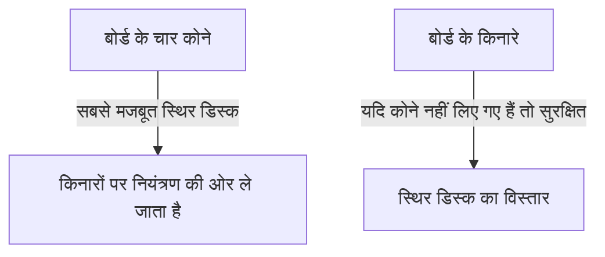

## 1. सीखने में एक मिनट, महारत हासिल करने में जीवन भर

ओथेलो (रिवर्सी) एक बोर्ड गेम है जिसका आविष्कार 1973 में जापान में गोरो हसेगावा द्वारा किया गया था, और यह पूरी दुनिया में लोकप्रिय है।
नियम बहुत ही सरल हैं: "अपने रंग में पलटने के लिए प्रतिद्वंद्वी की डिस्क को बीच में फंसाएं" और "अंत में जिसके पास बोर्ड (8×8, 64 वर्ग) पर अपने रंग की सबसे अधिक डिस्क होंगी, वह जीत जाएगा।" बस इतना ही।

हालाँकि, एक शुरुआती खिलाड़ी के लिए एक अनुभवी खिलाड़ी को हराना लगभग असंभव है। ऐसा इसलिए है क्योंकि ओथेलो में एक गहन रणनीतिक सिद्धांत है जो अंतर्ज्ञान के विपरीत है: "**शुरुआत में जानबूझकर अपनी डिस्क कम रखें**"।

## 2. कभी न पलटी जा सकने वाली "स्थिर डिस्क" का मूल्य

ओथेलो में सबसे महत्वपूर्ण अवधारणाओं में से एक "**स्थिर डिस्क**" है।
यह "ऐसी डिस्क को संदर्भित करता है जिसे खेल के अंत तक प्रतिद्वंद्वी द्वारा किसी भी तरह से पलटा नहीं जा सकता है।"

बोर्ड के "**कोनों (चारों कोनों)**" पर रखी गई डिस्क को किसी भी दिशा से घेरा नहीं जा सकता है, इसलिए वे सबसे मजबूत स्थिर डिस्क बन जाती हैं। एक बार जब आप एक कोने पर कब्ज़ा कर लेते हैं, तो आप उसे एक प्रारंभिक बिंदु के रूप में उपयोग कर सकते हैं और किनारों पर मौजूद डिस्क को एक के बाद एक स्थिर डिस्क में बदल सकते हैं।
इसलिए, मौलिक रूप से यह कहा जा सकता है कि ओथेलो की रणनीति यह खेल है कि "**प्रतिद्वंद्वी को कोनों पर कब्ज़ा करने से कैसे रोका जाए, और खुद कैसे कोनों पर कब्ज़ा किया जाए**"।

## 3. कोनों को बचाने के लिए "X" और "C" चालों का खतरा

कोनों को खोने से बचने का मुख्य नियम यह है कि कोनों के ठीक बगल वाले वर्गों में कभी भी डिस्क न रखें।
ओथेलो शब्दावली में, कोनों के तिरछे अंदर वाले वर्गों को "**X (एक्स)**" कहा जाता है, और कोनों के ऊपर, नीचे, बाएँ और दाएँ वाले वर्गों को "**C (सी)**" कहा जाता है।

- **X चाल का खतरा**: यदि आप अपनी डिस्क को X पर रखते हैं, तो आपका प्रतिद्वंद्वी तुरंत उस डिस्क को फंसा सकता है और "कोने" पर कब्ज़ा कर सकता है। इसलिए, खेल की शुरुआत और मध्य में X पर चाल चलना "आत्मघाती" माना जाता है।
- **C चाल का खतरा**: इसी तरह, C पर डिस्क रखने से भी कोने को खोने का बहुत अधिक जोखिम होता है, इसलिए जब तक आप एक विशेषज्ञ न हों, आपको इससे बचना चाहिए।

## 4. "शुरुआत में डिस्क क्यों न पलटें" यह रणनीति मजबूत क्यों है? (मोबिलिटी थ्योरी)

शुरुआती खिलाड़ी खुश हो जाते हैं और डिस्क पलट देते हैं जब उन्हें "एक ऐसी जगह मिलती है जहां वे बहुत सारी डिस्क फंसा सकते हैं।" हालाँकि, यह ओथेलो में सबसे खराब चाल है जिसे आपको कभी नहीं चलना चाहिए।

ओथेलो में, एक नियम है कि यदि आपकी अपनी डिस्क की संख्या बढ़ जाती है, तो "आपकी अगली चाल के लिए उपलब्ध जगहें" कम हो जाती हैं, और यदि प्रतिद्वंद्वी की डिस्क अधिक हैं, तो "आपकी चाल के लिए उपलब्ध जगहें" बढ़ जाती हैं। इसे "**मोबिलिटी थ्योरी**" कहा जाता है।

यदि आप शुरुआत में बहुत सारी डिस्क पलटते हैं, तो आपकी डिस्क बोर्ड के बाहरी हिस्से पर उजागर हो जाएंगी, और आपके पास अगली चाल चलने के लिए कोई जगह नहीं बचेगी। यदि ऐसी स्थिति आती है जहाँ आपके पास चाल चलने के लिए कोई जगह नहीं है (कोई विकल्प नहीं), तो आपको अंततः मजबूर होकर उन "खतरनाक जगहों (जैसे X और C) पर चाल चलनी पड़ेगी जहाँ आप वास्तव में नहीं जाना चाहते।"
ओथेलो शब्दावली में, इसे "**पास**" या "**मजबूरन चाल**" कहा जाता है।

मजबूत खिलाड़ी शुरुआत से लेकर खेल के मध्य तक अपनी डिस्क को जितना संभव हो सके बोर्ड के "केंद्र" में छोटा और कॉम्पैक्ट रखते हैं (जिसे मध्य-कट कहा जाता है), और प्रतिद्वंद्वी को बाहर की तरफ से घेरने देते हैं। फिर वे धीरे-धीरे प्रतिद्वंद्वी के चाल चलने के विकल्पों को छीन लेते हैं, और अंत में प्रतिद्वंद्वी को मजबूर कर देते हैं कि वह X पर चाल चले, जिससे वे खुद कोने पर कब्ज़ा कर लेते हैं।

## 5. शुरुआती खिलाड़ियों के जीतने के 3 कदम

यदि आप ओथेलो जीतना चाहते हैं, तो बस इन 3 नियमों का पालन करने से आपके खेल में नाटकीय रूप से सुधार होगा।

1. **शुरुआत में "केवल 1" डिस्क पलटें**: भले ही ऐसी जगहें हों जहाँ आप कई डिस्क पलट सकते हों, लेकिन धैर्य रखें और बोर्ड के केंद्र में केवल एक डिस्क पलटने पर अड़े रहें (इसे "मध्य-कट" कहा जाता है)।
2. **अपनी डिस्क की संख्या कम रखें**: प्रतिद्वंद्वी को बाहर की तरफ से घेरने दें, और खुद को अंदर छिपा कर रखें।
3. **कभी भी X और C पर चाल न चलें**: जब तक आपके पास चाल चलने के विकल्प खत्म न हो जाएं और आपको मजबूर न होना पड़े, तब तक कभी भी कोनों के आसपास के वर्गों को न छुएं।

## 6. निष्कर्ष

ओथेलो एक ऐसा खेल है जो तार्किक तर्कशीलता के साथ "सहज इच्छा (अंतर्ज्ञान से बहुत सारी डिस्क पलटने की इच्छा)" को दबाता है।
तात्कालिक लाभों को छोड़ने और अंतिम जीत (स्थिर डिस्क) के लिए जाने की वह रणनीतिक प्रकृति गहन सबक रखती है जो व्यापार और निवेश पर भी लागू होते हैं। अगली बार जब आप खेलें, तो कृपया "अपनी डिस्क कम रखने" की रणनीति आज़माएं।
