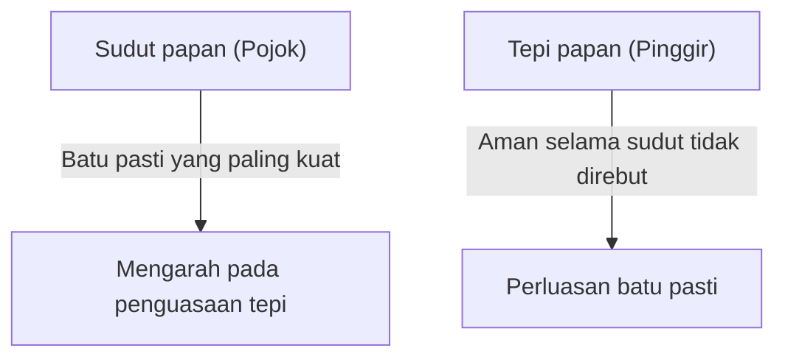

## 1. Dipahami dalam 1 menit, dikuasai seumur hidup

Othello (Reversi) adalah permainan papan yang diciptakan oleh Goro Hasegawa dari Jepang pada tahun 1973 dan dicintai di seluruh dunia.
Aturannya sangat sederhana. "Jepit batu lawan untuk membalikkannya menjadi warna Anda" dan "Pada akhirnya, warna yang paling banyak di papan (64 kotak 8x8) adalah pemenangnya." Hanya itu saja.

Namun, hampir mustahil bagi pemula untuk menang melawan pemain berpengalaman. Hal ini karena dalam Othello terdapat teori strategi mendalam yang berlawanan dengan intuisi, yaitu "**secara sengaja membuat batu sendiri lebih sedikit di awal permainan**".

## 2. Nilai "Batu Pasti" yang sama sekali tidak bisa dibalik

Salah satu konsep terpenting dalam Othello adalah "**Batu Pasti (Kakuteiseki)**".
Ini merujuk pada "batu yang tidak akan pernah bisa dibalikkan oleh lawan, bagaimanapun caranya, hingga permainan berakhir".

Batu yang diletakkan di "**sudut (keempat pojok)**" papan adalah batu pasti yang terkuat karena tidak bisa dijepit dari arah mana pun. Setelah Anda merebut sudut, Anda dapat menjadikannya sebagai titik awal untuk mengubah batu-batu di tepi menjadi batu pasti secara berurutan.
Oleh karena itu, strategi Othello pada dasarnya dapat dikatakan sebagai permainan tentang "**bagaimana mencegah lawan merebut sudut, dan Anda sendiri yang merebutnya**".

## 3. Bahaya "Langkah X" dan "Langkah C" untuk mencegah lawan merebut sudut

Untuk mencegah sudut direbut, aturan besinya adalah jangan meletakkan batu di kotak yang tepat bersebelahan dengan sudut.
Dalam terminologi Othello, kotak diagonal ke dalam dari sudut disebut "**X**", dan kotak di atas, bawah, kiri, dan kanan sudut disebut "**C**".

- **Bahaya Langkah X**: Jika Anda meletakkan batu di X, lawan dapat segera menjepit batu tersebut dan merebut "sudut". Oleh karena itu, langkah X di awal hingga pertengahan permainan dianggap sebagai "tindakan bunuh diri".
- **Bahaya Langkah C**: Sama halnya, meletakkan batu di C juga memiliki risiko sangat tinggi untuk kehilangan sudut, jadi sebaiknya dihindari kecuali jika Anda seorang ahli.

## 4. Mengapa "tidak mengambil batu di awal permainan" itu kuat? (Teori Derajat Keterbukaan)

Pemula sering kali dengan senang hati membalikkan batu ketika ada "tempat di mana banyak batu bisa dijepit". Namun, ini adalah langkah buruk yang paling tidak boleh dilakukan dalam Othello.

Dalam Othello, ada hukum di mana jika batu Anda bertambah banyak, "tempat di mana Anda bisa melangkah selanjutnya" menjadi sedikit, dan jika batu lawan banyak, "tempat di mana Anda bisa melangkah" menjadi banyak. Ini disebut "**Teori Derajat Keterbukaan (Kaihoudo)**".

Jika Anda mengambil terlalu banyak batu di awal permainan, batu Anda akan terekspos ke bagian luar papan, dan Anda tidak akan memiliki tempat untuk melangkah selanjutnya. Ketika Anda berada dalam keadaan di mana tidak ada tempat untuk melangkah (tidak ada pilihan), pada akhirnya Anda akan terpaksa melangkah di "tempat berbahaya yang sebenarnya tidak ingin Anda pilih (X atau C)".
Dalam terminologi Othello, hal ini disebut "**Kebuntuan (Pass)**" atau "**Langkah Paksaan**".

Pemain yang kuat, dari awal hingga pertengahan permainan, akan mengumpulkan batunya sekecil mungkin di "pusat papan" (Nakawari), dan membiarkan lawan mengelilingi bagian luar. Kemudian mereka perlahan-lahan merampas tempat lawan bisa melangkah, dan akhirnya memaksa lawan untuk melangkah di X, sehingga mereka sendiri bisa merebut sudut.

## 5. 3 Langkah bagi pemula untuk menang

Jika Anda ingin menang dalam Othello, Anda akan menjadi jauh lebih kuat hanya dengan mematuhi 3 aturan berikut.

1. **Di awal permainan, balikkan "hanya 1 buah"**: Bahkan jika ada tempat di mana Anda bisa mengambil banyak, tahanlah, dan terapkan dengan ketat "Nakawari" (pembelahan tengah), yaitu hanya membalikkan 1 batu di pusat papan.
2. **Jaga batu Anda tetap sedikit**: Biarkan lawan mengelilingi bagian luar, dan Anda bersembunyi di dalam.
3. **Sama sekali jangan melangkah di X dan C**: Sampai menemui kebuntuan dan dipaksa, jangan pernah menyentuh area di sekitar sudut.

## 6. Kesimpulan

Othello adalah permainan yang menekan "hasrat intuitif (ingin membalikkan banyak batu)" dengan rasionalitas logis.
Sifat strategisnya, yaitu membuang keuntungan di depan mata untuk meraih kemenangan akhir (batu pasti), memiliki pelajaran mendalam yang juga berlaku dalam bisnis dan investasi. Saat Anda bermain di lain waktu, cobalah terapkan strategi "menjaga batu tetap sedikit".
